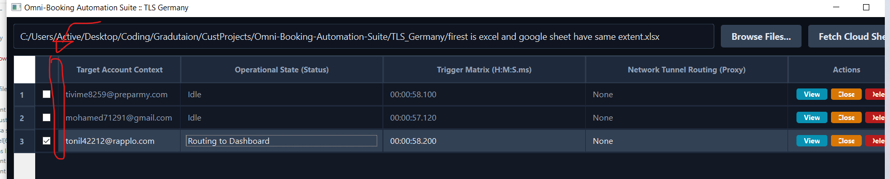

# Project Context File


## FILE: .\app.py

```py
#!/usr/bin/env python3
"""
Omni-Booking-Automation-Suite/TLS_Germany/app.py
Application entry point.
"""
import os
import sys

# Ensure the script can find project modules from the root directory
sys.path.append(os.path.dirname(os.path.abspath(__file__)))

from PyQt6.QtWidgets import QApplication
from gui.main_window import MainWindow

if __name__ == "__main__":
    app = QApplication(sys.argv)
    dashboard = MainWindow()
    dashboard.show()
    sys.exit(app.exec())
```


## FILE: .\project_context.md

```md

```


## FILE: .\project_context.py

```py
#!/usr/bin/env python3

import os

def create_context_file(output_file="project_context.md"):
    # المجلدات التي سيتم تجاهلها بالكامل
    exclude_dirs = {'.git', '__pycache__', 'venv', 'wenv', '.env', '.idea', '.vscode', 'downloaded_files'}
    
    # الامتدادات التي نريد تضمينها
    include_extensions = ('.py', '.qss', '.md')
    
    with open(output_file, 'w', encoding='utf-8') as outfile:
        outfile.write("# Project Context File\n\n")
        
        for root, dirs, files in os.walk('.'):
            # استبعاد المجلدات المحددة من البحث
            dirs[:] = [d for d in dirs if d not in exclude_dirs]
            
            for file in files:
                if file.endswith(include_extensions):
                    file_path = os.path.join(root, file)
                    
                    # استخراج الامتداد لتحديد نوع الكود في الماركدوان
                    ext = os.path.splitext(file)[1][1:]
                    
                    outfile.write(f"\n\n## FILE: {file_path}\n\n")
                    outfile.write(f"```{ext}\n")
                    
                    try:
                        with open(file_path, 'r', encoding='utf-8') as infile:
                            outfile.write(infile.read())
                    except Exception as e:
                        outfile.write(f"Error reading file: {e}")
                        
                    outfile.write(f"\n```\n")
                    
    print(f"✅ تم إنشاء الملف بنجاح: {output_file}")

if __name__ == "__main__":
    create_context_file()
```


## FILE: .\prompt.md

```md
previous pormpt was
```md
you will create methodd in browsers/chrome.py crhome_manager class anmed 
`check_appintment` 
bot keeps wait untill encounter `Book appointment`page to call `check_appintment`
now this page is the targeted page .which bot should keep check each ment if there are avilable appointment or not 
`Book appointment` page html code
```html
<html lang="en-us" dir="ltr"><head><style><!----> <!--?lit$586837649$-->.osano-cm-window{font-family:Helvetica,Arial,Hiragino Sans GB,STXihei,Microsoft YaHei,WenQuanYi Micro Hei,Hind,MS Gothic,Apple SD Gothic Neo,NanumBarunGothic,sans-serif;font-size:16px;font-smooth:always;-webkit-font-smoothing:antialiased;-moz-osx-font-smoothingz:auto;display:block;left:0;line-height:1;position:absolute;top:0;width:100%;z-index:2147483638;--fade-transition-time:700ms;--slide-transition-time:400ms}.osano-cm-window--context_amp{height:100%}.osano-visually-hidden{height:1px;left:-10000px;margin:-1px;opacity:0;overflow:hidden;position:absolute;width:1px}.osano-cm-button{border-radius:.25em;border-style:solid;border-width:thin;cursor:pointer;flex:1 1 auto;font-size:1em;font-weight:700;line-height:1;margin:.125em;min-width:6em;padding:.5em .75em;transition-duration:.2s;transition-property:background-color;transition-timing-function:ease-out}.osano-cm-button--type_icon{border-radius:50%;height:1em;line-height:0;min-width:1em;width:1em}.osano-cm-button:focus,.osano-cm-button:hover{outline:none}.osano-cm-close{border-radius:50%;border-style:solid;border-width:2px;box-sizing:content-box;cursor:pointer;height:20px;margin:.5em;min-height:20px;min-width:20px;order:0;outline:none;overflow:hidden;padding:0;width:20px;stroke-width:1px;justify-content:center;line-height:normal;text-decoration:none;transform:rotate(0deg);transition-duration:.2s;transition-property:transform,color,background-color,stroke,stroke-width;transition-timing-function:ease-out;z-index:2}.osano-cm-close:focus,.osano-cm-close:hover{transform:rotate(90deg);stroke-width:2px}.ccpa-opt-out-icon{display:flex;flex:1 1 auto}.ccpa-opt-out-icon svg{max-width:40px}.osano-cm-link{cursor:pointer;text-decoration:underline;transition-duration:.2s;transition-property:color;transition-timing-function:ease-out}.osano-cm-link:active,.osano-cm-link:hover{outline:none}.osano-cm-link:focus{font-weight:700;outline:none}.osano-cm-link--type_feature,.osano-cm-link--type_purpose,.osano-cm-link--type_specialFeature,.osano-cm-link--type_specialPurpose{cursor:help;display:block;-webkit-text-decoration:dashed;text-decoration:dashed}.osano-cm-link--type_denyAll{display:block;text-align:right}[dir=rtl] .osano-cm-link--type_denyAll{text-align:left}.osano-cm-link--type_vendor{display:block}.osano-cm-vendor-link{font-size:.75em}.osano-cm-list-item{margin:0}.osano-cm-list-item--type_term{border-top-style:solid;border-top-width:1px;font-size:.875rem;font-weight:400;margin-bottom:.25em;margin-top:.5em;padding:.5em .75rem 0;position:relative;top:-1px}.osano-cm-list-item--type_description{font-size:.75rem;font-weight:lighter;padding:0 .75rem}.osano-cm-list{list-style-position:outside;list-style-type:none;margin:0;padding:0}.osano-cm-list__list-item{text-indent:0}.osano-cm-list--type_description{margin:0 -1em}.osano-cm-list:first-of-type .osano-cm-list__list-item:first-of-type{border-top-width:0;margin-top:0;padding-top:0}.osano-cm-toggle{align-items:center;display:flex;flex-direction:row-reverse;justify-content:flex-start;margin:.25em 0;pointer-events:auto;position:relative}.osano-cm-toggle__label{margin:0 .5em 0 0}[dir=rtl] .osano-cm-toggle__label{margin:0 0 0 .5em}.osano-cm-toggle__switch{border-radius:14px;border-style:solid;border-width:2px;box-sizing:content-box;color:transparent;display:block;flex-shrink:0;height:18px;line-height:0;margin:0;position:relative;text-indent:-9999px;transition-duration:.2s;transition-property:background-color;transition-timing-function:ease-out;width:40px}.osano-cm-toggle__switch:hover{cursor:pointer}.osano-cm-toggle__switch:after{border-radius:9px;border-width:0;height:18px;left:0;top:0;width:18px}.osano-cm-toggle__switch:before{border-radius:16px;border-width:2px;bottom:-6px;box-sizing:border-box;left:-6px;right:-6px;top:-6px}.osano-cm-toggle__switch:after,.osano-cm-toggle__switch:before{border-style:solid;content:"";margin:0;position:absolute;transform:translateX(0);transition-duration:.3s;transition-property:transform,left,border-color;transition-timing-function:ease-out}.osano-cm-toggle__switch:after:active,.osano-cm-toggle__switch:before:active{transition-duration:.1s}.osano-cm-toggle__switch:after:active{width:26px}.osano-cm-toggle__switch:before:active{width:34px}[dir=rtl] .osano-cm-toggle__switch:after{left:100%;transform:translateX(-100%)}.osano-cm-toggle__input{height:1px;left:-10000px;margin:-1px;opacity:0;overflow:hidden;position:absolute;width:1px}[dir=rtl] .osano-cm-toggle__input{left:0;right:-10000px}.osano-cm-toggle__input:disabled{cursor:default}.osano-cm-toggle--type_checkbox .osano-cm-toggle__switch{border-radius:4px;border-style:solid;border-width:1px;height:22px;width:22px}.osano-cm-toggle--type_checkbox .osano-cm-toggle__switch:after{background-color:transparent!important;border-bottom-width:2px;border-left-width:2px;border-radius:0;content:none;height:6px;left:3px;top:3px;transform:rotate(-45deg);transition-property:color;transition-timing-function:ease-out;width:12px}.osano-cm-toggle--type_opt-out .osano-cm-toggle__switch{border-radius:4px;border-style:solid;border-width:1px;height:22px;width:22px}.osano-cm-toggle--type_opt-out .osano-cm-toggle__switch:after,.osano-cm-toggle--type_opt-out .osano-cm-toggle__switch:before{background-color:transparent!important;border-bottom-width:1px;border-radius:0;border-top-width:1px;content:none;height:0;left:-3px;top:7px;transition-property:color;transition-timing-function:ease-out;width:12px}.osano-cm-toggle--type_opt-out .osano-cm-toggle__switch:after{transform:translate(50%,50%) rotate(-45deg)}.osano-cm-toggle--type_opt-out .osano-cm-toggle__switch:before{transform:translate(50%,50%) rotate(45deg)}.osano-cm-toggle__input:checked+.osano-cm-toggle__switch:after{left:100%;transform:translateX(-100%)}[dir=rtl] .osano-cm-toggle__input:checked+.osano-cm-toggle__switch:after{left:0;transform:translateX(0)}.osano-cm-toggle__input:disabled+.osano-cm-toggle__switch{cursor:default}.osano-cm-toggle--type_checkbox .osano-cm-toggle__input:checked+.osano-cm-toggle__switch:after{content:"";left:3px;top:3px;transform:rotate(-45deg)}.osano-cm-toggle--type_opt-out .osano-cm-toggle__input:checked+.osano-cm-toggle__switch:after,.osano-cm-toggle--type_opt-out .osano-cm-toggle__input:checked+.osano-cm-toggle__switch:before{content:"";left:-1px;top:9px}.osano-cm-toggle--type_opt-out .osano-cm-toggle__input:checked+.osano-cm-toggle__switch:after{transform:translate(50%,50%) rotate(-45deg)}.osano-cm-toggle--type_opt-out .osano-cm-toggle__input:checked+.osano-cm-toggle__switch:before{transform:translate(50%,50%) rotate(45deg)}.osano-cm-toggle--type_checkbox .osano-cm-toggle__input:disabled+.osano-cm-toggle__switch,.osano-cm-toggle--type_opt-out .osano-cm-toggle__input:disabled+.osano-cm-toggle__switch{opacity:.3}.osano-cm-widget{background:none;border:none;bottom:12px;cursor:pointer;height:40px;opacity:.9;outline:none;padding:0;position:fixed;transition:transform .1s linear 0s,opacity .2s linear 0ms,visibility 0ms linear 0ms;visibility:visible;width:40px;z-index:2147483636}.osano-cm-widget--position_right{right:12px}.osano-cm-widget--position_left{left:12px}.osano-cm-widget:focus{outline:solid;outline-offset:.2rem}.osano-cm-widget:focus,.osano-cm-widget:hover{opacity:1;transform:scale(1.1)}.osano-cm-widget--hidden{opacity:0;visibility:hidden}.osano-cm-widget--hidden:focus,.osano-cm-widget--hidden:hover{opacity:0;transform:scale(1)}.osano-cm-dialog{align-items:center;box-sizing:border-box;font-size:1em;line-height:1.25;overflow:auto;padding:1.5em;position:fixed;transition-delay:0ms,0ms;transition-duration:.7s,0ms;transition-property:opacity,visibility;visibility:visible;z-index:2147483637}.osano-cm-dialog--hidden{opacity:0;transition-delay:0ms,.7s;visibility:hidden}.osano-cm-dialog--type_bar{box-sizing:border-box;display:flex;flex-direction:column;left:0;right:0}.osano-cm-dialog--type_bar .osano-cm-button{flex:none;margin:.125em auto;width:80%}@media screen and (min-width:768px){.osano-cm-dialog--type_bar{flex-direction:row}.osano-cm-dialog--type_bar .osano-cm-button{flex:1 1 100%;margin:.25em .5em;width:auto}}.osano-cm-dialog--type_box{flex-direction:column;max-height:calc(100vh - 2em);max-width:20em;width:calc(100vw - 2em)}.osano-cm-dialog__close{position:absolute;right:0;top:0}.osano-cm-dialog__list{margin:.5em 0 0;padding:0}.osano-cm-dialog__list .osano-cm-item{display:flex;margin-top:0}.osano-cm-dialog__list .osano-cm-item:last-child{margin-bottom:0}.osano-cm-dialog__list .osano-cm-toggle{flex-direction:row}[dir=rtl] .osano-cm-dialog__list .osano-cm-toggle{flex-direction:row-reverse}.osano-cm-dialog__list .osano-cm-label{white-space:nowrap}[dir=ltr] .osano-cm-dialog__list .osano-cm-label{margin-left:.375em}[dir=rtl] .osano-cm-dialog__list .osano-cm-label{margin-right:.375em}.osano-cm-dialog__buttons{display:flex;flex-wrap:wrap}.osano-cm-dialog--type_bar .osano-cm-dialog__content{flex:5;margin-bottom:.25em;width:100%}.osano-cm-dialog--type_box .osano-cm-dialog__content{display:flex;flex-direction:column;flex-grow:.0001;transition:flex-grow 1s linear}.osano-cm-dialog--type_bar .osano-cm-dialog__list{display:flex;flex-direction:column;flex-wrap:wrap;justify-content:flex-start;margin:.75em auto}@media screen and (min-width:376px){.osano-cm-dialog--type_bar .osano-cm-dialog__list{flex-direction:row}}@media screen and (min-width:768px){.osano-cm-dialog--type_bar .osano-cm-dialog__list{margin:.5em 0 0 auto}[dir=rtl] .osano-cm-dialog--type_bar .osano-cm-dialog__list{margin:.5em auto 0 0}}[dir=ltr] .osano-cm-dialog--type_bar .osano-cm-dialog__list .osano-cm-item{margin-right:.5em}[dir=rtl] .osano-cm-dialog--type_bar .osano-cm-dialog__list .osano-cm-item{margin-left:.5em}.osano-cm-dialog--type_bar .osano-cm-dialog__list .osano-cm-label{padding-top:0}.osano-cm-dialog--type_bar .osano-cm-dialog__buttons{flex:1;justify-content:flex-end;margin:0;width:100%}@media screen and (min-width:768px){.osano-cm-dialog--type_bar .osano-cm-dialog__buttons{margin:0 0 0 .5em;max-width:30vw;min-width:16em;position:sticky;top:0;width:auto}[dir=rtl] .osano-cm-dialog--type_bar .osano-cm-dialog__buttons{margin:0 .5em 0 0}}.osano-cm-dialog--type_box .osano-cm-dialog__buttons{margin:.5em 0 0}.osano-cm-dialog--type_bar.osano-cm-dialog--position_top{top:0}.osano-cm-dialog--type_bar.osano-cm-dialog--position_bottom{bottom:0}.osano-cm-dialog--type_box.osano-cm-dialog--position_top-left{left:1em;top:1em}.osano-cm-dialog--type_box.osano-cm-dialog--position_top-right{right:1em;top:1em}.osano-cm-dialog--type_box.osano-cm-dialog--position_bottom-left{bottom:1em;left:1em}.osano-cm-dialog--type_box.osano-cm-dialog--position_bottom-right{bottom:1em;right:1em}.osano-cm-dialog--type_box.osano-cm-dialog--position_center{left:50%;top:50%;transform:translate(-50%,-50%)}.osano-cm-dialog--type_box.osano-cm-dialog--wide{max-width:50em}@media screen and (max-height:800px)and (max-width:1200px){.osano-cm-dialog--type_box.osano-cm-dialog--wide{max-width:calc(100vw - 4em)}}.osano-cm-dialog--type_box.osano-cm-dialog--wide .osano-cm-dialog__list{display:flex;flex-wrap:wrap}.osano-cm-dialog--context_amp{height:100%;position:relative}.osano-cm-content__message{margin-bottom:1em;word-break:break-word}.osano-cm-drawer-links{margin:.5em 0 0}.osano-cm-drawer-links__link{display:block}.osano-cm-storage-policy{display:inline-block}.osano-cm-usage-list{margin:0 0 .5em}.osano-cm-usage-list__list{list-style-position:inside;list-style-type:disc}:export{fadeTransitionTime:.7s;slideTransitionTime:.4s}.osano-cm-info-dialog{height:100vh;left:0;position:fixed;top:0;transition-delay:0ms,0ms;transition-duration:.2s,0ms;transition-property:opacity,visibility;visibility:visible;width:100vw;z-index:2147483638}.osano-cm-info-dialog--hidden{opacity:0;transition-delay:0ms,.2s;visibility:hidden}.osano-cm-header{margin:0 0 -1em;padding:1em 0;position:sticky;top:0;z-index:1}.osano-cm-info{animation:delay-overflow .4s;bottom:0;box-shadow:0 0 2px 2px #ccc;box-sizing:border-box;max-width:20em;overflow:visible visible;position:fixed;top:0;transition-duration:.4s;transition-property:transform;width:100%}.osano-cm-info--position_left{left:0;transform:translate(-100%)}.osano-cm-info--position_right{right:0;transform:translate(100%)}.osano-cm-info--open{animation:none;overflow:hidden auto;transform:translate(0)}.osano-cm-info--do_not_sell{animation:none;height:-moz-fit-content;height:fit-content;left:50%;position:fixed;right:auto;top:50%;transform:translate(-50%,-50%);transition:none}.osano-cm-info--do_not_sell .osano-cm-close{order:-1}.osano-cm-info--do_not_sell .osano-cm-header{box-sizing:content-box;display:block;flex:none}.osano-cm-info-views{align-items:flex-start;display:flex;flex-direction:row;flex-wrap:nowrap;height:100%;transition-duration:.4s;transition-property:transform;width:100%}[dir=rtl] .osano-cm-info-views{flex-direction:row-reverse}.osano-cm-info-views__view{box-sizing:border-box;flex-shrink:0;width:100%}.osano-cm-info-views--position_0>:not(:first-of-type){max-height:100%;overflow:hidden}.osano-cm-info-views--position_1{transform:translateX(-100%)}.osano-cm-info-views--position_1>:not(:nth-of-type(2)){max-height:100%;overflow:hidden}.osano-cm-info-views--position_2{transform:translateX(-200%)}.osano-cm-info-views--position_2>:not(:nth-of-type(3)){max-height:100%;overflow:hidden}.osano-cm-info--do_not_sell .osano-cm-info-views{height:-moz-fit-content;height:fit-content}.osano-cm-view{height:0;padding:0 .75em 1em;transition-delay:.4s;transition-duration:0ms;transition-property:height,visibility;visibility:hidden;width:100%}.osano-cm-view__button{font-size:.875em;margin:1em 0 0;width:100%}.osano-cm-view--active{height:auto;transition-delay:0ms;visibility:visible}.osano-cm-description{font-size:.75em;font-weight:300;line-height:1.375;margin:1em 0 0}.osano-cm-description:first-child{margin:0}.osano-cm-description:last-of-type{margin-bottom:1em}.osano-cm-drawer-toggle .osano-cm-label{font-size:.875em;line-height:1.375em;margin:0 auto 0 0}[dir=rtl] .osano-cm-drawer-toggle .osano-cm-label{margin:0 0 0 auto}.osano-cm-info-dialog-header{align-items:center;display:flex;flex-direction:row-reverse;left:auto;min-height:3.25em;position:sticky;top:0;width:100%;z-index:1}[dir=rtl] .osano-cm-info-dialog-header{flex-direction:row}.osano-cm-info-dialog-header__header{align-items:center;display:flex;flex:1 1 auto;font-size:1em;justify-content:flex-start;margin:0;order:1;padding:1em .75em}.osano-cm-info-dialog-header__description{font-size:.75em;line-height:1.375}.osano-cm-back,.osano-cm-info-dialog-header__close{position:relative}.osano-cm-back{flex:0 1 auto;margin:0 0 0 .5em;min-width:0;order:2;width:auto;z-index:2}[dir=rtl] .osano-cm-back{margin:0 .5em 0 0}.osano-cm-powered-by{align-items:center;display:flex;flex-direction:column;font-weight:700;justify-content:center;margin:1em 0}.osano-cm-powered-by__link{font-size:.625em;outline:none;text-decoration:none}.osano-cm-powered-by__link:focus,.osano-cm-powered-by__link:hover{text-decoration:underline}@keyframes delay-overflow{0%{overflow:hidden auto}}.osano-cm-drawer-iab-button-container{display:flex;gap:.5em;justify-content:center;margin-bottom:2em}.osano-cm-illustrations__list>.osano-cm-list-item--type_description{padding:.2rem 1rem}.osano-cm-drawer-item.osano-cm-description__list li{padding-top:.75em}.osano-cm-tcf-purpose--label{border-bottom:1px solid rgba(0,0,0,.1);display:block;margin-bottom:.5em;padding:.25em 0 .5em}.osano-cm-link.osano-cm-link--type_purpose{font-weight:400}.osano-cm-tcf-purpose--label input{float:right;margin-right:.5em}.osano-cm-expansion-panel{border-bottom:1px solid rgba(0,0,0,.1);display:block;font-size:.75em;margin:0 -1.5em 1em;padding:1.5em 1.5em 0}.osano-cm-expansion-panel--expanded{border-bottom:none}.osano-cm-expansion-panel--empty,.osano-cm-expansion-panel--empty:not([open]){border-bottom:1px solid rgba(0,0,0,.1);padding-bottom:0}.osano-cm-expansion-panel__body{background-color:rgba(0,0,0,.1);line-height:1.25;list-style:none;margin:0 -1.5em;max-height:0;overflow:hidden;padding:0 1.5em;transition-delay:0ms,0ms,0ms,.3s;transition-duration:.3s,.3s,.3s,0s;transition-property:max-height,padding-top,padding-bottom,visibility;transition-timing-function:ease-out;visibility:hidden}.osano-cm-expansion-panel__toggle{cursor:pointer;display:block;line-height:1.25;margin:0 auto 1em 0;outline:none;position:relative}.osano-cm-expansion-panel__toggle:active,.osano-cm-expansion-panel__toggle:focus,.osano-cm-expansion-panel__toggle:hover{outline:none}[dir=rtl] .osano-cm-expansion-panel__toggle{margin:0 0 1em auto}.osano-cm-expansion-panel--expanded .osano-cm-expansion-panel__body{max-height:none;padding:1.25em 1.5em 1em;transition-delay:0ms,0ms,0ms,0ms;visibility:visible}.osano-cm-cookie-disclosure__title,.osano-cm-script-disclosure__title{border:0;clear:both;display:block;flex:0 1 30%;font-size:1em;font-weight:700;line-height:1.375;margin:0 0 .5em;padding:0}.osano-cm-cookie-disclosure__description,.osano-cm-script-disclosure__description{flex:0 1 70%;font-size:1em;line-height:1.375;margin:0 0 .5em;padding:0}.osano-cm-disclosure{border-bottom:none;display:block;font-size:.75em;margin:0 -1.5em 1em;padding:1.5em 1.5em 0}.osano-cm-disclosure--collapse{border-bottom:1px solid rgba(0,0,0,.1);padding-bottom:1em}.osano-cm-disclosure--empty,.osano-cm-disclosure--empty:not([open]){border-bottom:1px solid rgba(0,0,0,.1);padding-bottom:0}.osano-cm-disclosure__list{background-color:rgba(0,0,0,.1);line-height:1.25;list-style:none;margin:0 -1.5em;padding:1.25em 1.5em 1em}.osano-cm-disclosure__list:empty{border:none;padding:0 1.5em}.osano-cm-disclosure__list:first-of-type{margin-top:1em;padding:1.25em 1.5em 1em}.osano-cm-disclosure__list:first-of-type:empty{padding:1.75em 1.5em .75em}.osano-cm-disclosure__list:not(:first-of-type):not(:empty){border-top:1px solid rgba(0,0,0,.1)}.osano-cm-disclosure__list:empty+.osano-cm-disclosure__list:not(:empty){border:none;padding:0 1.5em}.osano-cm-disclosure__list:not(:empty)~.osano-cm-disclosure__list:empty+.osano-cm-disclosure__list:not(:empty){border-top:1px solid rgba(0,0,0,.1)}.osano-cm-disclosure__list>.osano-cm-list-item{line-height:1.25}.osano-cm-disclosure__list>.osano-cm-list-item:not(:first-of-type){border-top:1px solid rgba(0,0,0,.1);margin:1em -1.25em 0;padding:1em 1.25em 0}.osano-cm-disclosure__toggle{cursor:pointer;display:block;font-weight:700;line-height:1.25;margin:0 auto 0 0;outline:none;position:relative}.osano-cm-disclosure__toggle:focus,.osano-cm-disclosure__toggle:hover{text-decoration:underline}[dir=rtl] .osano-cm-disclosure__toggle{margin:0 0 0 auto}.osano-cm-disclosure--loading .osano-cm-disclosure__list{height:0;line-height:0;max-height:0}.osano-cm-disclosure--loading .osano-cm-disclosure__list>*{display:none}.osano-cm-disclosure--loading .osano-cm-disclosure__list:after{animation-duration:1s;animation-iteration-count:infinite;animation-name:osano-load-scale;animation-timing-function:ease-in-out;border-radius:100%;content:"";display:block;height:1em;position:relative;top:-.125em;transform:translateY(-50%);width:1em}.osano-cm-disclosure--collapse .osano-cm-disclosure__list{display:none}.osano-cm-disclosure--collapse .osano-cm-disclosure__list:after{content:none}.osano-cm-cookie-disclosure,.osano-cm-script-disclosure{display:flex;flex-wrap:wrap;margin:0}.osano-cm-cookie-disclosure__description:last-of-type,.osano-cm-cookie-disclosure__title:last-of-type,.osano-cm-script-disclosure__description:last-of-type,.osano-cm-script-disclosure__title:last-of-type{margin-bottom:0}@keyframes osano-load-scale{0%{transform:translateY(-50%) scale(0)}to{opacity:0;transform:translateY(-50%) scale(1)}} .osano-cm-window { direction: <!--?lit$586837649$-->ltr; text-align: <!--?lit$586837649$-->left; } .osano-cm-dialog { background: <!--?lit$586837649$-->#0a308f; color: <!--?lit$586837649$-->#ffffff; } .osano-cm-dialog__close { color: <!--?lit$586837649$-->#ffffff; stroke: <!--?lit$586837649$-->#ffffff; } .osano-cm-dialog__close:focus { background-color: <!--?lit$586837649$-->#ffffff; border-color: <!--?lit$586837649$-->#ffffff; stroke: <!--?lit$586837649$-->#0a308f; } .osano-cm-dialog__close:hover { stroke: <!--?lit$586837649$-->#ebebeb; } .osano-cm-dialog__close:focus:hover { stroke: <!--?lit$586837649$-->#1e44a3; } .osano-cm-info-dialog { background: <!--?lit$586837649$-->rgba(0,0,0,0.45); } .osano-cm-header, .osano-cm-info-dialog-header { background: <!--?lit$586837649$-->#0a308f; background: linear-gradient( 180deg, <!--?lit$586837649$-->#0a308f 2.5em, <!--?lit$586837649$-->rgba(10,48,143,0) 100% ); } .osano-cm-info { background: <!--?lit$586837649$-->#0a308f; color: <!--?lit$586837649$-->#ffffff; } .osano-cm-link-separator::before { content: '|'; padding: 0 0.5em; } .osano-cm-close { display: flex; background-color: transparent; border-color: transparent; } .osano-cm-info-dialog-header__close { color: <!--?lit$586837649$-->#ffffff; stroke: <!--?lit$586837649$-->#ffffff; } .osano-cm-info-dialog-header__close:focus { background-color: <!--?lit$586837649$-->#ffffff; border-color: <!--?lit$586837649$-->#ffffff; stroke: <!--?lit$586837649$-->#0a308f; } .osano-cm-info-dialog-header__close:hover { stroke: <!--?lit$586837649$-->#ebebeb; } .osano-cm-info-dialog-header__close:focus:hover { stroke: <!--?lit$586837649$-->#1e44a3; } .osano-cm-disclosure__list:first-of-type::after { background-color: <!--?lit$586837649$-->#eb6000; } .osano-cm-disclosure__toggle, .osano-cm-expansion-panel__toggle { color: <!--?lit$586837649$-->#eb6000; } .osano-cm-disclosure__toggle:hover, .osano-cm-disclosure__toggle:active, .osano-cm-expansion-panel__toggle:hover, .osano-cm-expansion-panel__toggle:active { color: <!--?lit$586837649$-->#eb6000; } .osano-cm-disclosure__toggle:focus, .osano-cm-expansion-panel__toggle:focus { color: <!--?lit$586837649$-->#ff7414; } .osano-cm-button { background-color: <!--?lit$586837649$-->#eb6000; border-color: <!--?lit$586837649$-->#ffffff; color: <!--?lit$586837649$-->#ffffff; } .osano-cm-button--type_deny { background-color: <!--?lit$586837649$-->#989; border-color: <!--?lit$586837649$-->#fff; color: <!--?lit$586837649$-->#fff; } .osano-cm-button:focus, .osano-cm-button:hover { background-color: <!--?lit$586837649$-->#ff7414; } .osano-cm-button--type_deny:focus, .osano-cm-button--type_deny:hover { background-color: <!--?lit$586837649$-->#857485; } .osano-cm-link { color: <!--?lit$586837649$-->#eb6000; } .osano-cm-link:hover, .osano-cm-link:active { color: <!--?lit$586837649$-->#eb6000; } .osano-cm-link:focus { color: <!--?lit$586837649$-->#ff7414; } .osano-cm-toggle__switch { background-color: <!--?lit$586837649$-->#d2cfff; } .osano-cm-toggle__switch::after { background-color: <!--?lit$586837649$-->#ffffff; border-color: <!--?lit$586837649$-->#ffffff; } .osano-cm-toggle__switch::before { border-color: transparent; } .osano-cm-toggle__input:checked + .osano-cm-toggle__switch { background-color: <!--?lit$586837649$-->#eb6000; border-color: <!--?lit$586837649$-->#eb6000; } .osano-cm-toggle__input:checked + .osano-cm-toggle__switch::after, .osano-cm-toggle__input:checked + .osano-cm-toggle__switch::before { border-color: <!--?lit$586837649$-->#ffffff; } .osano-cm-toggle__input:focus + .osano-cm-toggle__switch, .osano-cm-toggle__input:hover + .osano-cm-toggle__switch { background-color: <!--?lit$586837649$-->#bebbeb; border-color: <!--?lit$586837649$-->#bebbeb; } .osano-cm-toggle__input:focus + .osano-cm-toggle__switch::before { border-color: <!--?lit$586837649$-->#bebbeb; } .osano-cm-toggle__input:checked:focus + .osano-cm-toggle__switch, .osano-cm-toggle__input:checked:hover + .osano-cm-toggle__switch { background-color: <!--?lit$586837649$-->#ff7414; border-color: <!--?lit$586837649$-->#ff7414; } .osano-cm-toggle__input:checked:focus + .osano-cm-toggle__switch::before { border-color: <!--?lit$586837649$-->#ff7414; } .osano-cm-toggle__input:disabled + .osano-cm-toggle__switch, .osano-cm-toggle__input:disabled:focus + .osano-cm-toggle__switch, .osano-cm-toggle__input:disabled:hover + .osano-cm-toggle__switch { background-color: <!--?lit$586837649$-->#928fbf; border-color: <!--?lit$586837649$-->#928fbf; } .osano-cm-toggle__input:disabled + .osano-cm-toggle__switch::after, .osano-cm-toggle__input:disabled:focus + .osano-cm-toggle__switch::after, .osano-cm-toggle__input:disabled:hover + .osano-cm-toggle__switch::after { background-color: <!--?lit$586837649$-->#bfbfbf; border-color: <!--?lit$586837649$-->#bfbfbf; } .osano-cm-toggle__input:disabled + .osano-cm-toggle__switch::before, .osano-cm-toggle__input:disabled:focus + .osano-cm-toggle__switch::before, .osano-cm-toggle__input:disabled:hover + .osano-cm-toggle__switch::before { border-color: transparent; } .osano-cm-toggle__input:disabled:checked + .osano-cm-toggle__switch, .osano-cm-toggle__input:disabled:checked:focus + .osano-cm-toggle__switch, .osano-cm-toggle__input:disabled:checked:hover + .osano-cm-toggle__switch { background-color: <!--?lit$586837649$-->#ffa040; border-color: <!--?lit$586837649$-->#ffa040; } .osano-cm-toggle__input:disabled:checked + .osano-cm-toggle__switch::after, .osano-cm-toggle__input:disabled:checked:focus + .osano-cm-toggle__switch::after, .osano-cm-toggle__input:disabled:checked:hover + .osano-cm-toggle__switch::after { background-color: <!--?lit$586837649$-->#bfbfbf; border-color: <!--?lit$586837649$-->#bfbfbf; } .osano-cm-toggle__input:disabled:checked + .osano-cm-toggle__switch::before, .osano-cm-toggle__input:disabled:checked:focus + .osano-cm-toggle__switch::before, .osano-cm-toggle__input:disabled:checked:hover + .osano-cm-toggle__switch::before { border-color: transparent; } .osano-cm-widget__outline { fill: <!--?lit$586837649$-->#fff; stroke: <!--?lit$586837649$-->#29246a; } .osano-cm-widget__dot { fill: <!--?lit$586837649$-->#37cd8f; } .osano-cm-tcf-purpose--label input { accent-color: <!--?lit$586837649$-->#eb6000; } </style><meta http-equiv="origin-trial" content="A7vZI3v+Gz7JfuRolKNM4Aff6zaGuT7X0mf3wtoZTnKv6497cVMnhy03KDqX7kBz/q/iidW7srW31oQbBt4VhgoAAACUeyJvcmlnaW4iOiJodHRwczovL3d3dy5nb29nbGUuY29tOjQ0MyIsImZlYXR1cmUiOiJEaXNhYmxlVGhpcmRQYXJ0eVN0b3JhZ2VQYXJ0aXRpb25pbmczIiwiZXhwaXJ5IjoxNzU3OTgwODAwLCJpc1N1YmRvbWFpbiI6dHJ1ZSwiaXNUaGlyZFBhcnR5Ijp0cnVlfQ=="><meta charset="utf-8"><meta name="viewport" content="width=device-width, initial-scale=1"><link rel="preload" as="image" imagesrcset="/_next/image?url=https%3A%2F%2Fcache-cms.directuscloud.tlscontact.com%2Fassets%2F51249a1c-fbb6-4879-922f-2d5b8cf5faba&amp;w=16&amp;q=75 16w, /_next/image?url=https%3A%2F%2Fcache-cms.directuscloud.tlscontact.com%2Fassets%2F51249a1c-fbb6-4879-922f-2d5b8cf5faba&amp;w=32&amp;q=75 32w, /_next/image?url=https%3A%2F%2Fcache-cms.directuscloud.tlscontact.com%2Fassets%2F51249a1c-fbb6-4879-922f-2d5b8cf5faba&amp;w=48&amp;q=75 48w, /_next/image?url=https%3A%2F%2Fcache-cms.directuscloud.tlscontact.com%2Fassets%2F51249a1c-fbb6-4879-922f-2d5b8cf5faba&amp;w=64&amp;q=75 64w, /_next/image?url=https%3A%2F%2Fcache-cms.directuscloud.tlscontact.com%2Fassets%2F51249a1c-fbb6-4879-922f-2d5b8cf5faba&amp;w=96&amp;q=75 96w, /_next/image?url=https%3A%2F%2Fcache-cms.directuscloud.tlscontact.com%2Fassets%2F51249a1c-fbb6-4879-922f-2d5b8cf5faba&amp;w=128&amp;q=75 128w, /_next/image?url=https%3A%2F%2Fcache-cms.directuscloud.tlscontact.com%2Fassets%2F51249a1c-fbb6-4879-922f-2d5b8cf5faba&amp;w=256&amp;q=75 256w, /_next/image?url=https%3A%2F%2Fcache-cms.directuscloud.tlscontact.com%2Fassets%2F51249a1c-fbb6-4879-922f-2d5b8cf5faba&amp;w=384&amp;q=75 384w, /_next/image?url=https%3A%2F%2Fcache-cms.directuscloud.tlscontact.com%2Fassets%2F51249a1c-fbb6-4879-922f-2d5b8cf5faba&amp;w=640&amp;q=75 640w, /_next/image?url=https%3A%2F%2Fcache-cms.directuscloud.tlscontact.com%2Fassets%2F51249a1c-fbb6-4879-922f-2d5b8cf5faba&amp;w=750&amp;q=75 750w, /_next/image?url=https%3A%2F%2Fcache-cms.directuscloud.tlscontact.com%2Fassets%2F51249a1c-fbb6-4879-922f-2d5b8cf5faba&amp;w=828&amp;q=75 828w, /_next/image?url=https%3A%2F%2Fcache-cms.directuscloud.tlscontact.com%2Fassets%2F51249a1c-fbb6-4879-922f-2d5b8cf5faba&amp;w=1080&amp;q=75 1080w, /_next/image?url=https%3A%2F%2Fcache-cms.directuscloud.tlscontact.com%2Fassets%2F51249a1c-fbb6-4879-922f-2d5b8cf5faba&amp;w=1200&amp;q=75 1200w, /_next/image?url=https%3A%2F%2Fcache-cms.directuscloud.tlscontact.com%2Fassets%2F51249a1c-fbb6-4879-922f-2d5b8cf5faba&amp;w=1920&amp;q=75 1920w, /_next/image?url=https%3A%2F%2Fcache-cms.directuscloud.tlscontact.com%2Fassets%2F51249a1c-fbb6-4879-922f-2d5b8cf5faba&amp;w=2048&amp;q=75 2048w, /_next/image?url=https%3A%2F%2Fcache-cms.directuscloud.tlscontact.com%2Fassets%2F51249a1c-fbb6-4879-922f-2d5b8cf5faba&amp;w=3840&amp;q=75 3840w" imagesizes="200px"><link rel="preload" as="image" imagesrcset="/_next/image?url=https%3A%2F%2Fcache-cms.directuscloud.tlscontact.com%2Fassets%2Ffb60a0bb-8c69-48ae-8c83-2dffdde46a34&amp;w=256&amp;q=75 1x, /_next/image?url=https%3A%2F%2Fcache-cms.directuscloud.tlscontact.com%2Fassets%2Ffb60a0bb-8c69-48ae-8c83-2dffdde46a34&amp;w=384&amp;q=75 2x"><link rel="preload" as="image" imagesrcset="/_next/image?url=https%3A%2F%2Fcache-cms.directuscloud.tlscontact.com%2Fassets%2F4d870d85-366f-4a8d-95ea-2d38550b90b0&amp;w=1920&amp;q=75 1x, /_next/image?url=https%3A%2F%2Fcache-cms.directuscloud.tlscontact.com%2Fassets%2F4d870d85-366f-4a8d-95ea-2d38550b90b0&amp;w=3840&amp;q=75 2x"><link rel="stylesheet" href="/_next/static/css/4a300a7f839274a6.css" data-precedence="next"><link rel="stylesheet" href="/_next/static/css/f0441552670f7a24.css" data-precedence="next"><link rel="stylesheet" href="/_next/static/css/f547d6e20863a62f.css" data-precedence="next"><link rel="stylesheet" href="/_next/static/css/82a4bed7c90b697b.css" data-precedence="next"><link rel="stylesheet" href="/_next/static/css/94d8d2911634acc9.css" data-precedence="next"><link rel="preload" as="script" fetchpriority="low" href="/_next/static/chunks/webpack-30f96451a97e1438.js"><script integrity="sha384-DMJucfgjcmtc4a8x9gFfPgwoWXK+1qozk7K/wTFGVtduYs3wg2BI8Z5lrJXZV+iE" crossorigin="anonymous" charset="utf-8" async="" type="text/javascript" src="https://www.gstatic.com/recaptcha/releases/A7KpaEASfhDcK0nXxgQEyyYv/recaptcha__en.js"></script><script src="/_next/static/chunks/4bd1b696-182b6b13bdad92e3.js" async=""></script><script src="/_next/static/chunks/1255-14274d5037a7a763.js" async=""></script><script src="/_next/static/chunks/main-app-207231610fc2a90c.js" async=""></script><script src="/_next/static/chunks/4803-d24c48a8c8c4d542.js" async=""></script><script src="/_next/static/chunks/6136-945ce8def6cf87c3.js" async=""></script><script src="/_next/static/chunks/3276-7e5c90ae87912373.js" async=""></script><script src="/_next/static/chunks/1306-45a92788e90a35ca.js" async=""></script><script src="/_next/static/chunks/5157-716f39b8ea1e5cf6.js" async=""></script><script src="/_next/static/chunks/1937-475369ecb844e156.js" async=""></script><script src="/_next/static/chunks/1356-814af99a1613cc1d.js" async=""></script><script src="/_next/static/chunks/2619-b8db57ac19da49ac.js" async=""></script><script src="/_next/static/chunks/1029-3ef9e7fa38612fae.js" async=""></script><script src="/_next/static/chunks/4558-0cc18be185a78a8e.js" async=""></script><script src="/_next/static/chunks/7946-9ed25d27157cd533.js" async=""></script><script src="/_next/static/chunks/6012-f0b897b8559ece14.js" async=""></script><script src="/_next/static/chunks/2783-2b8c30f3bf94d037.js" async=""></script><script src="/_next/static/chunks/6824-c79054c2a50a995b.js" async=""></script><script src="/_next/static/chunks/3675-3c860e67f78a004f.js" async=""></script><script src="/_next/static/chunks/3874-7a313be07095c637.js" async=""></script><link rel="preload" href="https://cmp.osano.com/AzqL4lT4Pea7o2XE9/c9db9abf-709d-4404-9b82-fbe51b312b5f/osano.js" as="script"><link rel="preload" href="https://www.google.com/recaptcha/api.js?render=6LevDoQeAAAAAEVrXcQsTo2zjgSO5oQs-PGf6ZW7" as="script"><meta name="next-size-adjust" content=""><title>Appointment Booking | TLScontact</title><link rel="icon" href="/favicon.ico" type="image/x-icon" sizes="32x32"><script src="/_next/static/chunks/polyfills-42372ed130431b0a.js" nomodule=""></script><link rel="preload" href="/_next/static/media/e807dee2426166ad-s.p.woff2" as="font" crossorigin="" type="font/woff2"></head><body class="__className_2fad4c"><div data-nosnippet="" class="osano-cm-window" dir="ltr"><!----> <!--?lit$586837649$--><div hidden="" class="osano-visually-hidden"> <span id="osano-cm-aria.newWindow"><!--?lit$586837649$-->Opens in a new window</span> <span id="osano-cm-aria.external"><!--?lit$586837649$-->Opens an external website</span> <span id="osano-cm-aria.externalNewWindow"><!--?lit$586837649$-->Opens an external website in a new window</span> </div> <!--?lit$586837649$--> <div role="dialog" id="e5ffe81c-dbec-4696-b9f8-ebf7ddc0c7b8" aria-label="Cookie Consent Banner" aria-describedby="e5ffe81c-dbec-4696-b9f8-ebf7ddc0c7b8__label" class=" osano-cm-window__dialog osano-cm-dialog osano-cm-dialog--hidden osano-cm-dialog--position_bottom osano-cm-dialog--type_bar "> <!--?lit$586837649$--> <button class=" osano-cm-dialog__close osano-cm-close "> <!--?lit$586837649$--><svg width="20px" height="20px" viewBox="0 0 20 20" role="img" aria-labelledby="4939984e-d03b-4950-851f-022b8a4cdb08"> <title id="4939984e-d03b-4950-851f-022b8a4cdb08"><!---->Close this dialog<!----></title> <line role="presentation" x1="2" y1="2" x2="18" y2="18"></line> <line role="presentation" x1="2" y1="18" x2="18" y2="2"></line> </svg> </button>  <div class=" osano-cm-dialog__content osano-cm-content "> <!--?lit$586837649$--> <span id="e5ffe81c-dbec-4696-b9f8-ebf7ddc0c7b8__label" class=" osano-cm-content__message osano-cm-message "> <!--?lit$586837649$-->This website utilizes technologies such as cookies to enable essential site functionality, as well as for analytics, personalization, and targeted advertising. <!--?lit$586837649$-->To learn more, view the following link: <!--?lit$586837649$--> </span>  <!--?lit$586837649$--> <!--?lit$586837649$--><!--?lit$586837649$--><a rel="noopener" tabindex="0" href="/cookie-policy/*" target="_blank" class=" osano-cm-storage-policy osano-cm-content__link osano-cm-link " aria-describedby="osano-cm-aria.newWindow"><!--?lit$586837649$-->Cookie Policy</a><!--?--><!--?lit$586837649$--> <!--?lit$586837649$--> <!--?lit$586837649$--> </div> <!--?lit$586837649$--> </div>  <!--?lit$586837649$--> <button id="58c7614b-3b2a-4696-a8f0-942acbbddbde" class="osano-cm-window__widget osano-cm-widget osano-cm-widget--position_right" title="Cookie Preferences" aria-label="Cookie Preferences"> <svg role="img" width="40" height="40" viewBox="0 0 71.85 72.23" xmlns="http://www.w3.org/2000/svg" aria-labelledby="58c7614b-3b2a-4696-a8f0-942acbbddbde"> <path d="m67.6 36.73a6.26 6.26 0 0 1 -3.2-2.8 5.86 5.86 0 0 0 -5.2-3.1h-.3a11 11 0 0 1 -11.4-9.5 6 6 0 0 1 -.1-1.4 9.2 9.2 0 0 1 .4-2.9 8.65 8.65 0 0 0 .2-1.6 5.38 5.38 0 0 0 -1.9-4.3 7.3 7.3 0 0 1 -2.5-5.5 3.91 3.91 0 0 0 -3.5-3.9 36.46 36.46 0 0 0 -15 1.5 33.14 33.14 0 0 0 -22.1 22.7 35.62 35.62 0 0 0 -1.5 10.2 34.07 34.07 0 0 0 4.8 17.6.75.75 0 0 0 .07.12c.11.17 1.22 1.39 2.68 3-.36.47 5.18 6.16 5.65 6.52a34.62 34.62 0 0 0 55.6-21.9 4.38 4.38 0 0 0 -2.7-4.74z" stroke-width="3" class=" osano-cm-widget__outline osano-cm-outline "></path> <path d="m68 41.13a32.37 32.37 0 0 1 -52 20.5l-2-1.56c-2.5-3.28-5.62-7.15-5.81-7.44a32 32 0 0 1 -4.5-16.5 34.3 34.3 0 0 1 1.4-9.6 30.56 30.56 0 0 1 20.61-21.13 33.51 33.51 0 0 1 14.1-1.4 1.83 1.83 0 0 1 1.6 1.8 9.38 9.38 0 0 0 3.3 7.1 3.36 3.36 0 0 1 1.2 2.6 3.37 3.37 0 0 1 -.1 1 12.66 12.66 0 0 0 -.5 3.4 9.65 9.65 0 0 0 .1 1.7 13 13 0 0 0 10.5 11.2 16.05 16.05 0 0 0 3.1.2 3.84 3.84 0 0 1 3.5 2 10 10 0 0 0 4.1 3.83 2 2 0 0 1 1.4 2z" stroke-width="3" class=" osano-cm-widget__outline osano-cm-outline "></path> <g class=" osano-cm-widget__dot osano-cm-dot "> <path d="m26.6 31.43a5.4 5.4 0 1 1 5.4-5.43 5.38 5.38 0 0 1 -5.33 5.43z"></path> <path d="m25.2 53.13a5.4 5.4 0 1 1 5.4-5.4 5.44 5.44 0 0 1 -5.4 5.4z"></path> <path d="m47.9 52.33a5.4 5.4 0 1 1 5.4-5.4 5.32 5.32 0 0 1 -5.24 5.4z"></path> </g> </svg> </button>  <!--?lit$586837649$--><div role="dialog" aria-modal="true" id="02688388-fd3d-4833-bf64-5b4097520049" aria-labelledby="02688388-fd3d-4833-bf64-5b4097520049__label" aria-hidden="true" class=" osano-cm-window__info-dialog osano-cm-info-dialog osano-cm-info-dialog--hidden "> <!--?lit$586837649$--><!--?lit$586837649$--><span tabindex="0" aria-hidden="true" data-focus="first"></span><!--?--> <div role="presentation" class=" osano-cm-info-dialog__info osano-cm-info osano-cm-info--position_right "> <!--?lit$586837649$--><div role="presentation" class=" osano-cm-info__info-dialog-header osano-cm-info-dialog-header "> <p role="heading" aria-level="1" id="02688388-fd3d-4833-bf64-5b4097520049__label" class=" osano-cm-info-dialog-header__header osano-cm-header "> <!--?lit$586837649$--> </p> <!--?lit$586837649$--> <button class=" osano-cm-info-dialog-header__close osano-cm-close "> <!--?lit$586837649$--><svg width="20px" height="20px" viewBox="0 0 20 20" role="img" aria-labelledby="389ea31a-2d3f-4f38-ab93-254c33d7b8f6"> <title id="389ea31a-2d3f-4f38-ab93-254c33d7b8f6"><!---->Close Cookie Preferences<!----></title> <line role="presentation" x1="2" y1="2" x2="18" y2="18"></line> <line role="presentation" x1="2" y1="18" x2="18" y2="2"></line> </svg> </button> <!--?lit$586837649$--> </div> <div role="presentation" class=" osano-cm-info__info-views osano-cm-info-views osano-cm-info-views--hidden osano-cm-info-views--position_0 "> <!--?lit$586837649$--> </div> </div> <!--?lit$586837649$--><!--?lit$586837649$--><span tabindex="0" aria-hidden="true" data-focus="last"></span><!--?--> </div> </div><div hidden=""><!--$--><!--/$--></div><a tabindex="0" href="#page-title" class="absolute left-0 top-0 z-50 -translate-y-full transform bg-yellow-500 px-4 py-2 font-semibold transition focus:translate-y-0">Skip to main content</a><main id="main" class="flex min-h-screen flex-col items-stretch pt-12 md:pt-18" tabindex="-1"><nav id="navbar" class="fixed top-0 z-20 flex h-12 w-full items-center gap-2 bg-header px-2 text-on-header shadow-md md:h-18 lg:pe-4 lg:ps-8 print:hidden"><a href="/travel-groups" class="relative block h-11 w-52"></a><div class="flex-1"></div><div id="application-menu" class="AppMenu_application-menu__viMNs AppMenu_--closed__MH25S"><div class="absolute end-3 top-3 z-10 xl:hidden"><button class="group TlsIconButton_tls-icon-button__OJTx7 w-10" type="button" aria-label="Close menu icon"><svg xmlns="http://www.w3.org/2000/svg" viewBox="0 0 24 24" class="group-disabled:fill-gray-300 w-5 fill-on-header aspect-square" aria-label="Close" role="img"><path d="M13.41,12l4.3-4.29a1,1,0,1,0-1.42-1.42L12,10.59,7.71,6.29A1,1,0,0,0,6.29,7.71L10.59,12l-4.3,4.29a1,1,0,0,0,0,1.42,1,1,0,0,0,1.42,0L12,13.41l4.29,4.3a1,1,0,0,0,1.42,0,1,1,0,0,0,0-1.42Z"></path></svg></button></div><a href="/undefined/country/eg/vac/egCAI2de"><p class="MenuItem_menu-item__yIr3C">Welcome</p></a><div class="MenuItem_menu-item-group__92y6y"><div class="flex items-center gap-0.5"><p class="MenuItem_menu-item__yIr3C">Application Information</p><svg class="w-3 fill-on-header max-xl:hidden" aria-label="Chevron down icon" role="img" viewBox="0 0 24 24" xmlns="http://www.w3.org/2000/svg"><path fill-rule="evenodd" clip-rule="evenodd" d="M4.46967 8.46967C4.76256 8.17678 5.23744 8.17678 5.53033 8.46967L12.5 15.4393L19.4697 8.46967C19.7626 8.17678 20.2374 8.17678 20.5303 8.46967C20.8232 8.76256 20.8232 9.23744 20.5303 9.53033L13.0303 17.0303C12.7374 17.3232 12.2626 17.3232 11.9697 17.0303L4.46967 9.53033C4.17678 9.23744 4.17678 8.76256 4.46967 8.46967Z"></path></svg></div><ul class="MenuItem_menu-item-container__uObjA"><li class="flex items-center"><svg xmlns="http://www.w3.org/2000/svg" viewBox="0 0 24 24" aria-label="Visa Application Process" role="img" class="w-5 fill-on-header xl:hidden"><path d="M14.83,11.29,10.59,7.05a1,1,0,0,0-1.42,0,1,1,0,0,0,0,1.41L12.71,12,9.17,15.54a1,1,0,0,0,0,1.41,1,1,0,0,0,.71.29,1,1,0,0,0,.71-.29l4.24-4.24A1,1,0,0,0,14.83,11.29Z"></path></svg><div class="flex-1"><a href="/undefined/country/eg/vac/egCAI2de/application-process"><p class="MenuItem_menu-item__yIr3C">Visa Application Process</p></a></div></li><li class="flex items-center"><svg xmlns="http://www.w3.org/2000/svg" viewBox="0 0 24 24" aria-label="Visa Application Fees" role="img" class="w-5 fill-on-header xl:hidden"><path d="M14.83,11.29,10.59,7.05a1,1,0,0,0-1.42,0,1,1,0,0,0,0,1.41L12.71,12,9.17,15.54a1,1,0,0,0,0,1.41,1,1,0,0,0,.71.29,1,1,0,0,0,.71-.29l4.24-4.24A1,1,0,0,0,14.83,11.29Z"></path></svg><div class="flex-1"><a href="/undefined/country/eg/vac/egCAI2de/application-fees"><p class="MenuItem_menu-item__yIr3C">Visa Application Fees</p></a></div></li><li class="flex items-center"><svg xmlns="http://www.w3.org/2000/svg" viewBox="0 0 24 24" aria-label="Travel Purpose and Documents" role="img" class="w-5 fill-on-header xl:hidden"><path d="M14.83,11.29,10.59,7.05a1,1,0,0,0-1.42,0,1,1,0,0,0,0,1.41L12.71,12,9.17,15.54a1,1,0,0,0,0,1.41,1,1,0,0,0,.71.29,1,1,0,0,0,.71-.29l4.24-4.24A1,1,0,0,0,14.83,11.29Z"></path></svg><div class="flex-1"><a href="/undefined/country/eg/vac/egCAI2de/visa-types"><p class="MenuItem_menu-item__yIr3C">Travel Purpose and Documents</p></a></div></li><li class="flex items-center"><svg xmlns="http://www.w3.org/2000/svg" viewBox="0 0 24 24" aria-label="Links and Downloads" role="img" class="w-5 fill-on-header xl:hidden"><path d="M14.83,11.29,10.59,7.05a1,1,0,0,0-1.42,0,1,1,0,0,0,0,1.41L12.71,12,9.17,15.54a1,1,0,0,0,0,1.41,1,1,0,0,0,.71.29,1,1,0,0,0,.71-.29l4.24-4.24A1,1,0,0,0,14.83,11.29Z"></path></svg><div class="flex-1"><a href="/undefined/country/eg/vac/egCAI2de/useful-content"><p class="MenuItem_menu-item__yIr3C">Links and Downloads</p></a></div></li><li class="flex items-center"><svg xmlns="http://www.w3.org/2000/svg" viewBox="0 0 24 24" aria-label="Legalization website" role="img" class="w-5 fill-on-header xl:hidden"><path d="M14.83,11.29,10.59,7.05a1,1,0,0,0-1.42,0,1,1,0,0,0,0,1.41L12.71,12,9.17,15.54a1,1,0,0,0,0,1.41,1,1,0,0,0,.71.29,1,1,0,0,0,.71-.29l4.24-4.24A1,1,0,0,0,14.83,11.29Z"></path></svg><div class="flex-1"><a href="https://legalization-de.tlscontact.com/"><p class="MenuItem_menu-item__yIr3C">Legalization website</p></a></div></li></ul></div><a href="/undefined/country/eg/vac/egCAI2de/services"><p class="MenuItem_menu-item__yIr3C">Added Value Services</p></a><a href="/undefined/country/eg/vac/egCAI2de/help-centre"><p class="MenuItem_menu-item__yIr3C">FAQ</p></a><a href="/undefined/country/eg/vac/egCAI2de/contact"><p class="MenuItem_menu-item__yIr3C">Contact Us</p></a><a href="/undefined/country/eg/vac/egCAI2de/news"><p class="MenuItem_menu-item__yIr3C">News</p></a></div><div role="list" aria-label="Language switcher" class="relative z-[11]"><div role="listitem" class="cursor-pointer rounded-lg p-2 duration-300 hover:bg-gray-50 active:scale-90"><div class="flex items-center gap-x-1" data-testid="btn-language-selector"><p class="text-xs text-on-header">EN</p><div class="hidden duration-150 md:block"><svg class="w-4 fill-primary-500" aria-label="Chevron down icon" role="img" viewBox="0 0 24 24" xmlns="http://www.w3.org/2000/svg"><path fill-rule="evenodd" clip-rule="evenodd" d="M4.46967 8.46967C4.76256 8.17678 5.23744 8.17678 5.53033 8.46967L12.5 15.4393L19.4697 8.46967C19.7626 8.17678 20.2374 8.17678 20.5303 8.46967C20.8232 8.76256 20.8232 9.23744 20.5303 9.53033L13.0303 17.0303C12.7374 17.3232 12.2626 17.3232 11.9697 17.0303L4.46967 9.53033C4.17678 9.23744 4.17678 8.76256 4.46967 8.46967Z"></path></svg></div></div></div></div><div role="list" aria-label="Dropdown selector" class="relative z-[11]"><div role="listitem" class="cursor-pointer rounded-lg p-2 duration-300 hover:bg-gray-50 active:scale-90"><svg class="fill-primary-500 w-5 lg:w-7" data-testid="user-button" aria-label="User icon" role="img" viewBox="0 0 30 30" fill="none" xmlns="http://www.w3.org/2000/svg"><path fill-rule="evenodd" clip-rule="evenodd" d="M8.43692 11.25C8.43692 7.62563 11.3751 4.6875 14.9994 4.6875C18.6238 4.6875 21.5619 7.62563 21.5619 11.25C21.5619 14.8743 18.6238 17.8124 14.9995 17.8125C14.9995 17.8125 14.9995 17.8125 14.9994 17.8125C11.3751 17.8125 8.43692 14.8744 8.43692 11.25ZM19.327 18.4947C21.7888 17.021 23.4369 14.3279 23.4369 11.25C23.4369 6.5901 19.6593 2.8125 14.9994 2.8125C10.3395 2.8125 6.56192 6.5901 6.56192 11.25C6.56192 14.328 8.21004 17.021 10.6719 18.4947C9.73468 18.7977 8.82805 19.1996 7.96788 19.6961C5.82983 20.93 4.05416 22.7049 2.81925 24.8424C2.56024 25.2907 2.71371 25.8642 3.16203 26.1232C3.61036 26.3822 4.18377 26.2287 4.44278 25.7804C5.51309 23.9278 7.05207 22.3895 8.90513 21.32C10.7581 20.2505 12.8599 19.6875 14.9994 19.6875C14.9995 19.6875 14.9995 19.6875 14.9996 19.6875C17.1392 19.6875 19.241 20.2506 21.0941 21.3201C22.9471 22.3896 24.4861 23.928 25.5563 25.7806C25.8153 26.2289 26.3887 26.3824 26.8371 26.1234C27.2854 25.8644 27.4389 25.291 27.1799 24.8427C25.945 22.7051 24.1694 20.9302 22.0314 19.6962C21.1711 19.1997 20.2643 18.7977 19.327 18.4947Z"></path></svg></div></div><!--$--><div class="relative undefined"><a href="/undefined/4697839/workflow/order-summary"><button class="group TlsIconButton_tls-icon-button__OJTx7 w-8 fill-primary-500" type="button"><svg class="group-disabled:fill-gray-300 w-5 lg:w-7  fill-primary-500 aspect-square" aria-label="Shopping cart icon" role="img" viewBox="0 0 28 28" fill="none" xmlns="http://www.w3.org/2000/svg"><path fill-rule="evenodd" clip-rule="evenodd" d="M0.875 2.625C0.875 2.14175 1.26675 1.75 1.75 1.75H3.72969C3.73248 1.75 3.73527 1.75001 3.73807 1.75004C4.1462 1.75395 4.54013 1.90039 4.85171 2.16403C5.16277 2.42724 5.37222 2.79074 5.44396 3.19181C5.44408 3.19247 5.4442 3.19313 5.44432 3.19379L8.36459 19.25H20.125C20.6082 19.25 21 19.6418 21 20.125C21 20.6082 20.6082 21 20.125 21H7.63438C7.21152 21 6.84916 20.6976 6.7735 20.2816L3.72194 3.50345L3.72132 3.5H1.75C1.26675 3.5 0.875 3.10825 0.875 2.625Z"></path><path fill-rule="evenodd" clip-rule="evenodd" d="M8.75 21C8.02513 21 7.4375 21.5876 7.4375 22.3125C7.4375 23.0374 8.02513 23.625 8.75 23.625C9.47487 23.625 10.0625 23.0374 10.0625 22.3125C10.0625 21.5876 9.47487 21 8.75 21ZM5.6875 22.3125C5.6875 20.6211 7.05863 19.25 8.75 19.25C10.4414 19.25 11.8125 20.6211 11.8125 22.3125C11.8125 24.0039 10.4414 25.375 8.75 25.375C7.05863 25.375 5.6875 24.0039 5.6875 22.3125Z"></path><path fill-rule="evenodd" clip-rule="evenodd" d="M20.125 21C19.4001 21 18.8125 21.5876 18.8125 22.3125C18.8125 23.0374 19.4001 23.625 20.125 23.625C20.8499 23.625 21.4375 23.0374 21.4375 22.3125C21.4375 21.5876 20.8499 21 20.125 21ZM17.0625 22.3125C17.0625 20.6211 18.4336 19.25 20.125 19.25C21.8164 19.25 23.1875 20.6211 23.1875 22.3125C23.1875 24.0039 21.8164 25.375 20.125 25.375C18.4336 25.375 17.0625 24.0039 17.0625 22.3125Z"></path><path fill-rule="evenodd" clip-rule="evenodd" d="M4.375 7C4.375 6.51675 4.76675 6.125 5.25 6.125H23.625C23.8845 6.125 24.1307 6.24022 24.2969 6.43952C24.4632 6.63883 24.5324 6.90165 24.4858 7.15698L23.152 14.4713C23.1519 14.4718 23.1517 14.4724 23.1516 14.473C23.0431 15.0775 22.7251 15.6246 22.2535 16.0181C21.7818 16.4117 21.1866 16.6265 20.5723 16.625H6.83594C6.35269 16.625 5.96094 16.2333 5.96094 15.75C5.96094 15.2668 6.35269 14.875 6.83594 14.875H20.5734L20.5761 14.875C20.7793 14.8756 20.9763 14.8046 21.1323 14.6744C21.2884 14.5442 21.3935 14.3632 21.4293 14.1631L21.4298 14.1602L22.576 7.875H5.25C4.76675 7.875 4.375 7.48325 4.375 7Z"></path></svg></button></a><div class="absolute end-px top-px flex h-4 w-4 items-center justify-center rounded-full bg-red-500 text-[10px] text-white">1</div></div><!--/$--><button class="group TlsIconButton_tls-icon-button__OJTx7 w-8 xl:!hidden" type="button"><svg class="group-disabled:fill-gray-300 w-5 fill-primary-500 aspect-square" aria-label="Menu" role="img" viewBox="0 0 20 20" fill="none" xmlns="http://www.w3.org/2000/svg"><path d="M19.9015 2.85854H6.53153C6.43079 2.85854 6.34838 2.9389 6.34838 3.03711V4.28711C6.34838 4.38532 6.43079 4.46568 6.53153 4.46568H19.9015C20.0022 4.46568 20.0846 4.38532 20.0846 4.28711V3.03711C20.0846 2.9389 20.0022 2.85854 19.9015 2.85854ZM19.9015 9.19782H6.53153C6.43079 9.19782 6.34838 9.27818 6.34838 9.3764V10.6264C6.34838 10.7246 6.43079 10.805 6.53153 10.805H19.9015C20.0022 10.805 20.0846 10.7246 20.0846 10.6264V9.3764C20.0846 9.27818 20.0022 9.19782 19.9015 9.19782ZM19.9015 15.5371H6.53153C6.43079 15.5371 6.34838 15.6175 6.34838 15.7157V16.9657C6.34838 17.0639 6.43079 17.1443 6.53153 17.1443H19.9015C20.0022 17.1443 20.0846 17.0639 20.0846 16.9657V15.7157C20.0846 15.6175 20.0022 15.5371 19.9015 15.5371ZM1.40332 3.66211C1.40332 3.82626 1.43648 3.98881 1.50091 4.14046C1.56534 4.29212 1.65978 4.42992 1.77882 4.54599C1.89787 4.66207 2.03921 4.75414 2.19475 4.81696C2.3503 4.87978 2.51701 4.91211 2.68537 4.91211C2.85373 4.91211 3.02045 4.87978 3.17599 4.81696C3.33154 4.75414 3.47287 4.66207 3.59192 4.54599C3.71097 4.42992 3.8054 4.29212 3.86983 4.14046C3.93426 3.98881 3.96742 3.82626 3.96742 3.66211C3.96742 3.49796 3.93426 3.33541 3.86983 3.18376C3.8054 3.0321 3.71097 2.8943 3.59192 2.77823C3.47287 2.66215 3.33154 2.57008 3.17599 2.50726C3.02045 2.44444 2.85373 2.41211 2.68537 2.41211C2.51701 2.41211 2.3503 2.44444 2.19475 2.50726C2.03921 2.57008 1.89787 2.66215 1.77882 2.77823C1.65978 2.8943 1.56534 3.0321 1.50091 3.18376C1.43648 3.33541 1.40332 3.49796 1.40332 3.66211ZM1.40332 10.0014C1.40332 10.1655 1.43648 10.3281 1.50091 10.4797C1.56534 10.6314 1.65978 10.7692 1.77882 10.8853C1.89787 11.0014 2.03921 11.0934 2.19475 11.1562C2.3503 11.2191 2.51701 11.2514 2.68537 11.2514C2.85373 11.2514 3.02045 11.2191 3.17599 11.1562C3.33154 11.0934 3.47287 11.0014 3.59192 10.8853C3.71097 10.7692 3.8054 10.6314 3.86983 10.4797C3.93426 10.3281 3.96742 10.1655 3.96742 10.0014C3.96742 9.83724 3.93426 9.6747 3.86983 9.52304C3.8054 9.37138 3.71097 9.23358 3.59192 9.11751C3.47287 9.00144 3.33154 8.90936 3.17599 8.84655C3.02045 8.78373 2.85373 8.7514 2.68537 8.7514C2.51701 8.7514 2.3503 8.78373 2.19475 8.84655C2.03921 8.90936 1.89787 9.00144 1.77882 9.11751C1.65978 9.23358 1.56534 9.37138 1.50091 9.52304C1.43648 9.6747 1.40332 9.83724 1.40332 10.0014ZM1.40332 16.3407C1.40332 16.5048 1.43648 16.6674 1.50091 16.819C1.56534 16.9707 1.65978 17.1085 1.77882 17.2246C1.89787 17.3406 2.03921 17.4327 2.19475 17.4955C2.3503 17.5583 2.51701 17.5907 2.68537 17.5907C2.85373 17.5907 3.02045 17.5583 3.17599 17.4955C3.33154 17.4327 3.47287 17.3406 3.59192 17.2246C3.71097 17.1085 3.8054 16.9707 3.86983 16.819C3.93426 16.6674 3.96742 16.5048 3.96742 16.3407C3.96742 16.1765 3.93426 16.014 3.86983 15.8623C3.8054 15.7107 3.71097 15.5729 3.59192 15.4568C3.47287 15.3407 3.33154 15.2487 3.17599 15.1858C3.02045 15.123 2.85373 15.0907 2.68537 15.0907C2.51701 15.0907 2.3503 15.123 2.19475 15.1858C2.03921 15.2487 1.89787 15.3407 1.77882 15.4568C1.65978 15.5729 1.56534 15.7107 1.50091 15.8623C1.43648 16.014 1.40332 16.1765 1.40332 16.3407Z"></path></svg></button></nav><div class="relative flex-1"><div class="relative"><div class="flex h-1 items-stretch bg-gray-200 md:hidden print:hidden"><div class="rounded-e-full bg-primary-400 transition-all duration-300" style="width:57.14285714285714%"></div></div><div class="container mx-auto px-4 py-6 md:py-8 print:py-0"><div class="relative z-0 h-10 overflow-hidden rounded-full mb-8 max-md:hidden xl:mb-14"><div class="hidden-scroll relative z-[1] overflow-x-auto" tabindex="0" role="region"><div class="relative z-10 flex items-center"><div id="breadcrumb-0" data-testid="applicants-information" class="h-10 flex-1 p-0.5 bg-primary-200"><div class="flex h-full items-center rounded-full px-8 duration-150"><p class="flex-1 whitespace-nowrap text-center text-[13px] text-gray-900">Applicant information</p></div></div><div class="flex h-10 items-center rtl:scale-x-[-1] bg-primary-200"><svg xmlns="http://www.w3.org/2000/svg" viewBox="0 0 24 24" aria-label="Chevron right icon" role="img" class="h-4 w-4 shrink-0 fill-on-image"><path d="M14.83,11.29,10.59,7.05a1,1,0,0,0-1.42,0,1,1,0,0,0,0,1.41L12.71,12,9.17,15.54a1,1,0,0,0,0,1.41,1,1,0,0,0,.71.29,1,1,0,0,0,.71-.29l4.24-4.24A1,1,0,0,0,14.83,11.29Z"></path></svg></div><div id="breadcrumb-1" data-testid="application-method" class="h-10 flex-1 p-0.5 bg-primary-200"><div class="flex h-full items-center rounded-full px-8 duration-150"><p class="flex-1 whitespace-nowrap text-center text-[13px] text-gray-900">Application Method</p></div></div><div class="flex h-10 items-center rtl:scale-x-[-1] bg-primary-200"><svg xmlns="http://www.w3.org/2000/svg" viewBox="0 0 24 24" aria-label="Chevron right icon" role="img" class="h-4 w-4 shrink-0 fill-on-image"><path d="M14.83,11.29,10.59,7.05a1,1,0,0,0-1.42,0,1,1,0,0,0,0,1.41L12.71,12,9.17,15.54a1,1,0,0,0,0,1.41,1,1,0,0,0,.71.29,1,1,0,0,0,.71-.29l4.24-4.24A1,1,0,0,0,14.83,11.29Z"></path></svg></div><div id="breadcrumb-2" data-testid="service-level" class="h-10 flex-1 p-0.5 bg-primary-200"><a href="/en-us/4697839/workflow/service-level"><div class="flex h-full items-center rounded-full px-8 duration-150 cursor-pointer hover:bg-on-primary"><p class="flex-1 whitespace-nowrap text-center text-[13px] text-gray-900">Services</p></div></a></div><div class="flex h-10 items-center rtl:scale-x-[-1] bg-primary-200"><svg xmlns="http://www.w3.org/2000/svg" viewBox="0 0 24 24" aria-label="Chevron right icon" role="img" class="h-4 w-4 shrink-0 fill-on-image"><path d="M14.83,11.29,10.59,7.05a1,1,0,0,0-1.42,0,1,1,0,0,0,0,1.41L12.71,12,9.17,15.54a1,1,0,0,0,0,1.41,1,1,0,0,0,.71.29,1,1,0,0,0,.71-.29l4.24-4.24A1,1,0,0,0,14.83,11.29Z"></path></svg></div><div id="breadcrumb-3" data-testid="appointment-booking" class="h-10 flex-1 p-0.5 bg-primary-200 rounded-e-full"><a href="/workflow/appointment-booking/egCAI2de/4697839"><div class="flex h-full items-center rounded-full px-8 duration-150 !bg-on-primary cursor-pointer hover:bg-on-primary"><p class="flex-1 whitespace-nowrap text-center text-[13px] text-primary-500">Appointment booking</p></div></a></div><div class="flex h-10 items-center rtl:scale-x-[-1]"><svg xmlns="http://www.w3.org/2000/svg" viewBox="0 0 24 24" aria-label="Chevron right icon" role="img" class="h-4 w-4 shrink-0 fill-on-image"><path d="M14.83,11.29,10.59,7.05a1,1,0,0,0-1.42,0,1,1,0,0,0,0,1.41L12.71,12,9.17,15.54a1,1,0,0,0,0,1.41,1,1,0,0,0,.71.29,1,1,0,0,0,.71-.29l4.24-4.24A1,1,0,0,0,14.83,11.29Z"></path></svg></div><div id="breadcrumb-4" data-testid="order-summary" class="h-10 flex-1 p-0.5"><div class="flex h-full items-center rounded-full px-8 duration-150"><p class="flex-1 whitespace-nowrap text-center text-[13px] text-on-image">Order summary</p></div></div><div class="flex h-10 items-center rtl:scale-x-[-1]"><svg xmlns="http://www.w3.org/2000/svg" viewBox="0 0 24 24" aria-label="Chevron right icon" role="img" class="h-4 w-4 shrink-0 fill-on-image"><path d="M14.83,11.29,10.59,7.05a1,1,0,0,0-1.42,0,1,1,0,0,0,0,1.41L12.71,12,9.17,15.54a1,1,0,0,0,0,1.41,1,1,0,0,0,.71.29,1,1,0,0,0,.71-.29l4.24-4.24A1,1,0,0,0,14.83,11.29Z"></path></svg></div><div id="breadcrumb-5" data-testid="payment" class="h-10 flex-1 p-0.5"><div class="flex h-full items-center rounded-full px-8 duration-150"><p class="flex-1 whitespace-nowrap text-center text-[13px] text-on-image">Payment</p></div></div><div class="flex h-10 items-center rtl:scale-x-[-1]"><svg xmlns="http://www.w3.org/2000/svg" viewBox="0 0 24 24" aria-label="Chevron right icon" role="img" class="h-4 w-4 shrink-0 fill-on-image"><path d="M14.83,11.29,10.59,7.05a1,1,0,0,0-1.42,0,1,1,0,0,0,0,1.41L12.71,12,9.17,15.54a1,1,0,0,0,0,1.41,1,1,0,0,0,.71.29,1,1,0,0,0,.71-.29l4.24-4.24A1,1,0,0,0,14.83,11.29Z"></path></svg></div><div id="breadcrumb-6" data-testid="application-summary" class="h-10 flex-1 p-0.5"><div class="flex h-full items-center rounded-full px-8 duration-150"><p class="flex-1 whitespace-nowrap text-center text-[13px] text-on-image">Application summary</p></div></div></div></div><div class="pointer-events-none absolute start-0 top-0 z-0 flex h-10 w-full items-stretch justify-end rounded-full border border-on-image"></div><div class="absolute bottom-px end-px top-px z-10 w-10 rounded-e-full bg-gradient-to-r from-transparent to-primary-500 2xl:hidden rtl:bg-gradient-to-l"></div></div><div class="mb-6 flex flex-col items-center justify-between gap-2 md:mb-8 lg:mb-10 lg:flex-row"><h1 class="flex-1 text-center text-2.5xl font-semibold text-on-image md:text-start md:text-4xl" data-test-id="page-title" id="page-title" tabindex="-1">Book your appointment</h1></div><div class="gap flex flex-col items-stretch gap-4 lg:mb-20 lg:gap-8"><!--$--><div class="relative col-span-2 flex flex-col items-stretch gap-4 rounded-lg bg-surface-container shadow-primary lg:col-span-1"><div class="rounded-t-lg bg-surface-container px-4 pt-4 lg:sticky lg:top-18 lg:z-[1]"><div class="rounded-lg bg-surface-container shadow-primary"><div><div class="cursor-pointer overflow-hidden"><div aria-expanded="true" aria-controls="appointment-legend-content" class="flex w-full cursor-pointer items-center rounded-t-lg px-4 py-2 text-left hover:bg-gray-100" role="button"><p class="flex-1 text-sm font-bold text-on-surface-variant">Caption</p><div class="rotate-0 duration-150 rotate-180"><svg class="w-6 fill-on-surface-variant" aria-label="Chevron down icon" role="img" viewBox="0 0 24 24" xmlns="http://www.w3.org/2000/svg"><path fill-rule="evenodd" clip-rule="evenodd" d="M4.46967 8.46967C4.76256 8.17678 5.23744 8.17678 5.53033 8.46967L12.5 15.4393L19.4697 8.46967C19.7626 8.17678 20.2374 8.17678 20.5303 8.46967C20.8232 8.76256 20.8232 9.23744 20.5303 9.53033L13.0303 17.0303C12.7374 17.3232 12.2626 17.3232 11.9697 17.0303L4.46967 9.53033C4.17678 9.23744 4.17678 8.76256 4.46967 8.46967Z"></path></svg></div></div></div><div></div></div></div></div><div class="relative flex items-center overflow-hidden px-4"><button data-testid="btn-prev-month-available" class="MonthSelector_month-selector_button__An0eF MonthSelector_--active__K1ooB">August 2026</button><p data-testid="btn-current-month-available" class="MonthSelector_month-selector_button__An0eF MonthSelector_--selected__5re9q">September 2026</p><p data-testid="btn-next-month-unavailable" class="MonthSelector_month-selector_button__An0eF MonthSelector_--disabled__sfMZm">October 2026</p></div><div class="relative col-span-2 mx-auto w-full max-w-screen-sm p-4 lg:col-span-1 lg:pb-12"><div class="text-center"><p class="mb-2 text-center text-lg font-semibold text-on-surface-variant lg:text-xl">We currently don’t have any appointment slots available.</p><div class="TlsCmsContent_cms-wrapper__5pjaA text-center"><p>No slots are currently available. Please check this page regularly, as new appointments are constantly added.</p></div><slot></slot></div></div></div><form class="flex flex-col items-center gap-4 rounded-lg bg-footer p-6 shadow-primary lg:flex-row"><input type="hidden" name="formGroupId" value="4697839"><input type="hidden" name="lang" value="en-us"><input type="hidden" name="process" value="APPOINTMENT"><input type="hidden" name="location" value="egCAI2de"><input type="hidden" name="date" value=""><input type="hidden" name="time" value=""><input type="hidden" name="appointmentLabel" value=""><div class="flex flex-1 flex-col items-stretch gap-1 text-on-footer"><p class="text-center text-lg lg:text-left">Select a slot</p><div class="flex flex-col items-center gap-2 text-sm lg:flex-row"><svg width="25" height="25" viewBox="0 0 25 25" fill="none" xmlns="http://www.w3.org/2000/svg" class="fill-secondary-400 max-lg:hidden" aria-label="Shopping cart icon" role="img"><path fill-rule="evenodd" clip-rule="evenodd" d="M1.69531 2.38281C1.69531 1.9686 2.0311 1.63281 2.44531 1.63281H4.14219C4.14458 1.63281 4.14698 1.63282 4.14937 1.63285C4.4992 1.6362 4.83685 1.76172 5.10392 1.9877C5.37055 2.21331 5.55007 2.52487 5.61157 2.86865C5.61167 2.86922 5.61177 2.86978 5.61187 2.87035L8.11496 16.6328H18.1953C18.6095 16.6328 18.9453 16.9686 18.9453 17.3828C18.9453 17.797 18.6095 18.1328 18.1953 18.1328H7.48906C7.12661 18.1328 6.81603 17.8736 6.75117 17.517L4.13554 3.13577L4.13501 3.13281H2.44531C2.0311 3.13281 1.69531 2.79703 1.69531 2.38281Z"></path><path fill-rule="evenodd" clip-rule="evenodd" d="M8.44531 18.1328C7.82399 18.1328 7.32031 18.6365 7.32031 19.2578C7.32031 19.8791 7.82399 20.3828 8.44531 20.3828C9.06663 20.3828 9.57031 19.8791 9.57031 19.2578C9.57031 18.6365 9.06663 18.1328 8.44531 18.1328ZM5.82031 19.2578C5.82031 17.8081 6.99556 16.6328 8.44531 16.6328C9.89506 16.6328 11.0703 17.8081 11.0703 19.2578C11.0703 20.7076 9.89506 21.8828 8.44531 21.8828C6.99556 21.8828 5.82031 20.7076 5.82031 19.2578Z"></path><path fill-rule="evenodd" clip-rule="evenodd" d="M18.1953 18.1328C17.574 18.1328 17.0703 18.6365 17.0703 19.2578C17.0703 19.8791 17.574 20.3828 18.1953 20.3828C18.8166 20.3828 19.3203 19.8791 19.3203 19.2578C19.3203 18.6365 18.8166 18.1328 18.1953 18.1328ZM15.5703 19.2578C15.5703 17.8081 16.7456 16.6328 18.1953 16.6328C19.6451 16.6328 20.8203 17.8081 20.8203 19.2578C20.8203 20.7076 19.6451 21.8828 18.1953 21.8828C16.7456 21.8828 15.5703 20.7076 15.5703 19.2578Z"></path><path fill-rule="evenodd" clip-rule="evenodd" d="M4.69531 6.13281C4.69531 5.7186 5.0311 5.38281 5.44531 5.38281H21.1953C21.4178 5.38281 21.6288 5.48157 21.7713 5.6524C21.9137 5.82324 21.9731 6.04851 21.9331 6.26736L20.7898 12.5368C20.7898 12.5373 20.7897 12.5377 20.7896 12.5382C20.6965 13.0564 20.424 13.5253 20.0197 13.8626C19.6154 14.1999 19.1052 14.3841 18.5787 14.3828H6.80469C6.39047 14.3828 6.05469 14.047 6.05469 13.6328C6.05469 13.2186 6.39047 12.8828 6.80469 12.8828H18.5797L18.582 12.8828C18.7562 12.8833 18.925 12.8225 19.0587 12.7109C19.1925 12.5993 19.2826 12.4441 19.3133 12.2726L19.3137 12.2701L20.2962 6.88281H5.44531C5.0311 6.88281 4.69531 6.54703 4.69531 6.13281Z"></path></svg><p><span>TLScontact fees<!-- -->: </span><span class="font-bold">1450.00 EGP</span></p></div></div><button type="submit" disabled="" class="TlsButton_tls-button__syUS5 TlsButton_--filled__1vb1H TlsButton_tertiary__CSQwU TlsButton_--xl__Y_PUj undefined">Book your appointment</button></form><!--/$--></div></div></div></div><!--$--><!--/$--><div id="basket-container-teleport" class="sticky bottom-0 z-[5] cursor-pointer lg:bottom-14 lg:h-0 print:hidden"></div><footer class="relative bg-footer p-10 px-6 py-8 shadow-[0_-8px_20px_rgba(0,0,0,.08)] print:hidden"><div class="container mx-auto"><div id="footer-links-section" class="grid grid-cols-2 gap-8 md:grid-cols-4"><div class="flex flex-col gap-1 text-center md:text-start"><p class="text-sm font-bold text-on-footer">Centre Information</p><a class="text-sm text-on-footer" aria-label="Added Value Services" href="/en-us/country/eg/vac/egCAI2de/services">Added Value Services</a><a class="text-sm text-on-footer" aria-label="Address and opening hours" href="/en-us/country/eg/vac/egCAI2de/address-opening-hours">Address and opening hours</a><a class="text-sm text-on-footer" aria-label="Contact Us" href="/en-us/country/eg/vac/egCAI2de/contact">Contact Us</a></div><div class="flex flex-col gap-1 text-center md:text-start"><p class="text-sm font-bold text-on-footer">Application Information</p><a class="text-sm text-on-footer" aria-label="Application Process" href="/en-us/country/eg/vac/egCAI2de/application-process">Application Process</a><a class="text-sm text-on-footer" aria-label="Travel Purpose and Documents" href="/en-us/country/eg/vac/egCAI2de/visa-types">Travel Purpose and Documents</a><a class="text-sm text-on-footer" aria-label="Visa Application Fees" href="/en-us/country/eg/vac/egCAI2de/application-fees">Visa Application Fees</a><a class="text-sm text-on-footer" aria-label="Links and Downloads" href="/en-us/country/eg/vac/egCAI2de/useful-content">Links and Downloads</a></div><div class="flex flex-col gap-1 text-center md:text-start"><p class="text-sm font-bold text-on-footer">General Information</p><a class="text-sm text-on-footer" aria-label="FAQ" href="/en-us/country/eg/vac/egCAI2de/help-centre">FAQ</a><a class="text-sm text-on-footer" aria-label="News" href="/en-us/country/eg/vac/egCAI2de/news">News</a><a class="text-sm text-on-footer" aria-label="Security Notice" href="/en-us/information/security-notice">Security Notice</a><a class="text-sm text-on-footer" aria-label="Fraud Alert" href="/en-us/country/eg/vac/egCAI2de/scam-alert">Fraud Alert</a></div><div class="flex flex-col gap-1 text-center md:text-start"><p class="text-sm font-bold text-on-footer">Legal Information</p><a class="text-sm text-on-footer" aria-label="Privacy Notice" href="/en-us/country/eg/vac/egCAI2de/legal/privacy-policy">Privacy Notice</a><a class="text-sm text-on-footer" aria-label="Terms of Service" href="/en-us/country/eg/vac/egCAI2de/legal/terms-and-conditions">Terms of Service</a><a class="text-sm text-on-footer" aria-label="Terms of Website Use" href="/en-us/country/eg/vac/egCAI2de/legal/terms-of-website-use">Terms of Website Use</a><a class="text-sm text-on-footer" aria-label="Impressum" href="/en-us/country/eg/vac/egCAI2de/impressum">Impressum</a><a class="text-sm text-on-footer" aria-label="Cookies Policy" href="#cookie-policy">Cookies Policy</a></div></div><div class="my-8 h-px bg-white/40"></div><div class="grid grid-cols-2 content-between items-center justify-between gap-y-6 md:grid-cols-3"><a href="/en-us" class="justify-self-start md:col-span-2 lg:col-auto"></a><div class="col-span-4 row-start-2 text-center text-on-footer lg:col-span-1 lg:row-start-auto"><p>© 2026 TLScontact. All rights reserved.</p></div><div class="col-span-3 flex items-center gap-4 justify-self-end md:col-span-2 lg:col-auto"></div></div></div></footer></main><div class="toast fixed end-2 top-6 z-50 flex flex-col items-end sm:end-7"></div><script>requestAnimationFrame(function(){$RT=performance.now()});</script><script src="/_next/static/chunks/webpack-30f96451a97e1438.js" id="_R_" async=""></script><script>$RB=[];$RV=function(a){$RT=performance.now();for(var b=0;b<a.length;b+=2){var c=a[b],e=a[b+1];null!==e.parentNode&&e.parentNode.removeChild(e);var f=c.parentNode;if(f){var g=c.previousSibling,h=0;do{if(c&&8===c.nodeType){var d=c.data;if("/$"===d||"/&"===d)if(0===h)break;else h--;else"$"!==d&&"$?"!==d&&"$~"!==d&&"$!"!==d&&"&"!==d||h++}d=c.nextSibling;f.removeChild(c);c=d}while(c);for(;e.firstChild;)f.insertBefore(e.firstChild,c);g.data="$";g._reactRetry&&requestAnimationFrame(g._reactRetry)}}a.length=0};
$RC=function(a,b){if(b=document.getElementById(b))(a=document.getElementById(a))?(a.previousSibling.data="$~",$RB.push(a,b),2===$RB.length&&("number"!==typeof $RT?requestAnimationFrame($RV.bind(null,$RB)):(a=performance.now(),setTimeout($RV.bind(null,$RB),2300>a&&2E3<a?2300-a:$RT+300-a)))):b.parentNode.removeChild(b)};$RC("B:0","S:0")</script><script>(self.__next_f=self.__next_f||[]).push([0])</script><script>self.__next_f.push([1,"1:\"$Sreact.fragment\"\n2:I[9766,[],\"\"]\n3:I[98924,[],\"\"]\n7:I[24431,[],\"OutletBoundary\"]\n9:I[15278,[],\"AsyncMetadataOutlet\"]\nb:I[24431,[],\"ViewportBoundary\"]\nd:I[24431,[],\"MetadataBoundary\"]\ne:\"$Sreact.suspense\"\n10:I[57150,[],\"\"]\n11:I[41402,[\"4803\",\"static/chunks/4803-d24c48a8c8c4d542.js\",\"6136\",\"static/chunks/6136-945ce8def6cf87c3.js\",\"3276\",\"static/chunks/3276-7e5c90ae87912373.js\",\"1306\",\"static/chunks/1306-45a92788e90a35ca.js\",\"5157\",\"static/chunks/5157-716f39b8ea1e5cf6.js\",\"1937\",\"static/chunks/1937-475369ecb844e156.js\",\"5721\",\"static/chunks/app/workflow/layout-779efffb1fc3c6c7.js\"],\"\"]\n12:I[88781,[\"4803\",\"static/chunks/4803-d24c48a8c8c4d542.js\",\"6136\",\"static/chunks/6136-945ce8def6cf87c3.js\",\"3276\",\"static/chunks/3276-7e5c90ae87912373.js\",\"1306\",\"static/chunks/1306-45a92788e90a35ca.js\",\"5157\",\"static/chunks/5157-716f39b8ea1e5cf6.js\",\"1937\",\"static/chunks/1937-475369ecb844e156.js\",\"5721\",\"static/chunks/app/workflow/layout-779efffb1fc3c6c7.js\"],\"default\"]\n13:I[49501,[\"4803\",\"static/chunks/4803-d24c48a8c8c4d542.js\",\"6136\",\"static/chunks/6136-945ce8def6cf87c3.js\",\"3276\",\"static/chunks/3276-7e5c90ae87912373.js\",\"1306\",\"static/chunks/1306-45a92788e90a35ca.js\",\"5157\",\"static/chunks/5157-716f39b8ea1e5cf6.js\",\"1937\",\"static/chunks/1937-475369ecb844e156.js\",\"5721\",\"static/chunks/app/workflow/layout-779efffb1fc3c6c7.js\"],\"default\"]\n15:I[98177,[\"4803\",\"static/chunks/4803-d24c48a8c8c4d542.js\",\"6136\",\"static/chunks/6136-945ce8def6cf87c3.js\",\"3276\",\"static/chunks/3276-7e5c90ae87912373.js\",\"1306\",\"static/chunks/1306-45a92788e90a35ca.js\",\"5157\",\"static/chunks/5157-716f39b8ea1e5cf6.js\",\"1937\",\"static/chunks/1937-475369ecb844e156.js\",\"5721\",\"static/chunks/app/workflow/layout-779efffb1fc3c6c7.js\"],\"default\"]\n16:I[13435,[\"4803\",\"static/chunks/4803-d24c48a8c8c4d542.js\",\"6136\",\"static/chunks/6136-945ce8def6cf87c3.js\",\"3276\",\"static/chunks/3276-7e5c90ae87912373.js\",\"1306\",\"static/chunks/1306-45a92788e90a35ca.js\",\"5157\",\"static/chunks/5157-716f39b8ea1e5cf6.js\",\"1937\",\"static/chunks/1937-475369ecb844e156.js\",\"5721\",\"static/chunks/app/wor"])</script><script>self.__next_f.push([1,"kflow/layout-779efffb1fc3c6c7.js\"],\"default\"]\n"])</script><script>self.__next_f.push([1,"1f:I[30706,[\"8244\",\"static/chunks/f6b2489d-4bd8b040e4392df1.js\",\"1356\",\"static/chunks/1356-814af99a1613cc1d.js\",\"2619\",\"static/chunks/2619-b8db57ac19da49ac.js\",\"1029\",\"static/chunks/1029-3ef9e7fa38612fae.js\",\"6136\",\"static/chunks/6136-945ce8def6cf87c3.js\",\"4558\",\"static/chunks/4558-0cc18be185a78a8e.js\",\"7946\",\"static/chunks/7946-9ed25d27157cd533.js\",\"1553\",\"static/chunks/1553-b59520333b2a3b77.js\",\"1622\",\"static/chunks/1622-39aa4cd547022935.js\",\"1278\",\"static/chunks/1278-918934bea30ea55a.js\",\"5157\",\"static/chunks/5157-716f39b8ea1e5cf6.js\",\"1937\",\"static/chunks/1937-475369ecb844e156.js\",\"6012\",\"static/chunks/6012-f0b897b8559ece14.js\",\"7114\",\"static/chunks/7114-c01b5fc915ce9d6a.js\",\"2799\",\"static/chunks/app/workflow/%5BgroupId%5D/%5Blocation%5D/appointment-booking/page-8343b50d5401a6a0.js\"],\"default\"]\n"])</script><script>self.__next_f.push([1,"20:I[37222,[\"1356\",\"static/chunks/1356-814af99a1613cc1d.js\",\"2619\",\"static/chunks/2619-b8db57ac19da49ac.js\",\"4803\",\"static/chunks/4803-d24c48a8c8c4d542.js\",\"5157\",\"static/chunks/5157-716f39b8ea1e5cf6.js\",\"8471\",\"static/chunks/app/workflow/error-59dccdce8b9a4f7e.js\"],\"default\"]\n21:I[96912,[\"1356\",\"static/chunks/1356-814af99a1613cc1d.js\",\"2619\",\"static/chunks/2619-b8db57ac19da49ac.js\",\"4803\",\"static/chunks/4803-d24c48a8c8c4d542.js\",\"5157\",\"static/chunks/5157-716f39b8ea1e5cf6.js\",\"6409\",\"static/chunks/app/workflow/not-found-81f6340925f20f79.js\"],\"default\"]\n22:I[80622,[],\"IconMark\"]\n:HL[\"/_next/static/media/e807dee2426166ad-s.p.woff2\",\"font\",{\"crossOrigin\":\"\",\"type\":\"font/woff2\"}]\n:HL[\"/_next/static/css/4a300a7f839274a6.css\",\"style\"]\n:HL[\"/_next/static/css/f0441552670f7a24.css\",\"style\"]\n:HL[\"/_next/static/css/f547d6e20863a62f.css\",\"style\"]\n:HL[\"/_next/static/css/82a4bed7c90b697b.css\",\"style\"]\n:HL[\"/_next/static/css/94d8d2911634acc9.css\",\"style\"]\n"])</script><script>self.__next_f.push([1,"0:{\"P\":null,\"b\":\"GplKF-Gq0ogCx5bJpihIT\",\"p\":\"\",\"c\":[\"\",\"workflow\",\"appointment-booking\",\"egCAI2de\",\"4697839\"],\"i\":false,\"f\":[[[\"\",{\"children\":[\"workflow\",{\"children\":[[\"groupId\",\"4697839\",\"d\"],{\"children\":[[\"location\",\"egCAI2de\",\"d\"],{\"children\":[\"appointment-booking\",{\"children\":[\"__PAGE__\",{}]}]}]}]},\"$undefined\",\"$undefined\",true]}],[\"\",[\"$\",\"$1\",\"c\",{\"children\":[null,[\"$\",\"$L2\",null,{\"parallelRouterKey\":\"children\",\"error\":\"$undefined\",\"errorStyles\":\"$undefined\",\"errorScripts\":\"$undefined\",\"template\":[\"$\",\"$L3\",null,{}],\"templateStyles\":\"$undefined\",\"templateScripts\":\"$undefined\",\"notFound\":[[[\"$\",\"title\",null,{\"children\":\"404: This page could not be found.\"}],[\"$\",\"div\",null,{\"style\":{\"fontFamily\":\"system-ui,\\\"Segoe UI\\\",Roboto,Helvetica,Arial,sans-serif,\\\"Apple Color Emoji\\\",\\\"Segoe UI Emoji\\\"\",\"height\":\"100vh\",\"textAlign\":\"center\",\"display\":\"flex\",\"flexDirection\":\"column\",\"alignItems\":\"center\",\"justifyContent\":\"center\"},\"children\":[\"$\",\"div\",null,{\"children\":[[\"$\",\"style\",null,{\"dangerouslySetInnerHTML\":{\"__html\":\"body{color:#000;background:#fff;margin:0}.next-error-h1{border-right:1px solid rgba(0,0,0,.3)}@media (prefers-color-scheme:dark){body{color:#fff;background:#000}.next-error-h1{border-right:1px solid rgba(255,255,255,.3)}}\"}}],[\"$\",\"h1\",null,{\"className\":\"next-error-h1\",\"style\":{\"display\":\"inline-block\",\"margin\":\"0 20px 0 0\",\"padding\":\"0 23px 0 0\",\"fontSize\":24,\"fontWeight\":500,\"verticalAlign\":\"top\",\"lineHeight\":\"49px\"},\"children\":404}],[\"$\",\"div\",null,{\"style\":{\"display\":\"inline-block\"},\"children\":[\"$\",\"h2\",null,{\"style\":{\"fontSize\":14,\"fontWeight\":400,\"lineHeight\":\"49px\",\"margin\":0},\"children\":\"This page could not be found.\"}]}]]}]}]],[]],\"forbidden\":\"$undefined\",\"unauthorized\":\"$undefined\"}]]}],{\"children\":[\"workflow\",[\"$\",\"$1\",\"c\",{\"children\":[[[\"$\",\"link\",\"0\",{\"rel\":\"stylesheet\",\"href\":\"/_next/static/css/4a300a7f839274a6.css\",\"precedence\":\"next\",\"crossOrigin\":\"$undefined\",\"nonce\":\"$undefined\"}],[\"$\",\"link\",\"1\",{\"rel\":\"stylesheet\",\"href\":\"/_next/static/css/f0441552670f7a24.css\",\"precedence\":\"next\",\"crossOrigin\":\"$undefined\",\"nonce\":\"$undefined\"}],[\"$\",\"link\",\"2\",{\"rel\":\"stylesheet\",\"href\":\"/_next/static/css/f547d6e20863a62f.css\",\"precedence\":\"next\",\"crossOrigin\":\"$undefined\",\"nonce\":\"$undefined\"}]],\"$L4\"]}],{\"children\":[[\"groupId\",\"4697839\",\"d\"],[\"$\",\"$1\",\"c\",{\"children\":[null,[\"$\",\"$L2\",null,{\"parallelRouterKey\":\"children\",\"error\":\"$undefined\",\"errorStyles\":\"$undefined\",\"errorScripts\":\"$undefined\",\"template\":[\"$\",\"$L3\",null,{}],\"templateStyles\":\"$undefined\",\"templateScripts\":\"$undefined\",\"notFound\":\"$undefined\",\"forbidden\":\"$undefined\",\"unauthorized\":\"$undefined\"}]]}],{\"children\":[[\"location\",\"egCAI2de\",\"d\"],[\"$\",\"$1\",\"c\",{\"children\":[null,\"$L5\"]}],{\"children\":[\"appointment-booking\",[\"$\",\"$1\",\"c\",{\"children\":[null,[\"$\",\"$L2\",null,{\"parallelRouterKey\":\"children\",\"error\":\"$undefined\",\"errorStyles\":\"$undefined\",\"errorScripts\":\"$undefined\",\"template\":[\"$\",\"$L3\",null,{}],\"templateStyles\":\"$undefined\",\"templateScripts\":\"$undefined\",\"notFound\":\"$undefined\",\"forbidden\":\"$undefined\",\"unauthorized\":\"$undefined\"}]]}],{\"children\":[\"__PAGE__\",[\"$\",\"$1\",\"c\",{\"children\":[\"$L6\",[[\"$\",\"link\",\"0\",{\"rel\":\"stylesheet\",\"href\":\"/_next/static/css/82a4bed7c90b697b.css\",\"precedence\":\"next\",\"crossOrigin\":\"$undefined\",\"nonce\":\"$undefined\"}],[\"$\",\"link\",\"1\",{\"rel\":\"stylesheet\",\"href\":\"/_next/static/css/94d8d2911634acc9.css\",\"precedence\":\"next\",\"crossOrigin\":\"$undefined\",\"nonce\":\"$undefined\"}]],[\"$\",\"$L7\",null,{\"children\":[\"$L8\",[\"$\",\"$L9\",null,{\"promise\":\"$@a\"}]]}]]}],{},null,false]},null,false]},null,false]},null,false]},null,false]},null,false],[\"$\",\"$1\",\"h\",{\"children\":[null,[[\"$\",\"$Lb\",null,{\"children\":\"$Lc\"}],[\"$\",\"meta\",null,{\"name\":\"next-size-adjust\",\"content\":\"\"}]],[\"$\",\"$Ld\",null,{\"children\":[\"$\",\"div\",null,{\"hidden\":true,\"children\":[\"$\",\"$e\",null,{\"fallback\":null,\"children\":\"$Lf\"}]}]}]]}],false]],\"m\":\"$undefined\",\"G\":[\"$10\",[]],\"s\":false,\"S\":false}\n"])</script><script>self.__next_f.push([1,"17:T605,"])</script><script>self.__next_f.push([1,"Ces conditions générales constitueront le contrat régissant la fourniture de services au demandeur par TLScontact. Par la présente, vous reconnaissez et confirmez, avant le dépôt de votre demande de visa, avoir lu, compris et accepté, sans limite ni réserve, ces conditions générales. Vous pouvez accéder à ces conditions générales à tout moment sur le site internet de TLScontact afin de les consulter. Tous les amendements, les modifications, les ajouts ou les retraits pouvant occasionnellement être apportés à ces conditions générales seront publiés sur le site internet de TLScontact. Ces conditions générales modifiées, telles qu'affichées sur le site internet de TLScontact, prévaudront sur toute version antérieure et sur tout autre document contradictoire. Sauf preuve évidente du contraire, les données enregistrées dans le système d'information de TLScontact constitueront une preuve de toutes les transactions conclues par le demandeur avec TLScontact. Ces conditions générales ne sont applicables à aucun service fourni ni à aucune décision prise concernant votre demande de visa par l'Ambassade de France, y compris le paiement de vos droits de visa. Par la présente, vous reconnaissez et acceptez que TLScontact est un intermédiaire entre vous et l'Ambassade de France, intervenant en qualité d'agent de celle-ci, et qu'aucune réclamation concernant les décisions prises au sujet de votre demande de visa ou d'un remboursement des droits de visa ne devra être adressée à TLScontact."])</script><script>self.__next_f.push([1,"18:T59c,"])</script><script>self.__next_f.push([1,"Le cas échéant, les demandeurs ont la possibilité de sélectionner des services additionnels sur le site internet de TLScontact au moment de la prise de rendez-vous, ou de demander ces services additionnels via le centre d'appels de TLScontact ou directement lors d'une visite au centre de collecte de demandes de visa. TLScontact peut offrir des services additionnels liés au processus de demande de visa moyennant le paiement de frais supplémentaires au centre de collecte de demandes de visa ou, le cas échéant, sur le site internet de TLScontact. Les services additionnels sont facultatifs et ne garantissent pas que votre visa sera accordé ni que le traitement de votre demande de visa aura priorité sur celui des autres demandes. TLScontact n'acceptera aucune réservation ni commande de service si le demandeur n'a pas confirmé lors de son inscription, de la façon que TLScontact juge appropriée, qu'il accepte de respecter ces conditions générales. Cette confirmation constitue la preuve de la conclusion du contrat de fourniture de services avec le demandeur. Aucune réservation de services ne sera finalisée tant que TLScontact n'aura pas accepté la commande et reçu le paiement intégral des frais liés à la demande de visa. TLScontact se réserve le droit d'annuler ou de refuser toute commande de service en cas de litige existant avec le demandeur lié au paiement de commandes de service antérieures."])</script><script>self.__next_f.push([1,"19:T641,"])</script><script>self.__next_f.push([1,"Les frais indiqués ne sont valides que le jour où ils sont établis. Pour toute demande de visa à une date ultérieure, les frais peuvent être sujets à modification. Les droits de visa perçus par TLScontact pour le compte de l'Ambassade de France et les frais de service de TLScontact sont fixés en euros, mais payables dans la devise du pays où se trouve le centre de visas. Le taux de change entre ces devises est décidé par l'Ambassade de France et est sujet à variation, raison pour laquelle le montant à payer dans la devise locale peut différer de celui établi. Tous les frais liés à la demande de visa sont fermes, incluent la taxe sur la valeur ajoutée et sont affichés sur le site internet de TLScontact et dans le centre de visas. Tous les coûts liés au retour des passeports, des documents complémentaires et des décisions au sujet des visas aux demandeurs sont inclus dans le prix total final qui se fonde sur les informations que les demandeurs ont fournies et les méthodes de livraison qu'ils ont choisies parmi celles disponibles. Tous les frais doivent être reçus dans leur intégralité selon les options de paiement disponibles en tant que fonds compensés pour que la demande soit traitée. À l'exception des cas couverts par notre politique de remboursement détaillée ci-après, les frais ne sont pas remboursables ni transférables une fois le service prêté ou la demande transférée à l'Ambassade de France, et ce, que le visa soit finalement octroyé ou non par l'Ambassade de France ou que vous décidiez ou non de retirer votre demande de visa."])</script><script>self.__next_f.push([1,"1a:T53e,"])</script><script>self.__next_f.push([1,"Les frais de service et les frais de services additionnels (ci-après dénommés « Frais de TLScontact ») sont payables en totalité le jour où vous prenez rendez-vous pour déposer votre demande de visa ou ultérieurement lorsque vous arrivez au centre de visas pour votre rendez-vous, au moyen des méthodes suivantes, en fonction du moment où vous payez les frais de TLScontact, comme indiqué sur le site internet de TLScontact: en espèces; par carte de crédit/débit et, pour les paiements à distance (en ligne, par téléphone, etc.), par un mode de paiement sécurisé; par virement bancaire ou tout autre mode de paiement accepté par TLScontact. TLScontact remettra au demandeur un récépissé de la transaction après réception du paiement des frais de TLScontact et des droits de Visa. Les frais et les intérêts qui pourraient résulter de l'utilisation du mode de paiement disponible sont à la charge du demandeur. Les données de paiement sont chiffrées avant le transfert à l'aide du protocole SSL (Secure Sockets Layer). TLScontact n'est tenu de fournir aucun service si les frais de TLScontact n'ont pas été payés en totalité. Les paiements ne seront pas considérés comme effectués tant que TLScontact n'aura pas dûment reçu tous les frais liés à la demande de visa en fonds compensés et disponibles."])</script><script>self.__next_f.push([1,"1b:T76b,"])</script><script>self.__next_f.push([1,"TLScontact s'engage à faire tout effort raisonnable afin de fournir les services aux demandeurs à la date de rendez-vous qu'ils ont choisie. TLScontact traitera toutes les demandes de visa avec une diligence et une compétence raisonnable et conformément à toutes les procédures prescrites par l'Ambassade de France. Néanmoins, bien que nous fassions preuve d'une diligence raisonnable pour examiner votre formulaire de demande afin de détecter des erreurs manifestes, nous ne garantissons pas la détection de toutes les erreurs qui pourraient y figurer, et nous ne nous engageons pas à vérifier les informations que vous fournissez. Il vous appartient de vous assurer que toutes les informations et tous les documents que vous fournissez sont précis, exacts et à jour. TLScontact décline toute responsabilité en cas de retard dans la fourniture de services causé par un événement ou un tiers échappant au contrôle de TLScontact. Les délais de réception des décisions de l'Ambassade de France relatives à votre demande de visa ne sont que des estimations fondées sur les informations dont nous disposons et sur notre expérience avec l'Ambassade de France. TLScontact n'exerce aucune influence sur ces délais et ne peut donc pas les garantir. Il incombe aux demandeurs de lire attentivement et de s'assurer de comprendre les exigences définies dans les formulaires de demande de visa, de remplir ces formulaires de façon honnête avec des informations correctes et précises, de fournir les documents complémentaires corrects, de s'assurer qu'ils ont un passeport valide (non endommagé ni expiré) et de vérifier la validité du visa délivré dès réception. Les demandeurs doivent fournir des coordonnées valides à TLScontact afin que celle-ci puisse les joindre en cas de problème avec leur demande de visa ou si des documents supplémentaires sont nécessaires."])</script><script>self.__next_f.push([1,"1c:T744,"])</script><script>self.__next_f.push([1,"L'Ambassade de France ne délègue aucune compétence ni aucun pouvoir à TLScontact en ce qui concerne l'évaluation des demandes de visa ou la prise de décisions relatives aux demandes de visa. Par conséquent, TLScontact décline toute responsabilité à l'égard des décisions prises par l'Ambassade de France concernant votre demande de visa ainsi que tout retard de l'Ambassade de France dans l'évaluation, la concession ou le rejet de votre demande de visa ou pour la requête de plus amples informations concernant votre demande de visa. TLScontact décline toute responsabilité en cas de perte, de retard ou de non-délivrance de toute demande de visa ou de tout visa découlant, entre autres, de formulaires de demande incomplets, de formulaires de demande remplis de façon incorrecte ou inexacte, ou d'informations ou documents complémentaires imprécis, incomplets ou erronés. TLScontact ne doit pas être considérée comme ayant violé le contrat ni être aucunement tenue responsable en cas de retard, de perte ou de dommage concernant tout passeport, tout autre document ou toute demande de visa causé par un événement échappant au contrôle de TLScontact. TLScontact ne peut être tenue responsable en cas de retard, de perte ou de dommage concernant toute demande de visa, tout passeport ou tout autre document causé par un service de messagerie tiers. Dans le cas exceptionnel où un passeport ou tout autre document envoyé par le demandeur est perdu ou sérieusement endommagé en raison d'une grave négligence commise par TLScontact, cette dernière remboursera au demandeur les frais de service uniquement ainsi que les frais facturés par le gouvernement du pays émetteur du passeport du demandeur pour le remplacement du passeport ou de tout autre document perdu ou endommagé selon sa procédure normale de remplacement."])</script><script>self.__next_f.push([1,"1d:T4b1,"])</script><script>self.__next_f.push([1,"L'entité responsable du traitement des données collectées pour votre demande de visa est SARL TLS Contact. TLScontact collecte des données à caractère personnel concernant les demandeurs dans le cadre des demandes de visa Schengen, notamment les informations fournies à travers les formulaires de demande imprimés ou en ligne, les passeports et autres documents. TLScontact ne demande, ne collecte et ne traite que les données à caractère personnel strictement nécessaires à la fourniture des services sujets à ces conditions générales. Par la présente, vous consentez à la collecte, au stockage, au traitement et à la transmission de vos données à caractère personnel par TLScontact, ainsi qu'au transfert transfrontalier de celles-ci, si nécessaire, lors du processus de demande de visa avec l'Ambassade de France. Conformément aux règlementations applicables, les demandeurs peuvent avoir certains droits sur le traitement de leurs données à caractère personnel, comme le droit d'information, d'accès, de modification, de rectification ou de suppression, le droit de s'opposer à leur traitement et de le restreindre, ainsi que le droit à la portabilité des données."])</script><script>self.__next_f.push([1,"4:[\"$\",\"html\",null,{\"lang\":\"en-us\",\"dir\":\"ltr\",\"children\":[\"$\",\"body\",null,{\"className\":\"__className_2fad4c\",\"children\":[[\"$\",\"$L11\",null,{\"src\":\"https://cmp.osano.com/AzqL4lT4Pea7o2XE9/c9db9abf-709d-4404-9b82-fbe51b312b5f/osano.js\"}],[\"$\",\"$L12\",null,{\"rumConfig\":{\"applicationId\":\"be7eb733-6f50-4cc5-80e1-3e2a9d78fa3d\",\"clientToken\":\"pubb5612748c6b425689c86ba99c1917d82\",\"env\":\"production\",\"version\":\"2026-06-05-4067ec1a\",\"service\":\"tlscitizen-webapp-v2-ssr\",\"kubeNamespace\":\"$undefined\"}}],[\"$\",\"$L13\",null,{\"lang\":\"en-us\",\"children\":[\"$L14\",[\"$\",\"$L15\",null,{\"children\":[\"$\",\"$L16\",null,{\"lang\":\"en-us\",\"messages\":{\"common.back\":[{\"type\":0,\"value\":\"Back\"}],\"common.cancel\":[{\"type\":0,\"value\":\"Cancel\"}],\"common.confirm\":[{\"type\":0,\"value\":\"Confirm\"}],\"common.login\":[{\"type\":0,\"value\":\"Login\"}],\"common.next\":[{\"type\":0,\"value\":\"Next\"}],\"common.ok\":[{\"type\":0,\"value\":\"Ok\"}],\"common.tryAgain\":[{\"type\":0,\"value\":\"Try again\"}],\"deviceLink.assistance.install.content\":[{\"type\":8,\"value\":\"p\",\"children\":[{\"type\":0,\"value\":\"If you’re unable to install or use the mobile app, your device may not meet the minimum requirements.\"}]},{\"type\":8,\"value\":\"ul\",\"children\":[{\"type\":8,\"value\":\"li\",\"children\":[{\"type\":0,\"value\":\"Android: Version 8.0 or later\"}]},{\"type\":8,\"value\":\"li\",\"children\":[{\"type\":0,\"value\":\"iOS: Version 14.0 or later\"}]}]},{\"type\":8,\"value\":\"p\",\"children\":[{\"type\":0,\"value\":\"Please update your device to a supported operating system. Older devices that no longer receive updates may not be compatible.\"}]}],\"deviceLink.assistance.install.title\":[{\"type\":0,\"value\":\"You are unable to install or use the mobile app on your device.\"}],\"deviceLink.assistance.rfid.content\":[{\"type\":0,\"value\":\"After finishing the identity verification, if the document does not contain a chip, the data is extracted using OCR (Optical Character Recognition). Since OCR reads visible text instead of chip data, it may introduce minor inconsistencies, sometimes requiring further validation or adjustments.\"}],\"deviceLink.assistance.rfid.title\":[{\"type\":0,\"value\":\"Your document doesn't have a chip.\"}],\"deviceLink.assistance.title\":[{\"type\":0,\"value\":\"Need Assistance?\"}],\"deviceLink.confirmIdentity.autoUpdate\":[{\"type\":0,\"value\":\"We’ll update this screen automatically\"}],\"deviceLink.confirmIdentity.cantScan\":[{\"type\":0,\"value\":\"Can’t scan the code? \"},{\"type\":8,\"value\":\"link\",\"children\":[{\"type\":0,\"value\":\"Get help\"}]}],\"deviceLink.confirmIdentity.instruction1\":[{\"type\":0,\"value\":\"Follow the steps on your phone to scan your ID.\"}],\"deviceLink.confirmIdentity.instruction2\":[{\"type\":0,\"value\":\"Keep this window open.\"}],\"deviceLink.confirmIdentity.scanQR\":[{\"type\":0,\"value\":\"Scan the QR code to start.\"}],\"deviceLink.confirmIdentity.title\":[{\"type\":0,\"value\":\"Confirm your identity\"}],\"deviceLink.failure.agentsAvailable\":[{\"type\":0,\"value\":\"Our agents are available 24/7 to assist you with this process.\"}],\"deviceLink.failure.description\":[{\"type\":0,\"value\":\"Your automated identity verification could not be completed at this time. To proceed with your application, you must speak with one of our customer support agents via a secure video call.\"}],\"deviceLink.failure.documentsReady\":[{\"type\":0,\"value\":\"Please have your original identity documents ready before starting the call.\"}],\"deviceLink.failure.processing\":[{\"type\":0,\"value\":\"Processing your request\"}],\"deviceLink.failure.retryButton\":[{\"type\":0,\"value\":\"Do the verification again\"}],\"deviceLink.failure.subtitle\":[{\"type\":0,\"value\":\"We need a bit more information to verify your identity.\"}],\"deviceLink.failure.title\":[{\"type\":0,\"value\":\"Verification Incomplete\"}],\"deviceLink.failure.videoCallButton\":[{\"type\":0,\"value\":\"Start video call now\"}],\"deviceLink.ongoing.description\":[{\"type\":0,\"value\":\"To complete your verification, please use the mobile app and follow the instructions below:\"}],\"deviceLink.ongoing.step1.description\":[{\"type\":0,\"value\":\"In the app, scan the biographical data page of your document. Place it flat within the frame, making sure all text is clearly visible and there are no reflections.\"}],\"deviceLink.ongoing.step1.title\":[{\"type\":0,\"value\":\"Document scan\"}],\"deviceLink.ongoing.step2.description\":[{\"type\":0,\"value\":\"Using the app, place your phone against your document and hold it steady until the chip is successfully read.\"}],\"deviceLink.ongoing.step2.title\":[{\"type\":0,\"value\":\"Document chip reading\"}],\"deviceLink.ongoing.step3.description\":[{\"type\":0,\"value\":\"In the app, look directly at your phone’s camera and follow the on-screen instructions to confirm your presence.\"}],\"deviceLink.ongoing.step3.title\":[{\"type\":0,\"value\":\"Liveness verification\"}],\"deviceLink.ongoing.title\":[{\"type\":0,\"value\":\"Verification in progress\"}],\"deviceLink.preparation.document.description\":[{\"type\":0,\"value\":\"Make sure your document is valid and easily accessible\"}],\"deviceLink.preparation.document.title\":[{\"type\":0,\"value\":\"Have your document ready\"}],\"deviceLink.preparation.nfc.description\":[{\"type\":0,\"value\":\"Make sure NFC is enabled on your smartphone before starting\"}],\"deviceLink.preparation.nfc.title\":[{\"type\":0,\"value\":\"Enable NFC\"}],\"deviceLink.preparation.smartphone.description\":[{\"type\":0,\"value\":\"You'll need a smartphone with NFC capability to scan your document\"}],\"deviceLink.preparation.smartphone.title\":[{\"type\":0,\"value\":\"Use your smartphone\"}],\"deviceLink.preparation.support\":[{\"type\":0,\"value\":\"Get support with mobile identity verification?\"}],\"deviceLink.preparation.title\":[{\"type\":0,\"value\":\"Preparation\"}],\"deviceLink.scan.expiration\":[{\"type\":0,\"value\":\"The QR code will expire in \"},{\"type\":8,\"value\":\"timer\",\"children\":[]},{\"type\":0,\"value\":\"m\"}],\"deviceLink.scan.expiration.mobile\":[{\"type\":0,\"value\":\"The link will expire in \"},{\"type\":8,\"value\":\"timer\",\"children\":[]},{\"type\":0,\"value\":\"m\"}],\"deviceLink.scan.mobileTitleHeader\":[{\"type\":0,\"value\":\"Identity Verification\"}],\"deviceLink.scan.or\":[{\"type\":0,\"value\":\"or\"}],\"deviceLink.scan.subtitle\":[{\"type\":0,\"value\":\"Use your smartphone to scan the QR code\"}],\"deviceLink.scan.subtitle.mobile\":[{\"type\":0,\"value\":\"Use your smartphone to start the verification\"}],\"deviceLink.scan.title\":[{\"type\":0,\"value\":\"Scan to Continue\"}],\"deviceLink.scan.title.mobile\":[{\"type\":0,\"value\":\"Tap to Continue\"}],\"digitalSelfUpload.pageDescription\":[{\"type\":0,\"value\":\"Upload any documents that support your application. You can add multiple files and review them before submitting.\"}],\"digitalSelfUpload.pageTitle\":[{\"type\":0,\"value\":\"Upload Documents\"}],\"digitalSelfUpload.skipButton\":[{\"type\":0,\"value\":\"Skip upload\"}],\"digitalSelfUpload.skipHintLinkText\":[{\"type\":0,\"value\":\"you can skip this step\"}],\"digitalSelfUpload.skipHintPrefix\":[{\"type\":0,\"value\":\"If you are unsure which documents to provide, \"}],\"digitalSelfUpload.skipHintSuffix\":[{\"type\":0,\"value\":\", pay the Assisted Service fee, and call us for expert support.\"}],\"error.message\":[{\"type\":0,\"value\":\"It looks like something went wrong. We apologise for the inconvenience. Please try to refresh the page or go back. If this does not solve the issue, please report this error below to help us fix the issue.\"}],\"error.title.line2\":[{\"type\":0,\"value\":\"Something went wrong\"}],\"errorCode\":[{\"type\":0,\"value\":\"Error code:\"}],\"exam.confirmIdentity.button\":[{\"type\":0,\"value\":\"Verify Identity\"}],\"exam.confirmIdentity.description\":[{\"type\":0,\"value\":\"Please verify your identity to start the test. Make sure you have your ID or Passport at hand.\"}],\"exam.confirmIdentity.title\":[{\"type\":0,\"value\":\"Ready to begin?\"}],\"exam.identityVerificationFailed.button\":[{\"type\":0,\"value\":\"Contact center\"}],\"exam.identityVerificationFailed.description\":[{\"type\":0,\"value\":\"We couldn't confirm your identity—please contact our support team to continue.\"}],\"exam.identityVerificationFailed.title\":[{\"type\":0,\"value\":\"Verification unsuccessful\"}],\"exam.startExam.button\":[{\"type\":0,\"value\":\"Start test\"}],\"exam.startExam.description\":[{\"type\":0,\"value\":\"Your exam is now available—start whenever you're ready.\"}],\"exam.startExam.title\":[{\"type\":0,\"value\":\"You're ready to begin\"}],\"exam.waitingExamDay.description\":[{\"type\":0,\"value\":\"You will be able to access the test here on your scheduled test day.\"}],\"exam.waitingExamDay.onboardingSetup\":[{\"type\":0,\"value\":\"Please complete the \"},{\"type\":8,\"value\":\"a\",\"children\":[{\"type\":0,\"value\":\"Test Onboarding Setup\"}]},{\"type\":0,\"value\":\" to ensure your system is ready. We recommend completing it at least 24 hours in advance.\"}],\"exam.waitingExamDay.title\":[{\"type\":0,\"value\":\"Your test day is coming\"}],\"expiredSession.redirect\":[{\"type\":0,\"value\":\"You will be redirected automatically in 10 seconds.\"}],\"expiredSession.subtitle\":[{\"type\":0,\"value\":\"For security reasons, your session has expired. Please log in again to continue.\"}],\"expiredSession.title\":[{\"type\":0,\"value\":\"Session expired!\"}],\"maintenance.message\":[{\"type\":0,\"value\":\"We are currently working on improving your experience.\"}],\"maintenance.title.line2\":[{\"type\":0,\"value\":\"Our website is under maintenance\"}],\"moreInfo\":[{\"type\":0,\"value\":\"If you need more information on visa applications in the meantime please visit:\"}],\"notFound.message\":[{\"type\":0,\"value\":\"Please double check that the link is spelled correctly.\"}],\"notFound.title.line1\":[{\"type\":0,\"value\":\"Oh no!\"}],\"notFound.title.line2\":[{\"type\":0,\"value\":\"Page not found\"}],\"ocrFeature.cameraSelectionMessage\":[{\"type\":0,\"value\":\"Take a photo of your travel document\"}],\"ocrFeature.dialogSubTitle\":[{\"type\":0,\"value\":\"Start your application by uploading your travel document. We'll automatically extract key details - name, document number, and date of birth, to pre-fill your form\"}],\"ocrFeature.dialogTitle\":[{\"type\":0,\"value\":\"Upload document image\"}],\"ocrFeature.dragAndDropContent\":[{\"type\":0,\"value\":\"Uploads of 'jpg', 'jpeg', 'png', 'pdf' are allowed, with file size no large than 8MB\"}],\"ocrFeature.dragAndDropTitle\":[{\"type\":0,\"value\":\"Drag and drop files here or click here to select files from your browser\"}],\"ocrFeature.fileSizeError\":[{\"type\":0,\"value\":\"The selected file exceeds the maximum allowed size of 8MB. Please choose a smaller file.\"}],\"ocrFeature.fileTypeError\":[{\"type\":0,\"value\":\"The selected file type is not supported. Please upload\"}],\"ocrFeature.maxAttemptsErrorMessage\":[{\"type\":0,\"value\":\"Redirecting to manual mode\"}],\"ocrFeature.maxAttemptsErrorTitle\":[{\"type\":0,\"value\":\"Max attempts reached\"}],\"ocrFeature.mobileDragAndDrop\":[{\"type\":0,\"value\":\"Upload file\"}],\"ocrResult.dateOfBirth\":[{\"type\":0,\"value\":\"Date of birth\"}],\"ocrResult.documentExpiryDate\":[{\"type\":0,\"value\":\"Document Expiry Date\"}],\"ocrResult.documentImageAltText\":[{\"type\":0,\"value\":\"Scanned document image\"}],\"ocrResult.documentIssuingCountry\":[{\"type\":0,\"value\":\"Document Issuing Country\"}],\"ocrResult.documentNumber\":[{\"type\":0,\"value\":\"Document Number\"}],\"ocrResult.familyName\":[{\"type\":0,\"value\":\"Family name\"}],\"ocrResult.firstName\":[{\"type\":0,\"value\":\"First name(s)\"}],\"ocrResult.nationality\":[{\"type\":0,\"value\":\"Nationality\"}],\"ocrResult.notDataExtracted\":[{\"type\":0,\"value\":\"Not able to extract data from the uploaded document\"}],\"ocrResult.proceedManually\":[{\"type\":0,\"value\":\"I want to do it manually\"}],\"ocrResult.processingRequest\":[{\"type\":0,\"value\":\"We are processing your request...\"}],\"ocrResult.reviewDocumentMessage\":[{\"type\":0,\"value\":\"Please take a moment to review your document carefully. If everything looks correct, go ahead and confirm it. If you spot any mistakes, feel free to make changes and try again.\"}],\"ocrResult.sex\":[{\"type\":0,\"value\":\"Sex\"}],\"ocrResult.sexSelector\":[{\"type\":5,\"value\":\"gender\",\"options\":{\"M\":{\"value\":[{\"type\":0,\"value\":\"Male\"}]},\"F\":{\"value\":[{\"type\":0,\"value\":\"Female\"}]},\"other\":{\"value\":[{\"type\":0,\"value\":\"Other\"}]}}}],\"ocrResult.subTitle\":[{\"type\":0,\"value\":\"Applicants information\"}],\"ocrResult.title\":[{\"type\":0,\"value\":\"Personal information\"}],\"paymentGateway.ababank.cardImageAlt\":[{\"type\":0,\"value\":\"Card payment\"}],\"paymentGateway.ababank.cardOption\":[{\"type\":0,\"value\":\"Card Payment\"}],\"paymentGateway.ababank.qrImageAlt\":[{\"type\":0,\"value\":\"QR Code payment\"}],\"paymentGateway.ababank.qrOption\":[{\"type\":0,\"value\":\"QR Code Payment (KHQR)\"}],\"paymentGateway.binga.cash.codeLabel\":[{\"type\":0,\"value\":\"Order reference number\"}],\"paymentGateway.binga.cash.expiry\":[{\"type\":0,\"value\":\"Code will expire after \"},{\"type\":1,\"value\":\"countdown\"},{\"type\":0,\"value\":\" minutes\"}],\"paymentGateway.binga.cash.message\":[{\"type\":0,\"value\":\"Go to any Binga payment point and present this reference number to pay\"}],\"paymentGateway.binga.cash.paidThrough\":[{\"type\":0,\"value\":\"Paid through\"}],\"paymentGateway.binga.cash.returnButton\":[{\"type\":0,\"value\":\"Return\"}],\"paymentGateway.binga.cash.title\":[{\"type\":0,\"value\":\"Order created successfully\"}],\"paymentGateway.binga.cash.total\":[{\"type\":0,\"value\":\"Total\"}],\"paymentGateway.bnp.confirmation.cancellationWarning\":[{\"type\":0,\"value\":\"If payment is not completed within the time limit, your appointment will be automatically cancelled.\"}],\"paymentGateway.bnp.confirmation.instruction1\":[{\"type\":8,\"value\":\"b\",\"children\":[{\"type\":0,\"value\":\"Complete the payment\"}]},{\"type\":0,\"value\":\" as soon as the payment page opens.\"}],\"paymentGateway.bnp.confirmation.instruction2\":[{\"type\":8,\"value\":\"b\",\"children\":[{\"type\":0,\"value\":\"Keep the payment page open\"}]},{\"type\":0,\"value\":\" until the transaction is confirmed.\"}],\"paymentGateway.bnp.confirmation.instruction3\":[{\"type\":8,\"value\":\"b\",\"children\":[{\"type\":0,\"value\":\"Check your bank settings\"}]},{\"type\":0,\"value\":\" for any limits or security rules that could block online payments.\"}],\"paymentGateway.bnp.confirmation.instruction4\":[{\"type\":8,\"value\":\"b\",\"children\":[{\"type\":0,\"value\":\"Ensure the phone number linked to your bank card\"}]},{\"type\":0,\"value\":\" can receive security codes.\"}],\"paymentGateway.bnp.confirmation.instruction5\":[{\"type\":8,\"value\":\"b\",\"children\":[{\"type\":0,\"value\":\"Verify your card balance and limit\"}]},{\"type\":0,\"value\":\" before paying.\"}],\"paymentGateway.bnp.confirmation.instructionsIntro\":[{\"type\":0,\"value\":\"To avoid issues, please make sure to:\"}],\"paymentGateway.bnp.confirmation.reservationNotice\":[{\"type\":0,\"value\":\"Your appointment is temporarily reserved and will be confirmed only after successful payment.\"}],\"paymentGateway.bnp.confirmation.title\":[{\"type\":0,\"value\":\"Important: Complete your payment to confirm your appointment\"}],\"paymentGateway.bnp.satim.logoAlt\":[{\"type\":0,\"value\":\"SATIM Support\"}],\"paymentGateway.bnp.satim.supportText\":[{\"type\":0,\"value\":\"In case of payment problem, contact the SATIM toll-free number\"}],\"paymentGateway.bnp.terms.checkboxLabel\":[{\"type\":0,\"value\":\"I agree with \"},{\"type\":8,\"value\":\"a\",\"children\":[{\"type\":0,\"value\":\"Terms and Conditions of Service\"}]}],\"paymentGateway.bnp.terms.closeButtonAriaLabel\":[{\"type\":0,\"value\":\"Close terms and conditions\"}],\"paymentGateway.bnp.terms.introduction\":[{\"type\":0,\"value\":\"La collecte de demandes de visa dans les centres de TLScontact est un service fourni par SARL TLS Contact (ci-après dénommée « \"},{\"type\":8,\"value\":\"b\",\"children\":[{\"type\":0,\"value\":\"TLScontact\"}]},{\"type\":0,\"value\":\" », « \"},{\"type\":8,\"value\":\"b\",\"children\":[{\"type\":0,\"value\":\"nous\"}]},{\"type\":0,\"value\":\" », « \"},{\"type\":8,\"value\":\"b\",\"children\":[{\"type\":0,\"value\":\"notre\"}]},{\"type\":0,\"value\":\" » ou « \"},{\"type\":8,\"value\":\"b\",\"children\":[{\"type\":0,\"value\":\"nos\"}]},{\"type\":0,\"value\":\" »), immatriculée sous le numéro 08B0978253 et ayant son siège social à \"},{\"type\":8,\"value\":\"b\",\"children\":[{\"type\":0,\"value\":\"Butte des Deux Bassins, Oued Romane El Achour, 16000 Alger, Algérie.\"}]},{\"type\":0,\"value\":\"\u003cbr/\u003e\"},{\"type\":0,\"value\":\"TLScontact est un prestataire de services désigné et autorisé par l'Ambassade de France en Algérie pour gérer des centres de collecte de demandes de visa TLScontact dans ses locaux désignés (dénommés « \"},{\"type\":8,\"value\":\"b\",\"children\":[{\"type\":0,\"value\":\"centre de collecte de demandes de visa\"}]},{\"type\":0,\"value\":\" » ou « \"},{\"type\":8,\"value\":\"b\",\"children\":[{\"type\":0,\"value\":\"centre de visas\"}]},{\"type\":0,\"value\":\" ») et sur le site internet de TLScontact.\"}],\"paymentGateway.bnp.terms.section1.intro\":[{\"type\":0,\"value\":\"Ces conditions générales sont applicables à tous les services (ci-après dénommés « \"},{\"type\":8,\"value\":\"b\",\"children\":[{\"type\":0,\"value\":\"service\"}]},{\"type\":0,\"value\":\" » ou « \"},{\"type\":8,\"value\":\"b\",\"children\":[{\"type\":0,\"value\":\"services\"}]},{\"type\":0,\"value\":\" ») offerts par TLScontact pour le compte de l'Ambassade de France en Algérie ou pour son propre compte aux personnes (ci-après dénommées « \"},{\"type\":8,\"value\":\"b\",\"children\":[{\"type\":0,\"value\":\"demandeur\"}]},{\"type\":0,\"value\":\" », « \"},{\"type\":8,\"value\":\"b\",\"children\":[{\"type\":0,\"value\":\"demandeurs\"}]},{\"type\":0,\"value\":\" », « \"},{\"type\":8,\"value\":\"b\",\"children\":[{\"type\":0,\"value\":\"client\"}]},{\"type\":0,\"value\":\" », « \"},{\"type\":8,\"value\":\"b\",\"children\":[{\"type\":0,\"value\":\"vous\"}]},{\"type\":0,\"value\":\" », « \"},{\"type\":8,\"value\":\"b\",\"children\":[{\"type\":0,\"value\":\"votre\"}]},{\"type\":0,\"value\":\" » ou « \"},{\"type\":8,\"value\":\"b\",\"children\":[{\"type\":0,\"value\":\"vos\"}]},{\"type\":0,\"value\":\" ») qui souhaitent déposer une demande de visa à l'Ambassade de France par l'intermédiaire de TLScontact.\"}],\"paymentGateway.bnp.terms.section1.list\":[{\"type\":8,\"value\":\"li\",\"children\":[{\"type\":0,\"value\":\"L'inscription du demandeur sur le site internet de TLScontact afin de créer un compte;\"}]},{\"type\":8,\"value\":\"li\",\"children\":[{\"type\":0,\"value\":\"La prise de rendez-vous par le demandeur afin de déposer une demande de visa;\"}]},{\"type\":8,\"value\":\"li\",\"children\":[{\"type\":0,\"value\":\"La confirmation par TLScontact du rendez-vous du demandeur;\"}]},{\"type\":8,\"value\":\"li\",\"children\":[{\"type\":0,\"value\":\"La présence du demandeur au rendez-vous au centre de visas afin de remettre la demande de visa à TLScontact;\"}]},{\"type\":8,\"value\":\"li\",\"children\":[{\"type\":0,\"value\":\"La collecte des données biométriques nécessaires, le cas échéant, par l'Ambassade de France;\"}]},{\"type\":8,\"value\":\"li\",\"children\":[{\"type\":0,\"value\":\"Le paiement des frais liés à la demande de visa;\"}]},{\"type\":8,\"value\":\"li\",\"children\":[{\"type\":0,\"value\":\"Le dépôt et le transport par TLScontact à l'Ambassade de France de la demande de visa et de tous documents complémentaires;\"}]},{\"type\":8,\"value\":\"li\",\"children\":[{\"type\":0,\"value\":\"La fourniture par TLScontact de services facultatifs (« \"},{\"type\":8,\"value\":\"b\",\"children\":[{\"type\":0,\"value\":\"services additionnels\"}]},{\"type\":0,\"value\":\" »).\"}]}],\"paymentGateway.bnp.terms.section1.listIntro\":[{\"type\":0,\"value\":\"Ces conditions générales s'appliquent, sans limitation et selon la nature de votre demande de visa, à ce qui suit :\"}],\"paymentGateway.bnp.terms.section1.title\":[{\"type\":0,\"value\":\"1. Application de ces conditions générales\"}],\"paymentGateway.bnp.terms.section10.content\":[{\"type\":0,\"value\":\"Ces conditions générales et les transactions prévues aux présentes doivent être régies par les lois applicables dans le pays du centre de collecte de demandes de visa où le demandeur a passé sa commande de service.\"}],\"paymentGateway.bnp.terms.section10.title\":[{\"type\":0,\"value\":\"10. Droit applicable\"}],\"paymentGateway.bnp.terms.section11.content\":[{\"type\":0,\"value\":\"Tous les litiges liés à la fourniture des services ou aux transactions conclues conformément à ces conditions générales doivent être soumis aux tribunaux compétents en vertu des lois applicables.\"}],\"paymentGateway.bnp.terms.section11.title\":[{\"type\":0,\"value\":\"11. Litiges\"}],\"paymentGateway.bnp.terms.section12.content\":[{\"type\":0,\"value\":\"TLScontact peut, à sa seule discrétion, modifier, amender, annuler ou retirer une partie ou l'ensemble de ces conditions générales à tout moment sans aucun préavis. Toute modification sera publiée sur le site internet de TLScontact.\"}],\"paymentGateway.bnp.terms.section12.title\":[{\"type\":0,\"value\":\"12. Modifications de ces conditions générales\"}],\"paymentGateway.bnp.terms.section13.content\":[{\"type\":0,\"value\":\"Les titres des clauses ne servent qu'à en faciliter la lecture et ne sont pas destinés à en influencer l'interprétation. TLScontact n'offre aucune garantie et ne fait aucune déclaration ne figurant pas dans ces conditions générales.\"}],\"paymentGateway.bnp.terms.section13.title\":[{\"type\":0,\"value\":\"13. Généralités\"}],\"paymentGateway.bnp.terms.section2.intro\":[{\"type\":0,\"value\":\"Afin de bénéficier d'un service fourni par TLScontact, le demandeur doit réaliser les opérations suivantes sur le site internet de TLScontact:\"}],\"paymentGateway.bnp.terms.section2.list\":[{\"type\":8,\"value\":\"li\",\"children\":[{\"type\":0,\"value\":\"s'inscrire sur le site internet de TLScontact et créer un compte;\"}]},{\"type\":8,\"value\":\"li\",\"children\":[{\"type\":0,\"value\":\"se connecter et remplir le formulaire de demande en ligne, le cas échéant;\"}]},{\"type\":8,\"value\":\"li\",\"children\":[{\"type\":0,\"value\":\"prendre rendez-vous pour déposer la demande de visa au centre de collecte de demandes de visa.\"}]}],\"paymentGateway.bnp.terms.section2.title\":[{\"type\":0,\"value\":\"2. Commandes de service\"}],\"paymentGateway.bnp.terms.section3.content\":[{\"type\":0,\"value\":\"Les frais indiqués ne sont valides que le jour où ils sont établis. Pour toute demande de visa à une date ultérieure, les frais peuvent être sujets à modification.\"}],\"paymentGateway.bnp.terms.section3.title\":[{\"type\":0,\"value\":\"3. Frais de service\"}],\"paymentGateway.bnp.terms.section4.content\":[{\"type\":0,\"value\":\"Les frais de service et les frais de services additionnels (ci-après dénommés « \"},{\"type\":8,\"value\":\"b\",\"children\":[{\"type\":0,\"value\":\"Frais de TLScontact\"}]},{\"type\":0,\"value\":\" ») sont payables en totalité le jour où vous prenez rendez-vous pour déposer votre demande de visa ou ultérieurement lorsque vous arrivez au centre de visas pour votre rendez-vous.\"}],\"paymentGateway.bnp.terms.section4.title\":[{\"type\":0,\"value\":\"4. Conditions de paiement\"}],\"paymentGateway.bnp.terms.section5.content\":[{\"type\":0,\"value\":\"TLScontact s'engage à faire tout effort raisonnable afin de fournir les services aux demandeurs à la date de rendez-vous qu'ils ont choisie.\"}],\"paymentGateway.bnp.terms.section5.title\":[{\"type\":0,\"value\":\"5. Fourniture des services\"}],\"paymentGateway.bnp.terms.section6.content\":[{\"type\":0,\"value\":\"TLScontact ne remboursera aucun paiement de frais de TLScontact effectué par un demandeur au motif que l'Ambassade de France refuse d'accorder un visa ou que ce demandeur décide de retirer une demande de visa une fois la procédure en cours et les services prêtés.\"}],\"paymentGateway.bnp.terms.section6.title\":[{\"type\":0,\"value\":\"6. Conditions d'annulation\"}],\"paymentGateway.bnp.terms.section7.content\":[{\"type\":0,\"value\":\"L'Ambassade de France ne délègue aucune compétence ni aucun pouvoir à TLScontact en ce qui concerne l'évaluation des demandes de visa ou la prise de décisions relatives aux demandes de visa.\"}],\"paymentGateway.bnp.terms.section7.title\":[{\"type\":0,\"value\":\"7. Responsabilité de TLScontact\"}],\"paymentGateway.bnp.terms.section8.content\":[{\"type\":0,\"value\":\"L'entité responsable du traitement des données collectées pour votre demande de visa est SARL TLS Contact. TLScontact collecte des données à caractère personnel concernant les demandeurs dans le cadre des demandes de visa Schengen.\"}],\"paymentGateway.bnp.terms.section8.title\":[{\"type\":0,\"value\":\"8. Protection des données\"}],\"paymentGateway.bnp.terms.section9.content\":[{\"type\":0,\"value\":\"Le contenu du site internet de TLScontact est la propriété intellectuelle du groupe TLScontact et est protégé par les lois relatives à la propriété intellectuelle et les lois antitrust en vigueur.\"}],\"paymentGateway.bnp.terms.section9.title\":[{\"type\":0,\"value\":\"9. Propriété intellectuelle\"}],\"paymentGateway.bnp.terms.title\":[{\"type\":0,\"value\":\"Conditions d'utilisation du service\"}],\"paymentGateway.bnp.terms.toc.section1\":[{\"type\":0,\"value\":\"1. Application de ces conditions générales\"}],\"paymentGateway.bnp.terms.toc.section10\":[{\"type\":0,\"value\":\"10. Droit applicable\"}],\"paymentGateway.bnp.terms.toc.section11\":[{\"type\":0,\"value\":\"11. Litiges\"}],\"paymentGateway.bnp.terms.toc.section12\":[{\"type\":0,\"value\":\"12. Modifications de ces conditions générales\"}],\"paymentGateway.bnp.terms.toc.section13\":[{\"type\":0,\"value\":\"13. Généralités\"}],\"paymentGateway.bnp.terms.toc.section2\":[{\"type\":0,\"value\":\"2. Commandes de service\"}],\"paymentGateway.bnp.terms.toc.section3\":[{\"type\":0,\"value\":\"3. Frais de service\"}],\"paymentGateway.bnp.terms.toc.section4\":[{\"type\":0,\"value\":\"4. Conditions de paiement\"}],\"paymentGateway.bnp.terms.toc.section5\":[{\"type\":0,\"value\":\"5. Fourniture des services\"}],\"paymentGateway.bnp.terms.toc.section6\":[{\"type\":0,\"value\":\"6. Conditions d'annulation\"}],\"paymentGateway.bnp.terms.toc.section7\":[{\"type\":0,\"value\":\"7. Responsabilité de TLScontact\"}],\"paymentGateway.bnp.terms.toc.section8\":[{\"type\":0,\"value\":\"8. Protection des données\"}],\"paymentGateway.bnp.terms.toc.section9\":[{\"type\":0,\"value\":\"9. Propriété intellectuelle\"}],\"paymentGateway.cmi.contact\":[{\"type\":0,\"value\":\"In case of payment problem, please contact CMI\"}],\"paymentGateway.cmi.terms.checkboxLabel\":[{\"type\":0,\"value\":\"I agree with \"},{\"type\":8,\"value\":\"a\",\"children\":[{\"type\":0,\"value\":\"general conditions of service\"}]}],\"paymentGateway.cmi.terms.closeButtonAriaLabel\":[{\"type\":0,\"value\":\"Close terms and conditions\"}],\"paymentGateway.cmi.terms.introduction\":[{\"type\":0,\"value\":\"La collecte de demandes de visa dans les centres de TLScontact est un service fourni par SARL TLS Contact (ci-après dénommée « TLScontact », « nous », « notre » ou « nos »). TLScontact est un prestataire de services désigné et autorisé par l'Ambassade de France en Maroc pour gérer des centres de collecte de demandes de visa TLScontact dans ses locaux désignés (dénommés « centre de collecte de demandes de visa » ou « centre de visas ») et sur le site internet de TLScontact.\"}],\"paymentGateway.cmi.terms.section1.conclusion\":[{\"type\":0,\"value\":\"$17\"}],\"paymentGateway.cmi.terms.section1.intro\":[{\"type\":0,\"value\":\"Ces conditions générales sont applicables à tous les services (ci-après dénommés « \"},{\"type\":8,\"value\":\"b\",\"children\":[{\"type\":0,\"value\":\"service\"}]},{\"type\":0,\"value\":\" » ou « \"},{\"type\":8,\"value\":\"b\",\"children\":[{\"type\":0,\"value\":\"services\"}]},{\"type\":0,\"value\":\" ») offerts par TLScontact pour le compte de l'Ambassade de France en Maroc ou pour son propre compte aux personnes (ci-après dénommées « \"},{\"type\":8,\"value\":\"b\",\"children\":[{\"type\":0,\"value\":\"demandeur\"}]},{\"type\":0,\"value\":\" », « \"},{\"type\":8,\"value\":\"b\",\"children\":[{\"type\":0,\"value\":\"demandeurs\"}]},{\"type\":0,\"value\":\" », « \"},{\"type\":8,\"value\":\"b\",\"children\":[{\"type\":0,\"value\":\"client\"}]},{\"type\":0,\"value\":\" », « \"},{\"type\":8,\"value\":\"b\",\"children\":[{\"type\":0,\"value\":\"vous\"}]},{\"type\":0,\"value\":\" », « \"},{\"type\":8,\"value\":\"b\",\"children\":[{\"type\":0,\"value\":\"votre\"}]},{\"type\":0,\"value\":\" » ou « \"},{\"type\":8,\"value\":\"b\",\"children\":[{\"type\":0,\"value\":\"vos\"}]},{\"type\":0,\"value\":\" ») qui souhaitent déposer une demande de visa à l'Ambassade de France par l'intermédiaire de TLScontact et à l'éventuelle fourniture d'informations par TLScontact au sujet de cette demande de visa.\"}],\"paymentGateway.cmi.terms.section1.list\":[{\"type\":8,\"value\":\"li\",\"children\":[{\"type\":0,\"value\":\"L'inscription du demandeur sur le site internet de TLScontact afin de créer un compte;\"}]},{\"type\":8,\"value\":\"li\",\"children\":[{\"type\":0,\"value\":\"La prise de rendez-vous par le demandeur afin de déposer une demande de visa;\"}]},{\"type\":8,\"value\":\"li\",\"children\":[{\"type\":0,\"value\":\"La confirmation par TLScontact du rendez-vous du demandeur;\"}]},{\"type\":8,\"value\":\"li\",\"children\":[{\"type\":0,\"value\":\"La présence du demandeur au rendez-vous au centre de visas afin de remettre la demande de visa à TLScontact;\"}]},{\"type\":8,\"value\":\"li\",\"children\":[{\"type\":0,\"value\":\"La collecte des données biométriques nécessaires, le cas échéant, par l'Ambassade de France;\"}]},{\"type\":8,\"value\":\"li\",\"children\":[{\"type\":0,\"value\":\"Le paiement des frais liés à la demande de visa;\"}]},{\"type\":8,\"value\":\"li\",\"children\":[{\"type\":0,\"value\":\"Le dépôt et le transport par TLScontact (ou tout sous-traitant de TLScontact) à l'Ambassade de France de la demande de visa et de tous documents complémentaires;\"}]},{\"type\":8,\"value\":\"li\",\"children\":[{\"type\":0,\"value\":\"Le transfert de tous ces documents de l'Ambassade de France à TLScontact afin de retourner le document de voyage et tout autre document complémentaire, le cas échéant, au demandeur;\"}]},{\"type\":8,\"value\":\"li\",\"children\":[{\"type\":0,\"value\":\"La fourniture par TLScontact de services facultatifs en plus de celui de collecte de votre demande de visa (ci-après dénommés « \"},{\"type\":8,\"value\":\"b\",\"children\":[{\"type\":0,\"value\":\"services additionnels\"}]},{\"type\":0,\"value\":\" ») pour rendre le dépôt de votre demande de visa plus aisé.\"}]}],\"paymentGateway.cmi.terms.section1.listIntro\":[{\"type\":0,\"value\":\"Ces conditions générales s'appliquent, sans limitation et selon la nature de votre demande de visa, à ce qui suit :\"}],\"paymentGateway.cmi.terms.section1.title\":[{\"type\":0,\"value\":\"1. Application de ces conditions générales\"}],\"paymentGateway.cmi.terms.section10.content\":[{\"type\":0,\"value\":\"Ces conditions générales et les transactions prévues aux présentes doivent être régies par les lois applicables dans le pays du centre de collecte de demandes de visa où le demandeur a passé sa commande de service.\"}],\"paymentGateway.cmi.terms.section10.title\":[{\"type\":0,\"value\":\"10. Droit applicable\"}],\"paymentGateway.cmi.terms.section11.content\":[{\"type\":0,\"value\":\"Tous les litiges liés à la fourniture des services ou aux transactions conclues liées à ceux-ci conformément à ces conditions générales concernant leur validité, leur interprétation, leur exécution, leur résiliation, leurs conséquences et leurs implications, qui ne peuvent pas être réglés à l'amiable entre TLScontact et le demandeur, doivent être soumis aux tribunaux compétents en vertu des lois applicables dans le pays du centre de collecte de demandes de visa où le demandeur a passé sa commande de service.\"}],\"paymentGateway.cmi.terms.section11.title\":[{\"type\":0,\"value\":\"11. Litiges\"}],\"paymentGateway.cmi.terms.section12.content\":[{\"type\":0,\"value\":\"TLScontact peut, à sa seule discrétion, modifier, amender, annuler ou retirer une partie ou l'ensemble de ces conditions générales à tout moment sans aucun préavis conformément à la clause 1 des conditions générales. Toute modification sera publiée sur le site internet de TLScontact.\"}],\"paymentGateway.cmi.terms.section12.title\":[{\"type\":0,\"value\":\"12. Modifications de ces conditions générales\"}],\"paymentGateway.cmi.terms.section13.content\":[{\"type\":0,\"value\":\"Les titres des clauses ne servent qu'à en faciliter la lecture et ne sont pas destinés à en influencer l'interprétation. TLScontact n'offre aucune garantie et ne fait aucune déclaration ne figurant pas dans ces conditions générales. Aucune prolongation de délai ou autre indulgence que peut concéder TLScontact à un demandeur ne constituera une renonciation de TLScontact à ses droits nés ou à naître, qu'il pourrait exercer contre le demandeur. Toutes les dispositions de ces conditions générales sont séparables les unes des autres, nonobstant la façon dont elles ont été regroupées ensemble ou liées grammaticalement.\"}],\"paymentGateway.cmi.terms.section13.title\":[{\"type\":0,\"value\":\"13. Généralités\"}],\"paymentGateway.cmi.terms.section2.conclusion\":[{\"type\":0,\"value\":\"$18\"}],\"paymentGateway.cmi.terms.section2.intro\":[{\"type\":0,\"value\":\"Afin de bénéficier d'un service fourni par TLScontact, le demandeur doit réaliser les opérations suivantes sur le site internet de TLScontact:\"}],\"paymentGateway.cmi.terms.section2.list\":[{\"type\":8,\"value\":\"li\",\"children\":[{\"type\":0,\"value\":\"s'inscrire sur le site internet de TLScontact et créer un compte;\"}]},{\"type\":8,\"value\":\"li\",\"children\":[{\"type\":0,\"value\":\"se connecter et remplir le formulaire de demande en ligne, le cas échéant;\"}]},{\"type\":8,\"value\":\"li\",\"children\":[{\"type\":0,\"value\":\"prendre rendez-vous pour déposer la demande de visa au centre de collecte de demandes de visa.\"}]}],\"paymentGateway.cmi.terms.section2.title\":[{\"type\":0,\"value\":\"2. Commandes de service\"}],\"paymentGateway.cmi.terms.section3.sub1.content\":[{\"type\":0,\"value\":\"$19\"}],\"paymentGateway.cmi.terms.section3.sub1.title\":[{\"type\":0,\"value\":\"3.1 Conditions générales pour tous les frais à régler\"}],\"paymentGateway.cmi.terms.section3.sub2.content\":[{\"type\":0,\"value\":\"Les frais de service pour le traitement de votre demande de visa sont convenus entre l'Ambassade de France et TLScontact. Toute modification des frais de service pour la demande de visa doit être réalisée conformément à l'accord conclu avec l'Ambassade de France et doit être dûment affichée sur le site internet de TLScontact ou dans le centre de visas. TLScontact délivrera au demandeur un récépissé après paiement des frais de service.\"}],\"paymentGateway.cmi.terms.section3.sub2.title\":[{\"type\":0,\"value\":\"3.2 Frais de service de TLScontact pour le dépôt de votre demande de visa (ci-après dénommés « frais de service »)\"}],\"paymentGateway.cmi.terms.section3.sub3.content\":[{\"type\":0,\"value\":\"Les frais de services additionnels de TLScontact sont établis dans la devise du pays où vous déposez votre demande de visa ou en euros. TLScontact se réserve le droit de modifier les frais de services additionnels et de facturer ces frais de services additionnels modifiés aux demandeurs après la date d'entrée en vigueur de cette modification. Le demandeur doit en tenir compte s'il envisage de passer une commande à une date ultérieure. TLScontact délivrera au demandeur un récépissé après paiement des frais de services additionnels.\"}],\"paymentGateway.cmi.terms.section3.sub3.title\":[{\"type\":0,\"value\":\"3.3 Frais de services additionnels (ci-après dénommés « frais de service additionnels »)\"}],\"paymentGateway.cmi.terms.section3.sub4.content\":[{\"type\":0,\"value\":\"TLScontact n'a aucun contrôle sur les modifications apportées aux droits de visa perçus par TLScontact pour le compte de l'Ambassade de France et décline toute responsabilité à cet égard. TLScontact n'accepte aucune demande de remboursement des droits de visa, et de telles demandes ne doivent pas être adressées à TLScontact.\"}],\"paymentGateway.cmi.terms.section3.sub4.title\":[{\"type\":0,\"value\":\"3.4 Droits de visa perçus par TLScontact pour le compte de l'Ambassade de France (ci-après dénommés « droits de visa »)\"}],\"paymentGateway.cmi.terms.section3.title\":[{\"type\":0,\"value\":\"3. Frais de service\"}],\"paymentGateway.cmi.terms.section4.content\":[{\"type\":0,\"value\":\"$1a\"}],\"paymentGateway.cmi.terms.section4.title\":[{\"type\":0,\"value\":\"4. Conditions de paiement\"}],\"paymentGateway.cmi.terms.section5.content\":[{\"type\":0,\"value\":\"$1b\"}],\"paymentGateway.cmi.terms.section5.title\":[{\"type\":0,\"value\":\"5. Fourniture des services\"}],\"paymentGateway.cmi.terms.section6.content\":[{\"type\":0,\"value\":\"TLScontact ne remboursera aucun paiement de frais de TLScontact effectué par un demandeur au motif que l'Ambassade de France refuse d'accorder un visa ou que ce demandeur décide de retirer une demande de visa une fois la procédure en cours et les services prêtés. Les frais de TLScontact ne sont pas remboursables ni transférables une fois le service de TLScontact prêté ou la demande transférée à l'Ambassade de France. Néanmoins, si TLScontact a commis une négligence grave ou une faute intentionnelle liée à une demande de visa déposée, entraînant la non-concession du visa ou la perte du passeport du demandeur avec les visas valides, TLScontact remboursera au demandeur les frais de service uniquement ainsi que les frais facturés par le pays émetteur du passeport du demandeur pour le remplacement du passeport ou de tout autre document perdu ou endommagé selon sa procédure normale de remplacement.\"}],\"paymentGateway.cmi.terms.section6.title\":[{\"type\":0,\"value\":\"6. Conditions d'annulation\"}],\"paymentGateway.cmi.terms.section7.content\":[{\"type\":0,\"value\":\"$1c\"}],\"paymentGateway.cmi.terms.section7.title\":[{\"type\":0,\"value\":\"7. Responsabilité de TLScontact\"}],\"paymentGateway.cmi.terms.section8.content\":[{\"type\":0,\"value\":\"$1d\"}],\"paymentGateway.cmi.terms.section8.title\":[{\"type\":0,\"value\":\"8. Protection des données\"}],\"paymentGateway.cmi.terms.section9.content\":[{\"type\":0,\"value\":\"Le contenu du site internet de TLScontact est la propriété intellectuelle du groupe TLScontact et est protégé par les lois relatives à la propriété intellectuelle et les lois antitrust en vigueur. La copie ou la publication des informations, en tout ou en partie, sur d'autres sites internet sans lien redirigeant vers le site internet de TLScontact est strictement interdite et constitue un acte de contrefaçon. En outre, TLScontact conservera tous les droits de propriété intellectuelle relatifs aux photographies, présentations, études, conceptions, modèles, prototypes, etc. créés afin de fournir les services.\"}],\"paymentGateway.cmi.terms.section9.title\":[{\"type\":0,\"value\":\"9. Propriété intellectuelle\"}],\"paymentGateway.cmi.terms.title\":[{\"type\":0,\"value\":\"Conditions d'utilisation du service\"}],\"paymentGateway.cmi.terms.toc.section1\":[{\"type\":0,\"value\":\"1. Application de ces conditions générales\"}],\"paymentGateway.cmi.terms.toc.section10\":[{\"type\":0,\"value\":\"10. Droit applicable\"}],\"paymentGateway.cmi.terms.toc.section11\":[{\"type\":0,\"value\":\"11. Litiges\"}],\"paymentGateway.cmi.terms.toc.section12\":[{\"type\":0,\"value\":\"12. Modifications de ces conditions générales\"}],\"paymentGateway.cmi.terms.toc.section13\":[{\"type\":0,\"value\":\"13. Généralités\"}],\"paymentGateway.cmi.terms.toc.section2\":[{\"type\":0,\"value\":\"2. Commandes de service\"}],\"paymentGateway.cmi.terms.toc.section3\":[{\"type\":0,\"value\":\"3. Frais de service\"}],\"paymentGateway.cmi.terms.toc.section4\":[{\"type\":0,\"value\":\"4. Conditions de paiement\"}],\"paymentGateway.cmi.terms.toc.section5\":[{\"type\":0,\"value\":\"5. Fourniture des services\"}],\"paymentGateway.cmi.terms.toc.section6\":[{\"type\":0,\"value\":\"6. Conditions d'annulation\"}],\"paymentGateway.cmi.terms.toc.section7\":[{\"type\":0,\"value\":\"7. Responsabilité de TLScontact\"}],\"paymentGateway.cmi.terms.toc.section8\":[{\"type\":0,\"value\":\"8. Protection des données\"}],\"paymentGateway.cmi.terms.toc.section9\":[{\"type\":0,\"value\":\"9. Propriété intellectuelle\"}],\"paymentGateway.confirmButton\":[{\"type\":0,\"value\":\"Confirm\"}],\"paymentGateway.default.confirmation.description\":[{\"type\":8,\"value\":\"ul\",\"children\":[{\"type\":8,\"value\":\"li\",\"children\":[{\"type\":0,\"value\":\"Your appointment has been \"},{\"type\":8,\"value\":\"b\",\"children\":[{\"type\":0,\"value\":\"temporarily reserved\"}]},{\"type\":0,\"value\":\".\"}]},{\"type\":8,\"value\":\"li\",\"children\":[{\"type\":0,\"value\":\"The appointment will be \"},{\"type\":8,\"value\":\"b\",\"children\":[{\"type\":0,\"value\":\"confirmed only after a successful payment\"}]},{\"type\":0,\"value\":\".\"}]},{\"type\":8,\"value\":\"li\",\"children\":[{\"type\":0,\"value\":\"Please be aware of the \"},{\"type\":8,\"value\":\"b\",\"children\":[{\"type\":0,\"value\":\"time limit\"}]},{\"type\":0,\"value\":\" for completing your payment.\"}]},{\"type\":8,\"value\":\"li\",\"children\":[{\"type\":0,\"value\":\"If the payment is not completed before the time expires, your appointment will be \"},{\"type\":8,\"value\":\"b\",\"children\":[{\"type\":0,\"value\":\"automatically released\"}]},{\"type\":0,\"value\":\".\"}]}]},{\"type\":0,\"value\":\"Make sure to complete your payment promptly to secure your appointment.\"}],\"paymentGateway.default.confirmation.title\":[{\"type\":0,\"value\":\"Important Information Before Proceeding to Payment\"}],\"paymentGateway.default.terms.checkboxLabel\":[{\"type\":0,\"value\":\"I do understand\"}],\"paymentGateway.easypayOffline.en.applicationNumberLabel\":[{\"type\":0,\"value\":\"Application Number:\"}],\"paymentGateway.easypayOffline.en.deadline\":[{\"type\":0,\"value\":\"Provide this application number and pay within 24 hours.\"}],\"paymentGateway.easypayOffline.en.findTerminals\":[{\"type\":0,\"value\":\"You can find the nearest kiosks here:\"}],\"paymentGateway.easypayOffline.en.instruction\":[{\"type\":0,\"value\":\"To have your application done, please go to one of the EasyPay kiosks\"}],\"paymentGateway.easypayOffline.en.title\":[{\"type\":0,\"value\":\"Please proceed to an EasyPay Kiosk\"}],\"paymentGateway.easypayOffline.ua.applicationNumberLabel\":[{\"type\":0,\"value\":\"Номер Вашої заявки:\"}],\"paymentGateway.easypayOffline.ua.deadline\":[{\"type\":0,\"value\":\"Оплату треба здійснити протягом 24 годин, обов'язково вказавши зазначений вище номер візової заявки.\"}],\"paymentGateway.easypayOffline.ua.findTerminals\":[{\"type\":0,\"value\":\"Найближчі платіжні термінали можна знайти за посиланням\"}],\"paymentGateway.easypayOffline.ua.instruction\":[{\"type\":0,\"value\":\"Щоб закінчити подачу візової форми, будь ласка, відвідайте один з терміналів EasyPay\"}],\"paymentGateway.easypayOffline.ua.title\":[{\"type\":0,\"value\":\"Будь ласка, відвідайте EasyPay термінал\"}],\"paymentGateway.fliggy.wait.backToOrder\":[{\"type\":0,\"value\":\"Back to Order\"}],\"paymentGateway.fliggy.wait.description\":[{\"type\":0,\"value\":\"Open Alipay and scan the QR code below to complete your payment. Do not close this page.\"}],\"paymentGateway.fliggy.wait.expired\":[{\"type\":0,\"value\":\"Payment time has expired. You can still complete the payment and we will process it if successful.\"}],\"paymentGateway.fliggy.wait.failed\":[{\"type\":0,\"value\":\"Payment failed. Please try again.\"}],\"paymentGateway.fliggy.wait.title\":[{\"type\":0,\"value\":\"Scan to pay with Alipay\"}],\"paymentGateway.goToPaymentButton\":[{\"type\":0,\"value\":\"Go to Payment\"}],\"paymentGateway.kbank.cardOption\":[{\"type\":0,\"value\":\"Card Payment\"}],\"paymentGateway.kbank.qrOption\":[{\"type\":0,\"value\":\"QR Code Payment\"}],\"paymentGateway.kbank.wait.description\":[{\"type\":0,\"value\":\"Please complete your payment using the form below. Do not close this page.\"}],\"paymentGateway.kbank.wait.title\":[{\"type\":0,\"value\":\"Processing your payment\"}],\"paymentGateway.omt.instructions.codeLabel\":[{\"type\":0,\"value\":\"Order reference number\"}],\"paymentGateway.omt.instructions.expiry\":[{\"type\":0,\"value\":\"This code will expire after \"},{\"type\":1,\"value\":\"countdown\"},{\"type\":0,\"value\":\" hours\"}],\"paymentGateway.omt.instructions.message\":[{\"type\":0,\"value\":\"Go to any OMT Store and present this reference number to pay\"}],\"paymentGateway.omt.instructions.paidThrough\":[{\"type\":0,\"value\":\"Paid through\"}],\"paymentGateway.omt.instructions.returnButton\":[{\"type\":0,\"value\":\"Return\"}],\"paymentGateway.omt.instructions.title\":[{\"type\":0,\"value\":\"Order created successfully\"}],\"paymentGateway.omt.instructions.total\":[{\"type\":0,\"value\":\"Total\"}],\"paymentGateway.orange.wait.backToOrder\":[{\"type\":0,\"value\":\"Back to Order\"}],\"paymentGateway.payLater.confirmation.description\":[{\"type\":5,\"value\":\"tenant\",\"options\":{\"visail\":{\"value\":[{\"type\":0,\"value\":\"Please pay the fees through CITIC Bank online payment or at CITIC bank counter, including visa fee, visa service fee and added value service charge. It is not possible to pay the above fees at the Visa Application Center.\\nThe receipt of payment of CITIC bank must be accompanied by visa application materials. If the certificate is missing, your visa application will not be transferred to the Israeli embassy or consulate.\"}]},\"other\":{\"value\":[]}}}],\"paymentGateway.payLater.name\":[{\"type\":5,\"value\":\"tenant\",\"options\":{\"visail\":{\"value\":[{\"type\":0,\"value\":\"CITIC Bank online payment or at CITIC bank counter\"}]},\"legalizationbe\":{\"value\":[{\"type\":0,\"value\":\"Pay later in our legalisation centre\"}]},\"other\":{\"value\":[{\"type\":0,\"value\":\"Pay later at our visa application centre\"}]}}}],\"paymentGateway.section.title\":[{\"type\":0,\"value\":\"Available payment method(s)\"}],\"paymentGateway.switch.checkout.loadError\":[{\"type\":0,\"value\":\"Failed to load the payment form. Please try again.\"}],\"paymentGateway.switch.checkout.title\":[{\"type\":0,\"value\":\"Complete your payment\"}],\"paymentGateway.unavailable\":[{\"type\":0,\"value\":\"Payment methods currently unavailable\"}],\"rights\":[{\"type\":0,\"value\":\"© \"},{\"type\":1,\"value\":\"year\"},{\"type\":0,\"value\":\" TLScontact. All rights reserved.\"}],\"sorry\":[{\"type\":0,\"value\":\"Sorry\"}],\"temporarilyBlocked.subtitle\":[{\"type\":0,\"value\":\"Your session has been temporarily suspended due to the high number of your access to this page.\"}],\"temporarilyBlocked.timeSpan\":[{\"type\":6,\"value\":\"count\",\"options\":{\"one\":{\"value\":[{\"type\":0,\"value\":\"You can try to access your account again in one hour.\"}]},\"other\":{\"value\":[{\"type\":0,\"value\":\"You can try to access your account again in \"},{\"type\":7},{\"type\":0,\"value\":\" hours.\"}]}},\"offset\":0,\"pluralType\":\"cardinal\"}],\"temporarilyBlocked.title\":[{\"type\":0,\"value\":\"Temporarily blocked!\"}],\"tlsFileUploader.addMoreFiles\":[{\"type\":0,\"value\":\"Add more files\"}],\"tlsFileUploader.applicantDocumentsHeading\":[{\"type\":1,\"value\":\"name\"},{\"type\":0,\"value\":\"'s documents (\"},{\"type\":1,\"value\":\"count\"},{\"type\":0,\"value\":\" files)\"}],\"tlsFileUploader.categoryPlaceholder\":[{\"type\":0,\"value\":\"Unassigned\"}],\"tlsFileUploader.columnCategory\":[{\"type\":0,\"value\":\"Category\"}],\"tlsFileUploader.columnName\":[{\"type\":0,\"value\":\"Name\"}],\"tlsFileUploader.columnPages\":[{\"type\":0,\"value\":\"Number of Pages\"}],\"tlsFileUploader.columnSize\":[{\"type\":0,\"value\":\"Size\"}],\"tlsFileUploader.confirmationModal.subtitle\":[{\"type\":0,\"value\":\"Once you submit, no changes are allowed.\"}],\"tlsFileUploader.confirmationModal.titleLine1\":[{\"type\":0,\"value\":\"Are you sure you want to submit\"}],\"tlsFileUploader.confirmationModal.titleLine2\":[{\"type\":1,\"value\":\"name\"},{\"type\":0,\"value\":\"'s files?\"}],\"tlsFileUploader.deleting\":[{\"type\":0,\"value\":\"Deleting...\"}],\"tlsFileUploader.dragAndDropContent\":[{\"type\":0,\"value\":\"Uploads of 'jpg', 'jpeg', 'png', 'pdf' are allowed, with file size no larger than 8MB\"}],\"tlsFileUploader.dragAndDropTitle\":[{\"type\":0,\"value\":\"Drag and drop files here or click here to select files from your browser\"}],\"tlsFileUploader.errors.categoryRequired\":[{\"type\":0,\"value\":\"Please assign a category to all uploaded documents before submitting.\"}],\"tlsFileUploader.errors.deleteError\":[{\"type\":0,\"value\":\"It was not possible to delete the document.\"}],\"tlsFileUploader.errors.documentNotFound\":[{\"type\":0,\"value\":\"Document not found!\"}],\"tlsFileUploader.errors.fileTooLarge\":[{\"type\":0,\"value\":\"The selected file exceeds the maximum allowed size of \"},{\"type\":1,\"value\":\"maxSize\"},{\"type\":0,\"value\":\".\"}],\"tlsFileUploader.errors.invalidFileType\":[{\"type\":0,\"value\":\"The selected file type is not allowed. Allowed formats: \"},{\"type\":1,\"value\":\"extensions\"},{\"type\":0,\"value\":\".\"}],\"tlsFileUploader.errors.previewError\":[{\"type\":0,\"value\":\"It was not possible to download the document.\"}],\"tlsFileUploader.errors.timeout\":[{\"type\":0,\"value\":\"The request timed out. Please try again later.\"}],\"tlsFileUploader.filesCount\":[{\"type\":6,\"value\":\"count\",\"options\":{\"one\":{\"value\":[{\"type\":7},{\"type\":0,\"value\":\" file\"}]},\"other\":{\"value\":[{\"type\":7},{\"type\":0,\"value\":\" files\"}]}},\"offset\":0,\"pluralType\":\"cardinal\"}],\"tlsFileUploader.pagesCount\":[{\"type\":6,\"value\":\"count\",\"options\":{\"one\":{\"value\":[{\"type\":7},{\"type\":0,\"value\":\" page\"}]},\"other\":{\"value\":[{\"type\":7},{\"type\":0,\"value\":\" pages\"}]}},\"offset\":0,\"pluralType\":\"cardinal\"}],\"tlsFileUploader.submit\":[{\"type\":0,\"value\":\"Submit\"}],\"tlsFileUploader.submitFailed\":[{\"type\":0,\"value\":\"Failed to submit documents. Please try again.\"}],\"tlsFileUploader.submitted\":[{\"type\":0,\"value\":\"Submitted\"}],\"tlsFileUploader.uploadBlockedTooltip\":[{\"type\":0,\"value\":\"Our system blocked this file for security reasons. To proceed, please ensure your document is virus-free and re-scan it before trying a new upload.\"}],\"tlsFileUploader.uploadFailed\":[{\"type\":0,\"value\":\"Upload failed\"}],\"tlsFileUploader.uploading\":[{\"type\":0,\"value\":\"Uploading...\"}],\"travelGroups.cannotDeleteDialog.description\":[{\"type\":0,\"value\":\"You have reached the maximum number of group deletions. If you need assistance, please contact our support center.\"}],\"travelGroups.cannotDeleteDialog.title\":[{\"type\":0,\"value\":\"You can no longer delete this group\"}]},\"children\":\"$L1e\"}]}]]}]]}]}]\n"])</script><script>self.__next_f.push([1,"1e:[\"$\",\"$L1f\",null,{\"captchaKey\":\"6LevDoQeAAAAAEVrXcQsTo2zjgSO5oQs-PGf6ZW7\",\"provider\":\"google\",\"children\":[\"$\",\"main\",null,{\"id\":\"main\",\"className\":\"flex min-h-screen flex-col items-stretch pt-12 md:pt-18\",\"tabIndex\":-1,\"children\":[\"$\",\"$L2\",null,{\"parallelRouterKey\":\"children\",\"error\":\"$20\",\"errorStyles\":[],\"errorScripts\":[],\"template\":[\"$\",\"$L3\",null,{}],\"templateStyles\":\"$undefined\",\"templateScripts\":\"$undefined\",\"notFound\":[[\"$\",\"$L21\",null,{}],[]],\"forbidden\":\"$undefined\",\"unauthorized\":\"$undefined\"}]}]}]\n14:[\"$\",\"a\",null,{\"tabIndex\":0,\"href\":\"#page-title\",\"className\":\"absolute left-0 top-0 z-50 -translate-y-full transform bg-yellow-500 px-4 py-2 font-semibold transition focus:translate-y-0\",\"children\":\"Skip to main content\"}]\nc:[[\"$\",\"meta\",\"0\",{\"charSet\":\"utf-8\"}],[\"$\",\"meta\",\"1\",{\"name\":\"viewport\",\"content\":\"width=device-width, initial-scale=1\"}]]\n8:null\na:{\"metadata\":[[\"$\",\"title\",\"0\",{\"children\":\"Appointment Booking | TLScontact\"}],[\"$\",\"link\",\"1\",{\"rel\":\"icon\",\"href\":\"/favicon.ico\",\"type\":\"image/x-icon\",\"sizes\":\"32x32\"}],[\"$\",\"$L22\",\"2\",{}]],\"error\":null,\"digest\":\"$undefined\"}\nf:\"$a:metadata\"\n"])</script><script>self.__next_f.push([1,"26:I[52619,[\"8244\",\"static/chunks/f6b2489d-4bd8b040e4392df1.js\",\"1356\",\"static/chunks/1356-814af99a1613cc1d.js\",\"2619\",\"static/chunks/2619-b8db57ac19da49ac.js\",\"1029\",\"static/chunks/1029-3ef9e7fa38612fae.js\",\"6136\",\"static/chunks/6136-945ce8def6cf87c3.js\",\"4558\",\"static/chunks/4558-0cc18be185a78a8e.js\",\"7946\",\"static/chunks/7946-9ed25d27157cd533.js\",\"1553\",\"static/chunks/1553-b59520333b2a3b77.js\",\"1622\",\"static/chunks/1622-39aa4cd547022935.js\",\"1278\",\"static/chunks/1278-918934bea30ea55a.js\",\"5157\",\"static/chunks/5157-716f39b8ea1e5cf6.js\",\"1937\",\"static/chunks/1937-475369ecb844e156.js\",\"6012\",\"static/chunks/6012-f0b897b8559ece14.js\",\"7114\",\"static/chunks/7114-c01b5fc915ce9d6a.js\",\"2799\",\"static/chunks/app/workflow/%5BgroupId%5D/%5Blocation%5D/appointment-booking/page-8343b50d5401a6a0.js\"],\"\"]\n"])</script><script>self.__next_f.push([1,"5:[\"$L23\",\"$L24\",\"$L25\",[\"$\",\"div\",null,{\"id\":\"basket-container-teleport\",\"className\":\"sticky bottom-0 z-[5] cursor-pointer lg:bottom-14 lg:h-0 print:hidden\"}],false,[\"$\",\"footer\",null,{\"className\":\"relative bg-footer p-10 px-6 py-8 shadow-[0_-8px_20px_rgba(0,0,0,.08)] print:hidden\",\"children\":[[\"$\",\"div\",null,{\"className\":\"container mx-auto\",\"children\":[[[\"$\",\"div\",null,{\"id\":\"footer-links-section\",\"className\":\"grid grid-cols-2 gap-8 md:grid-cols-4\",\"children\":[[\"$\",\"div\",\"0\",{\"className\":\"flex flex-col gap-1 text-center md:text-start\",\"children\":[[\"$\",\"p\",null,{\"className\":\"text-sm font-bold text-on-footer\",\"children\":\"Centre Information\"}],[[\"$\",\"$L26\",\"0\",{\"className\":\"text-sm text-on-footer\",\"aria-label\":\"Added Value Services\",\"href\":\"/en-us/country/eg/vac/egCAI2de/services\",\"children\":\"Added Value Services\"}],[\"$\",\"$L26\",\"1\",{\"className\":\"text-sm text-on-footer\",\"aria-label\":\"Address and opening hours\",\"href\":\"/en-us/country/eg/vac/egCAI2de/address-opening-hours\",\"children\":\"Address and opening hours\"}],[\"$\",\"$L26\",\"2\",{\"className\":\"text-sm text-on-footer\",\"aria-label\":\"Contact Us\",\"href\":\"/en-us/country/eg/vac/egCAI2de/contact\",\"children\":\"Contact Us\"}]]]}],[\"$\",\"div\",\"1\",{\"className\":\"flex flex-col gap-1 text-center md:text-start\",\"children\":[[\"$\",\"p\",null,{\"className\":\"text-sm font-bold text-on-footer\",\"children\":\"Application Information\"}],[[\"$\",\"$L26\",\"0\",{\"className\":\"text-sm text-on-footer\",\"aria-label\":\"Application Process\",\"href\":\"/en-us/country/eg/vac/egCAI2de/application-process\",\"children\":\"Application Process\"}],[\"$\",\"$L26\",\"1\",{\"className\":\"text-sm text-on-footer\",\"aria-label\":\"Travel Purpose and Documents\",\"href\":\"/en-us/country/eg/vac/egCAI2de/visa-types\",\"children\":\"Travel Purpose and Documents\"}],[\"$\",\"$L26\",\"2\",{\"className\":\"text-sm text-on-footer\",\"aria-label\":\"Visa Application Fees\",\"href\":\"/en-us/country/eg/vac/egCAI2de/application-fees\",\"children\":\"Visa Application Fees\"}],[\"$\",\"$L26\",\"3\",{\"className\":\"text-sm text-on-footer\",\"aria-label\":\"Links and Downloads\",\"href\":\"/en-us/country/eg/vac/egCAI2de/useful-content\",\"children\":\"Links and Downloads\"}]]]}],[\"$\",\"div\",\"2\",{\"className\":\"flex flex-col gap-1 text-center md:text-start\",\"children\":[[\"$\",\"p\",null,{\"className\":\"text-sm font-bold text-on-footer\",\"children\":\"General Information\"}],[[\"$\",\"$L26\",\"0\",{\"className\":\"text-sm text-on-footer\",\"aria-label\":\"FAQ\",\"href\":\"/en-us/country/eg/vac/egCAI2de/help-centre\",\"children\":\"FAQ\"}],[\"$\",\"$L26\",\"1\",{\"className\":\"text-sm text-on-footer\",\"aria-label\":\"News\",\"href\":\"/en-us/country/eg/vac/egCAI2de/news\",\"children\":\"News\"}],[\"$\",\"$L26\",\"2\",{\"className\":\"text-sm text-on-footer\",\"aria-label\":\"Security Notice\",\"href\":\"/en-us/information/security-notice\",\"children\":\"Security Notice\"}],[\"$\",\"$L26\",\"3\",{\"className\":\"text-sm text-on-footer\",\"aria-label\":\"Fraud Alert\",\"href\":\"/en-us/country/eg/vac/egCAI2de/scam-alert\",\"children\":\"Fraud Alert\"}]]]}],[\"$\",\"div\",\"3\",{\"className\":\"flex flex-col gap-1 text-center md:text-start\",\"children\":[[\"$\",\"p\",null,{\"className\":\"text-sm font-bold text-on-footer\",\"children\":\"Legal Information\"}],[[\"$\",\"$L26\",\"0\",{\"className\":\"text-sm text-on-footer\",\"aria-label\":\"Privacy Notice\",\"href\":\"/en-us/country/eg/vac/egCAI2de/legal/privacy-policy\",\"children\":\"Privacy Notice\"}],[\"$\",\"$L26\",\"1\",{\"className\":\"text-sm text-on-footer\",\"aria-label\":\"Terms of Service\",\"href\":\"/en-us/country/eg/vac/egCAI2de/legal/terms-and-conditions\",\"children\":\"Terms of Service\"}],[\"$\",\"$L26\",\"2\",{\"className\":\"text-sm text-on-footer\",\"aria-label\":\"Terms of Website Use\",\"href\":\"/en-us/country/eg/vac/egCAI2de/legal/terms-of-website-use\",\"children\":\"Terms of Website Use\"}],[\"$\",\"$L26\",\"3\",{\"className\":\"text-sm text-on-footer\",\"aria-label\":\"Impressum\",\"href\":\"/en-us/country/eg/vac/egCAI2de/impressum\",\"children\":\"Impressum\"}],[\"$\",\"$L26\",\"4\",{\"className\":\"text-sm text-on-footer\",\"aria-label\":\"Cookies Policy\",\"href\":\"#cookie-policy\",\"children\":\"Cookies Policy\"}]]]}]]}],[\"$\",\"div\",null,{\"className\":\"my-8 h-px bg-white/40\"}]],[\"$\",\"div\",null,{\"className\":\"grid grid-cols-2 content-between items-center justify-between gap-y-6 md:grid-cols-3\",\"children\":[\"$L27\",\"$L28\",false,\"$L29\"]}]]}],\"$L2a\"]}]]\n"])</script><script>self.__next_f.push([1,"2b:I[81356,[\"8244\",\"static/chunks/f6b2489d-4bd8b040e4392df1.js\",\"1356\",\"static/chunks/1356-814af99a1613cc1d.js\",\"2619\",\"static/chunks/2619-b8db57ac19da49ac.js\",\"1029\",\"static/chunks/1029-3ef9e7fa38612fae.js\",\"6136\",\"static/chunks/6136-945ce8def6cf87c3.js\",\"4558\",\"static/chunks/4558-0cc18be185a78a8e.js\",\"7946\",\"static/chunks/7946-9ed25d27157cd533.js\",\"1553\",\"static/chunks/1553-b59520333b2a3b77.js\",\"1622\",\"static/chunks/1622-39aa4cd547022935.js\",\"1278\",\"static/chunks/1278-918934bea30ea55a.js\",\"5157\",\"static/chunks/5157-716f39b8ea1e5cf6.js\",\"1937\",\"static/chunks/1937-475369ecb844e156.js\",\"6012\",\"static/chunks/6012-f0b897b8559ece14.js\",\"7114\",\"static/chunks/7114-c01b5fc915ce9d6a.js\",\"2799\",\"static/chunks/app/workflow/%5BgroupId%5D/%5Blocation%5D/appointment-booking/page-8343b50d5401a6a0.js\"],\"Image\"]\n"])</script><script>self.__next_f.push([1,"2c:I[70923,[\"1356\",\"static/chunks/1356-814af99a1613cc1d.js\",\"2619\",\"static/chunks/2619-b8db57ac19da49ac.js\",\"1029\",\"static/chunks/1029-3ef9e7fa38612fae.js\",\"6136\",\"static/chunks/6136-945ce8def6cf87c3.js\",\"4558\",\"static/chunks/4558-0cc18be185a78a8e.js\",\"2783\",\"static/chunks/2783-2b8c30f3bf94d037.js\",\"5157\",\"static/chunks/5157-716f39b8ea1e5cf6.js\",\"6824\",\"static/chunks/6824-c79054c2a50a995b.js\",\"3675\",\"static/chunks/3675-3c860e67f78a004f.js\",\"3874\",\"static/chunks/3874-7a313be07095c637.js\",\"5300\",\"static/chunks/app/workflow/%5BgroupId%5D/%5Blocation%5D/layout-c4efdffdcdd4da6b.js\"],\"default\"]\n2d:I[66769,[\"1356\",\"static/chunks/1356-814af99a1613cc1d.js\",\"2619\",\"static/chunks/2619-b8db57ac19da49ac.js\",\"1029\",\"static/chunks/1029-3ef9e7fa38612fae.js\",\"6136\",\"static/chunks/6136-945ce8def6cf87c3.js\",\"4558\",\"static/chunks/4558-0cc18be185a78a8e.js\",\"2783\",\"static/chunks/2783-2b8c30f3bf94d037.js\",\"5157\",\"static/chunks/5157-716f39b8ea1e5cf6.js\",\"6824\",\"static/chunks/6824-c79054c2a50a995b.js\",\"3675\",\"static/chunks/3675-3c860e67f78a004f.js\",\"3874\",\"static/chunks/3874-7a313be07095c637.js\",\"5300\",\"static/chunks/app/workflow/%5BgroupId%5D/%5Blocation%5D/layout-c4efdffdcdd4da6b.js\"],\"default\"]\n2e:I[39246,[\"1356\",\"static/chunks/1356-814af99a1613cc1d.js\",\"2619\",\"static/chunks/2619-b8db57ac19da49ac.js\",\"1029\",\"static/chunks/1029-3ef9e7fa38612fae.js\",\"6136\",\"static/chunks/6136-945ce8def6cf87c3.js\",\"4558\",\"static/chunks/4558-0cc18be185a78a8e.js\",\"2783\",\"static/chunks/2783-2b8c30f3bf94d037.js\",\"5157\",\"static/chunks/5157-716f39b8ea1e5cf6.js\",\"6824\",\"static/chunks/6824-c79054c2a50a995b.js\",\"3675\",\"static/chunks/3675-3c860e67f78a004f.js\",\"3874\",\"static/chunks/3874-7a313be07095c637.js\",\"5300\",\"static/chunks/app/workflow/%5BgroupId%5D/%5Blocation%5D/layout-c4efdffdcdd4da6b.js\"],\"default\"]\n2f:I[9798,[\"1356\",\"static/chunks/1356-814af99a1613cc1d.js\",\"2619\",\"static/chunks/2619-b8db57ac19da49ac.js\",\"1029\",\"static/chunks/1029-3ef9e7fa38612fae.js\",\"6136\",\"static/chunks/6136-945ce8def6cf87c3.js\",\"4558\",\"static/chunks/4558-0cc18be185a78a8e.js\",\"2783\",\"s"])</script><script>self.__next_f.push([1,"tatic/chunks/2783-2b8c30f3bf94d037.js\",\"5157\",\"static/chunks/5157-716f39b8ea1e5cf6.js\",\"6824\",\"static/chunks/6824-c79054c2a50a995b.js\",\"3675\",\"static/chunks/3675-3c860e67f78a004f.js\",\"3874\",\"static/chunks/3874-7a313be07095c637.js\",\"5300\",\"static/chunks/app/workflow/%5BgroupId%5D/%5Blocation%5D/layout-c4efdffdcdd4da6b.js\"],\"default\"]\n30:I[41718,[\"1356\",\"static/chunks/1356-814af99a1613cc1d.js\",\"2619\",\"static/chunks/2619-b8db57ac19da49ac.js\",\"1029\",\"static/chunks/1029-3ef9e7fa38612fae.js\",\"6136\",\"static/chunks/6136-945ce8def6cf87c3.js\",\"4558\",\"static/chunks/4558-0cc18be185a78a8e.js\",\"2783\",\"static/chunks/2783-2b8c30f3bf94d037.js\",\"5157\",\"static/chunks/5157-716f39b8ea1e5cf6.js\",\"6824\",\"static/chunks/6824-c79054c2a50a995b.js\",\"3675\",\"static/chunks/3675-3c860e67f78a004f.js\",\"3874\",\"static/chunks/3874-7a313be07095c637.js\",\"5300\",\"static/chunks/app/workflow/%5BgroupId%5D/%5Blocation%5D/layout-c4efdffdcdd4da6b.js\"],\"default\"]\n27:[\"$\",\"a\",null,{\"href\":\"/en-us\",\"className\":\"justify-self-start md:col-span-2 lg:col-auto\",\"children\":[\"$\",\"$L2b\",null,{\"priority\":true,\"width\":140,\"height\":35,\"src\":\"https://cache-cms.directuscloud.tlscontact.com/assets/fb60a0bb-8c69-48ae-8c83-2dffdde46a34\",\"alt\":\"company logo\"}]}]\n28:[\"$\",\"div\",null,{\"className\":\"col-span-4 row-start-2 text-center text-on-footer lg:col-span-1 lg:row-start-auto\",\"children\":[\"$\",\"p\",null,{\"children\":\"© 2026 TLScontact. All rights reserved.\"}]}]\n29:[\"$\",\"div\",null,{\"className\":\"col-span-3 flex items-center gap-4 justify-self-end md:col-span-2 lg:col-auto\",\"children\":[[\"$\",\"$L2b\",null,{\"width\":106,\"height\":36,\"src\":\"https://cache-cms.directuscloud.tlscontact.com/assets/ccb166ba-3386-43f0-a394-27397062a5ed\",\"alt\":\"W3C WAI-AA WCAG-2.1\"}],false]}]\n2a:[\"$\",\"$L2c\",null,{}]\n24:[]\n"])</script><script>self.__next_f.push([1,"23:[\"$\",\"nav\",null,{\"id\":\"navbar\",\"className\":\"fixed top-0 z-20 flex h-12 w-full items-center gap-2 bg-header px-2 text-on-header shadow-md md:h-18 lg:pe-4 lg:ps-8 print:hidden\",\"children\":[[\"$\",\"a\",null,{\"href\":\"/travel-groups\",\"className\":\"relative block h-11 w-52\",\"children\":[\"$\",\"$L2b\",null,{\"fill\":true,\"src\":\"https://cache-cms.directuscloud.tlscontact.com/assets/51249a1c-fbb6-4879-922f-2d5b8cf5faba\",\"alt\":\"TLScontact logo\",\"sizes\":\"200px\",\"priority\":true,\"className\":\"object-contain object-left\"}]}],[\"$\",\"div\",null,{\"className\":\"flex-1\"}],[\"$\",\"$L2d\",null,{\"issuerId\":\"$undefined\",\"cmsContent\":{\"consentPreferences\":\"Consent\",\"goToPayment\":\"Proceed to checkout\",\"login\":\"LOGIN\",\"logout\":\"Logout\",\"myApplication\":\"My application\",\"register\":\"REGISTER\",\"menuItems\":[{\"href\":\"/country/eg/vac/egCAI2de\",\"label\":\"Welcome\",\"subItems\":[]},{\"href\":\"$undefined\",\"label\":\"Application Information\",\"subItems\":[{\"label\":\"Visa Application Process\",\"href\":\"/country/eg/vac/egCAI2de/application-process\"},{\"label\":\"Visa Application Fees\",\"href\":\"/country/eg/vac/egCAI2de/application-fees\"},{\"label\":\"Travel Purpose and Documents\",\"href\":\"/country/eg/vac/egCAI2de/visa-types\"},{\"label\":\"Links and Downloads\",\"href\":\"/country/eg/vac/egCAI2de/useful-content\"},{\"label\":\"Legalization website\",\"href\":\"https://legalization-de.tlscontact.com/\"}]},{\"href\":\"/country/eg/vac/egCAI2de/services\",\"label\":\"Added Value Services\",\"subItems\":[]},{\"href\":\"/country/eg/vac/egCAI2de/help-centre\",\"label\":\"FAQ\",\"subItems\":[]},{\"href\":\"/country/eg/vac/egCAI2de/contact\",\"label\":\"Contact Us\",\"subItems\":[]},{\"href\":\"/country/eg/vac/egCAI2de/news\",\"label\":\"News\",\"subItems\":[]}]},\"showAuthButtons\":false,\"currentLanguage\":\"en-us\"}],[\"$\",\"$L2e\",null,{\"availableLanguages\":[{\"code\":\"ar-ar\",\"flag\":\"https://cache-cms.directuscloud.tlscontact.com/assets/21084a1b-a459-4019-9f76-9bff0e9ce518\",\"name\":\"Arabic\",\"id\":\"ar-ar\"},{\"code\":\"de-de\",\"flag\":\"https://cache-cms.directuscloud.tlscontact.com/assets/8a892811-a793-436a-a2e4-dcc290249a51\",\"name\":\"German\",\"id\":\"de-de\"},{\"code\":\"en-us\",\"flag\":\"https://cache-cms.directuscloud.tlscontact.com/assets/9856539f-4a08-476a-af02-98cf8a688aaa\",\"name\":\"English\",\"id\":\"en-us\"}],\"selectedLanguage\":\"en-us\"}],[\"$\",\"$L2f\",null,{\"user\":{\"userName\":\"tonil42212@rapplo.com\",\"sessionState\":\"308107d4-307e-4d47-9332-ad24c6b29f87\"},\"cmsContent\":\"$23:props:children:2:props:cmsContent\",\"lang\":\"en-us\",\"showConsentConsole\":\"$undefined\"}],[\"$\",\"$e\",null,{\"fallback\":[\"$\",\"$L30\",null,{}],\"children\":\"$L31\"}]]}]\n"])</script><script>self.__next_f.push([1,"25:[\"$\",\"$L2\",null,{\"parallelRouterKey\":\"children\",\"error\":\"$undefined\",\"errorStyles\":\"$undefined\",\"errorScripts\":\"$undefined\",\"template\":[\"$\",\"$L3\",null,{}],\"templateStyles\":\"$undefined\",\"templateScripts\":\"$undefined\",\"notFound\":\"$undefined\",\"forbidden\":\"$undefined\",\"unauthorized\":\"$undefined\"}]\n"])</script><script>self.__next_f.push([1,"31:[\"$\",\"div\",null,{\"className\":\"relative undefined\",\"children\":[[\"$\",\"$L30\",null,{}],[\"$\",\"div\",null,{\"className\":\"absolute end-px top-px flex h-4 w-4 items-center justify-center rounded-full bg-red-500 text-[10px] text-white\",\"children\":1}]]}]\n"])</script><script>self.__next_f.push([1,"32:I[21369,[\"8244\",\"static/chunks/f6b2489d-4bd8b040e4392df1.js\",\"1356\",\"static/chunks/1356-814af99a1613cc1d.js\",\"2619\",\"static/chunks/2619-b8db57ac19da49ac.js\",\"1029\",\"static/chunks/1029-3ef9e7fa38612fae.js\",\"6136\",\"static/chunks/6136-945ce8def6cf87c3.js\",\"4558\",\"static/chunks/4558-0cc18be185a78a8e.js\",\"7946\",\"static/chunks/7946-9ed25d27157cd533.js\",\"1553\",\"static/chunks/1553-b59520333b2a3b77.js\",\"1622\",\"static/chunks/1622-39aa4cd547022935.js\",\"1278\",\"static/chunks/1278-918934bea30ea55a.js\",\"5157\",\"static/chunks/5157-716f39b8ea1e5cf6.js\",\"1937\",\"static/chunks/1937-475369ecb844e156.js\",\"6012\",\"static/chunks/6012-f0b897b8559ece14.js\",\"7114\",\"static/chunks/7114-c01b5fc915ce9d6a.js\",\"2799\",\"static/chunks/app/workflow/%5BgroupId%5D/%5Blocation%5D/appointment-booking/page-8343b50d5401a6a0.js\"],\"default\"]\n"])</script><script>self.__next_f.push([1,"6:[\"$\",\"div\",null,{\"className\":\"relative flex-1\",\"children\":[[\"$\",\"$L2b\",null,{\"src\":\"https://cache-cms.directuscloud.tlscontact.com/assets/4d870d85-366f-4a8d-95ea-2d38550b90b0\",\"width\":1440,\"height\":260,\"unoptimized\":\"$undefined\",\"priority\":true,\"className\":\"absolute start-0 top-0 h-[13.5rem] w-full object-cover print:hidden md:h-[17.5rem]\",\"alt\":\"Destination country background.\"}],[\"$\",\"div\",null,{\"className\":\"relative\",\"children\":[[\"$\",\"div\",null,{\"className\":\"flex h-1 items-stretch bg-gray-200 md:hidden print:hidden\",\"children\":[\"$\",\"div\",null,{\"className\":\"rounded-e-full bg-primary-400 transition-all duration-300\",\"style\":{\"width\":\"57.14285714285714%\"}}]}],[\"$\",\"div\",null,{\"className\":\"container mx-auto px-4 py-6 md:py-8 print:py-0\",\"children\":[[\"$\",\"$L32\",null,{\"className\":\"mb-8 max-md:hidden xl:mb-14\",\"currentElementIndex\":3,\"elements\":[{\"clickable\":false,\"key\":\"applicants-information\",\"label\":\"Applicant information\",\"relatedRoutes\":[\"bioFormCreate\",\"bioFormEdit\",\"assistanceFormCreate\",\"assistanceFormEdit\"]},{\"clickable\":false,\"key\":\"application-method\",\"label\":\"Application Method\",\"relatedRoutes\":[\"passportReturnAddress\"]},{\"clickable\":true,\"key\":\"service-level\",\"label\":\"Services\",\"relatedRoutes\":[]},{\"clickable\":true,\"key\":\"appointment-booking\",\"label\":\"Appointment booking\",\"relatedRoutes\":[]},{\"clickable\":true,\"key\":\"order-summary\",\"label\":\"Order summary\",\"relatedRoutes\":[]},{\"clickable\":true,\"key\":\"payment\",\"label\":\"Payment\",\"relatedRoutes\":[]},{\"clickable\":true,\"key\":\"application-summary\",\"label\":\"Application summary\",\"relatedRoutes\":[\"applicationRequirements\"]}],\"issuerId\":\"egCAI2de\"}],\"$L33\"]}]]}]]}]\n"])</script><script>self.__next_f.push([1,"34:I[16776,[\"8244\",\"static/chunks/f6b2489d-4bd8b040e4392df1.js\",\"1356\",\"static/chunks/1356-814af99a1613cc1d.js\",\"2619\",\"static/chunks/2619-b8db57ac19da49ac.js\",\"1029\",\"static/chunks/1029-3ef9e7fa38612fae.js\",\"6136\",\"static/chunks/6136-945ce8def6cf87c3.js\",\"4558\",\"static/chunks/4558-0cc18be185a78a8e.js\",\"7946\",\"static/chunks/7946-9ed25d27157cd533.js\",\"1553\",\"static/chunks/1553-b59520333b2a3b77.js\",\"1622\",\"static/chunks/1622-39aa4cd547022935.js\",\"1278\",\"static/chunks/1278-918934bea30ea55a.js\",\"5157\",\"static/chunks/5157-716f39b8ea1e5cf6.js\",\"1937\",\"static/chunks/1937-475369ecb844e156.js\",\"6012\",\"static/chunks/6012-f0b897b8559ece14.js\",\"7114\",\"static/chunks/7114-c01b5fc915ce9d6a.js\",\"2799\",\"static/chunks/app/workflow/%5BgroupId%5D/%5Blocation%5D/appointment-booking/page-8343b50d5401a6a0.js\"],\"default\"]\n"])</script><script>self.__next_f.push([1,"33:[[\"$\",\"div\",null,{\"className\":\"mb-6 flex flex-col items-center justify-between gap-2 md:mb-8 lg:mb-10 lg:flex-row\",\"children\":[[\"$\",\"h1\",null,{\"className\":\"flex-1 text-center text-2.5xl font-semibold text-on-image md:text-start md:text-4xl\",\"data-test-id\":\"page-title\",\"id\":\"page-title\",\"tabIndex\":-1,\"children\":\"Book your appointment\"}],false]}],[\"$\",\"div\",null,{\"className\":\"gap flex flex-col items-stretch gap-4 lg:mb-20 lg:gap-8\",\"children\":[\"$\",\"$L34\",null,{\"sdkKey\":\"$undefined\",\"children\":[\"$\",\"$L1f\",null,{\"captchaKey\":\"6LevDoQeAAAAAEVrXcQsTo2zjgSO5oQs-PGf6ZW7\",\"provider\":\"google\",\"children\":[\"$\",\"$e\",null,{\"fallback\":[\"$\",\"div\",null,{\"className\":\"aspect-video animate-pulse rounded-lg bg-surface-container shadow-primary\"}],\"children\":\"$L35\"}]}]}]}]]\n"])</script><script>self.__next_f.push([1,"36:I[66086,[\"8244\",\"static/chunks/f6b2489d-4bd8b040e4392df1.js\",\"1356\",\"static/chunks/1356-814af99a1613cc1d.js\",\"2619\",\"static/chunks/2619-b8db57ac19da49ac.js\",\"1029\",\"static/chunks/1029-3ef9e7fa38612fae.js\",\"6136\",\"static/chunks/6136-945ce8def6cf87c3.js\",\"4558\",\"static/chunks/4558-0cc18be185a78a8e.js\",\"7946\",\"static/chunks/7946-9ed25d27157cd533.js\",\"1553\",\"static/chunks/1553-b59520333b2a3b77.js\",\"1622\",\"static/chunks/1622-39aa4cd547022935.js\",\"1278\",\"static/chunks/1278-918934bea30ea55a.js\",\"5157\",\"static/chunks/5157-716f39b8ea1e5cf6.js\",\"1937\",\"static/chunks/1937-475369ecb844e156.js\",\"6012\",\"static/chunks/6012-f0b897b8559ece14.js\",\"7114\",\"static/chunks/7114-c01b5fc915ce9d6a.js\",\"2799\",\"static/chunks/app/workflow/%5BgroupId%5D/%5Blocation%5D/appointment-booking/page-8343b50d5401a6a0.js\"],\"default\"]\n"])</script><script>self.__next_f.push([1,"35:[\"$\",\"$L36\",null,{\"lang\":\"en-us\",\"groupId\":\"4697839\",\"premiumService\":\"$undefined\",\"cmsContent\":{\"additionalCostLabel\":\"Additional cost\",\"appointmentAllocation\":{\"currentAllocationLabel\":\"\u003cp\u003e\u003cstrong\u003eYour allocated appointment:\u003c/strong\u003e\u003c/p\u003e\",\"cancelAllocationError\":\"It was not possible to cancel your appointment.\",\"cancelAppointmentDialogContent\":\"After cancelling, you will need to wait for the next allocation.\",\"cancelAppointmentDialogTitle\":\"Cancel appointment\",\"cancelButton\":\"Cancel\",\"completePayment\":\"Proceed with payment\",\"confirmAllocationDialogContent\":\"Do you want to confirm your appointment?\",\"confirmAllocationDialogTitle\":\"Confirm appointment\",\"confirmAllocationError\":\"It was not possible to confirm your allocation.\",\"confirmButton\":\"Confirm\",\"checkMyApplicationButton\":\"Proceed\",\"descriptionPending\":\"An appointment will be allocated to you as soon as possible. \",\"disclaimerPending\":\"Once selected, you will receive a confirmation email with the date and time of your appointment.\",\"enqueueAllocationError\":\"You are no longer eligible to rejoin the appointment queue. If you have any questions, please contact our support team.\",\"enqueueButton\":\"Join again\",\"enqueueAllocationErrorTitle\":\"You cannot rejoin the waiting list\",\"enqueueAllocationLabel\":\"\u003cp\u003eIt looks like your appointment has expired. Click on 'Join again' to return to the waiting list.\u003c/p\u003e\",\"refuseAllocationDialogContent\":\"Cancelling your appointment will end your current application. You will need to start the process again and book a new appointment. New slots may take several days to become available.\",\"refuseAllocationDialogTitle\":\"Cancel your appointment\",\"refuseAllocationError\":\"Unable to cancel your appointment.\",\"refuseButton\":\"Cancel\",\"titlePending\":\"Your application has been placed in a queue.\",\"upgradeAppointmentConfirmDialogSubtitle\":\"\u003cp\u003ePlease pay for this reservation within the time limit to avoid cancellation of your appointment.\u003c/p\u003e\",\"upgradeAppointmentConfirmDialogTitle\":\"Your reserved appointment\",\"upgradeAppointmentSubtitle\":\"\u003cp\u003e\u003cstrong\u003eLooking for the best time?\u003c/strong\u003e We have suggested the most suitable options for you.\u003c/p\u003e\",\"upgradeAppointmentTitle\":\"Upgrade your appointment\"},\"yesLabel\":\"Yes\",\"noLabel\":\"No\",\"backLabel\":\"Back\",\"bigGroupAppointmentPopupContent\":\"\u003cp\u003eGiven the numerous members of your group, please contact our call centre to finalise your appointment booking. You can call us on the telephone number shown on the 'Contact Us' page of our website, or you can write to us by filling in the contact form.\u003c/p\u003e\",\"bigGroupAppointmentPopupTitle\":\"Please contact our call centre to seek support\",\"buttonNoThanks\":\"No, thank you\",\"consulateWorkflowSubtitle\":\"As a consulate applicant, it is required for you to reach out to our customer service to book an appointment.\",\"consulateWorkflowTitle\":\"Please contact our customer service to book an appointment.\",\"contactUs\":\"Contact us\",\"continue\":\"Continue\",\"documentPrecheckContainerContent\":\"You will receive an email once we have verified your supporting documents. \",\"documentPrecheckContainerTitle\":\"We are checking your documents\",\"earliestSlotNearestCentre\":\"Earliest available slots at the nearest visa application centre\",\"errorDownSubtitle\":\"We apologise for the inconvenience. Our website team is currently working to fix this.\",\"exceedBookingCallsSubtitle\":\"No appointments available.\",\"exceedBookingCallsTitle\":\"You have reached the maximum limit for appointment booking attempts.\",\"exceedBookingLimitation\":\"\",\"flexiAppointmentLegend\":\"Flexi appointment\",\"flexiAppointmentSlotSubtitle\":\"Visit us at any time\",\"flexiAppointmentSlotTitle\":\"Flexi appointment\",\"flexiAppointmentTooltip\":\"You can arrive at the visa application centre at any time during opening hours on the day of your appointment. Please check the opening hours.\",\"govBasket\":\"Government fees\",\"learnMoreLabel\":\"Learn more\",\"legendContainerTitle\":\"Caption\",\"loading\":\"We are processing your request...\",\"metaDescription\":\"\",\"metaTitle\":\"Appointment Booking | TLScontact\",\"buttonItemAddedToBasket\":\"Item added to the shopping cart\",\"noAdditionalCostLabel\":\"No additional cost\",\"noAvailableSlotsSubtitle\":\"\u003cp\u003eNo slots are currently available. Please check this page regularly, as new appointments are constantly added.\u003c/p\u003e\",\"noAvailableSlotsTitle\":\"We currently don’t have any appointment slots available.\",\"pageTitle\":\"Book your appointment\",\"premiumLoungeLegend\":\"Upgrade to premium lounge\",\"premiumLoungeTooltip\":\"Upgrade to experience the ultimate in convenience, comfort, and support for your application in a dedicated space.\",\"primeTimeLegend\":\"Prime Time appointment\",\"primeTimeLegendTooltip\":\"Choose a Prime Time appointment outside of standard opening hours (additional services fees apply).\",\"primeWeekendLegend\":\"Prime Time weekend appointment\",\"primeWeekendTooltip\":\"Choose a Prime Time appointment and come during the weekend.\",\"regularSlotLegend\":\"Standard appointment\",\"regularSlotLegendTooltip\":\"Choose a standard appointment\",\"submitCardPlaceholder\":\"Select a slot\",\"submitCardTitle\":\"Your appointment time is\",\"tlsBasket\":\"TLScontact fees\",\"unavailableLegend\":\"Not available\",\"unavailableTooltip\":\"Slot unavailable\",\"upgradeLabel\":\"Upgrade\",\"upgradeToPremiumLoungeLegend\":\"Upgrade to premium lounge\",\"upgradeToPremiumLoungeTooltip\":\"Enhance your experience to enjoy convenience, comfort and support with your application in a dedicated space.\",\"yourVisaCentreLabel\":\"Your visa application centre\",\"bookingRequestAlreadyProcessed\":\"Appointment reserved. Continue to the next step.\",\"appointmentUnavailable\":\"\"},\"currentDate\":\"07-2026\",\"assistanceServices\":[],\"selectedAssistedService\":\"\",\"availableAppointments\":[{\"day\":\"2026-10-11\",\"slots\":[{\"day\":\"2026-10-11\",\"time\":\"08:00\",\"labels\":[\"\"]},{\"day\":\"2026-10-11\",\"time\":\"08:30\",\"labels\":[\"\"]},{\"day\":\"2026-10-11\",\"time\":\"09:00\",\"labels\":[\"\"]},{\"day\":\"2026-10-11\",\"time\":\"09:30\",\"labels\":[\"\"]},{\"day\":\"2026-10-11\",\"time\":\"10:00\",\"labels\":[]},{\"day\":\"2026-10-11\",\"time\":\"10:30\",\"labels\":[\"\"]},{\"day\":\"2026-10-11\",\"time\":\"11:00\",\"labels\":[]},{\"day\":\"2026-10-11\",\"time\":\"11:30\",\"labels\":[\"\"]},{\"day\":\"2026-10-11\",\"time\":\"12:00\",\"labels\":[]},{\"day\":\"2026-10-11\",\"time\":\"12:30\",\"labels\":[\"\"]},{\"day\":\"2026-10-11\",\"time\":\"13:00\",\"labels\":[]},{\"day\":\"2026-10-11\",\"time\":\"13:30\",\"labels\":[\"\"]},{\"day\":\"2026-10-11\",\"time\":\"14:00\",\"labels\":[\"\"]},{\"day\":\"2026-10-11\",\"time\":\"14:30\",\"labels\":[\"\"]},{\"day\":\"2026-10-11\",\"time\":\"15:00\",\"labels\":[\"\"]},{\"day\":\"2026-10-11\",\"time\":\"15:30\",\"labels\":[]},{\"day\":\"2026-10-11\",\"time\":\"16:00\",\"labels\":[]},{\"day\":\"2026-10-11\",\"time\":\"16:30\",\"labels\":[]}]},{\"day\":\"2026-10-12\",\"slots\":[{\"day\":\"2026-10-12\",\"time\":\"08:00\",\"labels\":[\"\"]},{\"day\":\"2026-10-12\",\"time\":\"08:30\",\"labels\":[\"\"]},{\"day\":\"2026-10-12\",\"time\":\"09:00\",\"labels\":[\"\"]},{\"day\":\"2026-10-12\",\"time\":\"09:30\",\"labels\":[\"\"]},{\"day\":\"2026-10-12\",\"time\":\"10:00\",\"labels\":[]},{\"day\":\"2026-10-12\",\"time\":\"10:30\",\"labels\":[]},{\"day\":\"2026-10-12\",\"time\":\"11:00\",\"labels\":[\"\"]},{\"day\":\"2026-10-12\",\"time\":\"11:30\",\"labels\":[\"\"]},{\"day\":\"2026-10-12\",\"time\":\"12:00\",\"labels\":[\"\"]},{\"day\":\"2026-10-12\",\"time\":\"12:30\",\"labels\":[\"\"]},{\"day\":\"2026-10-12\",\"time\":\"13:00\",\"labels\":[]},{\"day\":\"2026-10-12\",\"time\":\"13:30\",\"labels\":[\"\"]},{\"day\":\"2026-10-12\",\"time\":\"14:00\",\"labels\":[\"\"]},{\"day\":\"2026-10-12\",\"time\":\"14:30\",\"labels\":[\"\"]},{\"day\":\"2026-10-12\",\"time\":\"15:00\",\"labels\":[\"\"]},{\"day\":\"2026-10-12\",\"time\":\"15:30\",\"labels\":[]},{\"day\":\"2026-10-12\",\"time\":\"16:00\",\"labels\":[]},{\"day\":\"2026-10-12\",\"time\":\"16:30\",\"labels\":[]}]},{\"day\":\"2026-10-13\",\"slots\":[{\"day\":\"2026-10-13\",\"time\":\"08:00\",\"labels\":[\"\"]},{\"day\":\"2026-10-13\",\"time\":\"08:30\",\"labels\":[\"\"]},{\"day\":\"2026-10-13\",\"time\":\"09:00\",\"labels\":[\"\"]},{\"day\":\"2026-10-13\",\"time\":\"09:30\",\"labels\":[\"\"]},{\"day\":\"2026-10-13\",\"time\":\"10:00\",\"labels\":[\"\"]},{\"day\":\"2026-10-13\",\"time\":\"10:30\",\"labels\":[\"\"]},{\"day\":\"2026-10-13\",\"time\":\"11:00\",\"labels\":[\"\"]},{\"day\":\"2026-10-13\",\"time\":\"11:30\",\"labels\":[\"\"]},{\"day\":\"2026-10-13\",\"time\":\"12:00\",\"labels\":[\"\"]},{\"day\":\"2026-10-13\",\"time\":\"12:30\",\"labels\":[\"\"]},{\"day\":\"2026-10-13\",\"time\":\"13:00\",\"labels\":[\"\"]},{\"day\":\"2026-10-13\",\"time\":\"13:30\",\"labels\":[\"\"]},{\"day\":\"2026-10-13\",\"time\":\"14:00\",\"labels\":[\"\"]},{\"day\":\"2026-10-13\",\"time\":\"14:30\",\"labels\":[\"\"]},{\"day\":\"2026-10-13\",\"time\":\"15:00\",\"labels\":[\"\"]},{\"day\":\"2026-10-13\",\"time\":\"15:30\",\"labels\":[\"\"]},{\"day\":\"2026-10-13\",\"time\":\"16:00\",\"labels\":[]},{\"day\":\"2026-10-13\",\"time\":\"16:30\",\"labels\":[]}]},{\"day\":\"2026-10-14\",\"slots\":[{\"day\":\"2026-10-14\",\"time\":\"08:00\",\"labels\":[\"\"]},{\"day\":\"2026-10-14\",\"time\":\"08:30\",\"labels\":[\"\"]},{\"day\":\"2026-10-14\",\"time\":\"09:00\",\"labels\":[\"\"]},{\"day\":\"2026-10-14\",\"time\":\"09:30\",\"labels\":[\"\"]},{\"day\":\"2026-10-14\",\"time\":\"10:00\",\"labels\":[\"\"]},{\"day\":\"2026-10-14\",\"time\":\"10:30\",\"labels\":[\"\"]},{\"day\":\"2026-10-14\",\"time\":\"11:00\",\"labels\":[\"\"]},{\"day\":\"2026-10-14\",\"time\":\"11:30\",\"labels\":[\"\"]},{\"day\":\"2026-10-14\",\"time\":\"12:00\",\"labels\":[\"\"]},{\"day\":\"2026-10-14\",\"time\":\"12:30\",\"labels\":[\"\"]},{\"day\":\"2026-10-14\",\"time\":\"13:00\",\"labels\":[\"\"]},{\"day\":\"2026-10-14\",\"time\":\"13:30\",\"labels\":[\"\"]},{\"day\":\"2026-10-14\",\"time\":\"14:00\",\"labels\":[\"\"]},{\"day\":\"2026-10-14\",\"time\":\"14:30\",\"labels\":[\"\"]},{\"day\":\"2026-10-14\",\"time\":\"15:00\",\"labels\":[\"\"]},{\"day\":\"2026-10-14\",\"time\":\"15:30\",\"labels\":[]},{\"day\":\"2026-10-14\",\"time\":\"16:00\",\"labels\":[]},{\"day\":\"2026-10-14\",\"time\":\"16:30\",\"labels\":[]}]},{\"day\":\"2026-10-15\",\"slots\":[{\"day\":\"2026-10-15\",\"time\":\"08:00\",\"labels\":[\"\"]},{\"day\":\"2026-10-15\",\"time\":\"08:30\",\"labels\":[\"\"]},{\"day\":\"2026-10-15\",\"time\":\"09:00\",\"labels\":[\"\"]},{\"day\":\"2026-10-15\",\"time\":\"09:30\",\"labels\":[\"\"]},{\"day\":\"2026-10-15\",\"time\":\"10:00\",\"labels\":[\"\"]},{\"day\":\"2026-10-15\",\"time\":\"10:30\",\"labels\":[\"\"]},{\"day\":\"2026-10-15\",\"time\":\"11:00\",\"labels\":[\"\"]},{\"day\":\"2026-10-15\",\"time\":\"11:30\",\"labels\":[\"\"]},{\"day\":\"2026-10-15\",\"time\":\"12:00\",\"labels\":[\"\"]},{\"day\":\"2026-10-15\",\"time\":\"12:30\",\"labels\":[\"\"]},{\"day\":\"2026-10-15\",\"time\":\"13:00\",\"labels\":[\"\"]},{\"day\":\"2026-10-15\",\"time\":\"13:30\",\"labels\":[\"\"]},{\"day\":\"2026-10-15\",\"time\":\"14:00\",\"labels\":[\"\"]},{\"day\":\"2026-10-15\",\"time\":\"14:30\",\"labels\":[\"\"]},{\"day\":\"2026-10-15\",\"time\":\"15:00\",\"labels\":[\"\"]},{\"day\":\"2026-10-15\",\"time\":\"15:30\",\"labels\":[\"\"]},{\"day\":\"2026-10-15\",\"time\":\"16:00\",\"labels\":[]},{\"day\":\"2026-10-15\",\"time\":\"16:30\",\"labels\":[]}]},{\"day\":\"2026-10-18\",\"slots\":[{\"day\":\"2026-10-18\",\"time\":\"08:00\",\"labels\":[\"\"]},{\"day\":\"2026-10-18\",\"time\":\"08:30\",\"labels\":[\"\"]},{\"day\":\"2026-10-18\",\"time\":\"09:00\",\"labels\":[\"\"]},{\"day\":\"2026-10-18\",\"time\":\"09:30\",\"labels\":[\"\"]},{\"day\":\"2026-10-18\",\"time\":\"10:00\",\"labels\":[\"\"]},{\"day\":\"2026-10-18\",\"time\":\"10:30\",\"labels\":[\"\"]},{\"day\":\"2026-10-18\",\"time\":\"11:00\",\"labels\":[\"\"]},{\"day\":\"2026-10-18\",\"time\":\"11:30\",\"labels\":[\"\"]},{\"day\":\"2026-10-18\",\"time\":\"12:00\",\"labels\":[\"\"]},{\"day\":\"2026-10-18\",\"time\":\"12:30\",\"labels\":[\"\"]},{\"day\":\"2026-10-18\",\"time\":\"13:00\",\"labels\":[\"\"]},{\"day\":\"2026-10-18\",\"time\":\"13:30\",\"labels\":[\"\"]},{\"day\":\"2026-10-18\",\"time\":\"14:00\",\"labels\":[\"\"]},{\"day\":\"2026-10-18\",\"time\":\"14:30\",\"labels\":[\"\"]},{\"day\":\"2026-10-18\",\"time\":\"15:00\",\"labels\":[\"\"]},{\"day\":\"2026-10-18\",\"time\":\"15:30\",\"labels\":[\"\"]},{\"day\":\"2026-10-18\",\"time\":\"16:00\",\"labels\":[]},{\"day\":\"2026-10-18\",\"time\":\"16:30\",\"labels\":[]}]},{\"day\":\"2026-10-19\",\"slots\":[{\"day\":\"2026-10-19\",\"time\":\"08:00\",\"labels\":[\"\"]},{\"day\":\"2026-10-19\",\"time\":\"08:30\",\"labels\":[\"\"]},{\"day\":\"2026-10-19\",\"time\":\"09:00\",\"labels\":[\"\"]},{\"day\":\"2026-10-19\",\"time\":\"09:30\",\"labels\":[\"\"]},{\"day\":\"2026-10-19\",\"time\":\"10:00\",\"labels\":[\"\"]},{\"day\":\"2026-10-19\",\"time\":\"10:30\",\"labels\":[\"\"]},{\"day\":\"2026-10-19\",\"time\":\"11:00\",\"labels\":[\"\"]},{\"day\":\"2026-10-19\",\"time\":\"11:30\",\"labels\":[\"\"]},{\"day\":\"2026-10-19\",\"time\":\"12:00\",\"labels\":[\"\"]},{\"day\":\"2026-10-19\",\"time\":\"12:30\",\"labels\":[\"\"]},{\"day\":\"2026-10-19\",\"time\":\"13:00\",\"labels\":[\"\"]},{\"day\":\"2026-10-19\",\"time\":\"13:30\",\"labels\":[\"\"]},{\"day\":\"2026-10-19\",\"time\":\"14:00\",\"labels\":[\"\"]},{\"day\":\"2026-10-19\",\"time\":\"14:30\",\"labels\":[\"\"]},{\"day\":\"2026-10-19\",\"time\":\"15:00\",\"labels\":[\"\"]},{\"day\":\"2026-10-19\",\"time\":\"15:30\",\"labels\":[\"\"]},{\"day\":\"2026-10-19\",\"time\":\"16:00\",\"labels\":[]},{\"day\":\"2026-10-19\",\"time\":\"16:30\",\"labels\":[]}]},{\"day\":\"2026-10-20\",\"slots\":[{\"day\":\"2026-10-20\",\"time\":\"08:00\",\"labels\":[\"\"]},{\"day\":\"2026-10-20\",\"time\":\"08:30\",\"labels\":[\"\"]},{\"day\":\"2026-10-20\",\"time\":\"09:00\",\"labels\":[\"\"]},{\"day\":\"2026-10-20\",\"time\":\"09:30\",\"labels\":[\"\"]},{\"day\":\"2026-10-20\",\"time\":\"10:00\",\"labels\":[\"\"]},{\"day\":\"2026-10-20\",\"time\":\"10:30\",\"labels\":[\"\"]},{\"day\":\"2026-10-20\",\"time\":\"11:00\",\"labels\":[\"\"]},{\"day\":\"2026-10-20\",\"time\":\"11:30\",\"labels\":[\"\"]},{\"day\":\"2026-10-20\",\"time\":\"12:00\",\"labels\":[\"\"]},{\"day\":\"2026-10-20\",\"time\":\"12:30\",\"labels\":[\"\"]},{\"day\":\"2026-10-20\",\"time\":\"13:00\",\"labels\":[\"\"]},{\"day\":\"2026-10-20\",\"time\":\"13:30\",\"labels\":[\"\"]},{\"day\":\"2026-10-20\",\"time\":\"14:00\",\"labels\":[\"\"]},{\"day\":\"2026-10-20\",\"time\":\"14:30\",\"labels\":[\"\"]},{\"day\":\"2026-10-20\",\"time\":\"15:00\",\"labels\":[\"\"]},{\"day\":\"2026-10-20\",\"time\":\"15:30\",\"labels\":[\"\"]},{\"day\":\"2026-10-20\",\"time\":\"16:00\",\"labels\":[]},{\"day\":\"2026-10-20\",\"time\":\"16:30\",\"labels\":[]}]},{\"day\":\"2026-10-21\",\"slots\":[{\"day\":\"2026-10-21\",\"time\":\"08:00\",\"labels\":[\"\"]},{\"day\":\"2026-10-21\",\"time\":\"08:30\",\"labels\":[\"\"]},{\"day\":\"2026-10-21\",\"time\":\"09:00\",\"labels\":[\"\"]},{\"day\":\"2026-10-21\",\"time\":\"09:30\",\"labels\":[\"\"]},{\"day\":\"2026-10-21\",\"time\":\"10:00\",\"labels\":[\"\"]},{\"day\":\"2026-10-21\",\"time\":\"10:30\",\"labels\":[\"\"]},{\"day\":\"2026-10-21\",\"time\":\"11:00\",\"labels\":[\"\"]},{\"day\":\"2026-10-21\",\"time\":\"11:30\",\"labels\":[\"\"]},{\"day\":\"2026-10-21\",\"time\":\"12:00\",\"labels\":[\"\"]},{\"day\":\"2026-10-21\",\"time\":\"12:30\",\"labels\":[\"\"]},{\"day\":\"2026-10-21\",\"time\":\"13:00\",\"labels\":[\"\"]},{\"day\":\"2026-10-21\",\"time\":\"13:30\",\"labels\":[\"\"]},{\"day\":\"2026-10-21\",\"time\":\"14:00\",\"labels\":[\"\"]},{\"day\":\"2026-10-21\",\"time\":\"14:30\",\"labels\":[\"\"]},{\"day\":\"2026-10-21\",\"time\":\"15:00\",\"labels\":[\"\"]},{\"day\":\"2026-10-21\",\"time\":\"15:30\",\"labels\":[\"\"]},{\"day\":\"2026-10-21\",\"time\":\"16:00\",\"labels\":[]},{\"day\":\"2026-10-21\",\"time\":\"16:30\",\"labels\":[]}]},{\"day\":\"2026-10-22\",\"slots\":[{\"day\":\"2026-10-22\",\"time\":\"08:00\",\"labels\":[\"\"]},{\"day\":\"2026-10-22\",\"time\":\"08:30\",\"labels\":[\"\"]},{\"day\":\"2026-10-22\",\"time\":\"09:00\",\"labels\":[\"\"]},{\"day\":\"2026-10-22\",\"time\":\"09:30\",\"labels\":[\"\"]},{\"day\":\"2026-10-22\",\"time\":\"10:00\",\"labels\":[\"\"]},{\"day\":\"2026-10-22\",\"time\":\"10:30\",\"labels\":[\"\"]},{\"day\":\"2026-10-22\",\"time\":\"11:00\",\"labels\":[\"\"]},{\"day\":\"2026-10-22\",\"time\":\"11:30\",\"labels\":[\"\"]},{\"day\":\"2026-10-22\",\"time\":\"12:00\",\"labels\":[\"\"]},{\"day\":\"2026-10-22\",\"time\":\"12:30\",\"labels\":[\"\"]},{\"day\":\"2026-10-22\",\"time\":\"13:00\",\"labels\":[\"\"]},{\"day\":\"2026-10-22\",\"time\":\"13:30\",\"labels\":[\"\"]},{\"day\":\"2026-10-22\",\"time\":\"14:00\",\"labels\":[\"\"]},{\"day\":\"2026-10-22\",\"time\":\"14:30\",\"labels\":[\"\"]},{\"day\":\"2026-10-22\",\"time\":\"15:00\",\"labels\":[\"\"]},{\"day\":\"2026-10-22\",\"time\":\"15:30\",\"labels\":[\"\"]},{\"day\":\"2026-10-22\",\"time\":\"16:00\",\"labels\":[]},{\"day\":\"2026-10-22\",\"time\":\"16:30\",\"labels\":[]}]}],\"showFlexiAppointment\":false,\"totalGovBasket\":0,\"totalTlsBasket\":1450,\"selectedLocation\":\"egCAI2de\",\"availableAvs\":[],\"maxDate\":\"$D2026-09-01T00:00:00.000Z\",\"tlsBasketCurrency\":\"EGP\",\"showPremiumBanner\":false,\"govBasketCurrency\":\"\",\"initialSlot\":\"$undefined\",\"appointmentProcess\":\"APPOINTMENT\",\"children\":false}]\n"])</script><script>$RC("B:1","S:1")</script><script type="module" src="https://static.cloudflareinsights.com/beacon.min.js/v4513226cdae34746b4dedf0b4dfa099e1781791509496" integrity="sha512-ZE9pZaUXND66v380QUtch/5sE9tPFh2zg45pR2PB0CVkCtOREv2AJKkSidISWkysEuQ0EH8faUU5du78bx87UQ==" data-cf-beacon="{&quot;version&quot;:&quot;2024.11.0&quot;,&quot;token&quot;:&quot;89c2c2834f854b4c916c3c28ef5d92d4&quot;}" crossorigin="anonymous"></script>
<script src="https://cmp.osano.com/AzqL4lT4Pea7o2XE9/c9db9abf-709d-4404-9b82-fbe51b312b5f/osano.js" data-nscript="afterInteractive"></script><script src="https://www.google.com/recaptcha/api.js?render=6LevDoQeAAAAAEVrXcQsTo2zjgSO5oQs-PGf6ZW7" data-nscript="afterInteractive"></script><next-route-announcer style="position: absolute;"><template shadowrootmode="open"><div aria-live="assertive" id="__next-route-announcer__" role="alert" style="position: absolute; border: 0px; height: 1px; margin: -1px; padding: 0px; width: 1px; clip: rect(0px, 0px, 0px, 0px); overflow: hidden; white-space: nowrap; overflow-wrap: normal;"></div></template></next-route-announcer><iframe name="__uspapiLocator" style="display: none;"></iframe><div><div class="grecaptcha-badge" data-style="bottomright" style="width: 256px; height: 60px; display: block; transition: right 0.3s; position: fixed; bottom: 14px; right: -186px; box-shadow: gray 0px 0px 5px; border-radius: 2px; overflow: hidden;"><div class="grecaptcha-logo"><iframe title="reCAPTCHA" width="256" height="60" role="presentation" name="a-n1f40b9wu3lx" frameborder="0" scrolling="no" sandbox="allow-forms allow-popups allow-same-origin allow-scripts allow-top-navigation allow-modals allow-popups-to-escape-sandbox allow-storage-access-by-user-activation" src="https://www.google.com/recaptcha/api2/anchor?ar=2&amp;k=6LevDoQeAAAAAEVrXcQsTo2zjgSO5oQs-PGf6ZW7&amp;co=aHR0cHM6Ly92aXNhcy1kZS50bHNjb250YWN0LmNvbTo0NDM.&amp;hl=en&amp;v=A7KpaEASfhDcK0nXxgQEyyYv&amp;size=invisible&amp;anchor-ms=20000&amp;execute-ms=30000&amp;cb=pa2rf1x6a700"></iframe></div><div class="grecaptcha-error"></div><textarea id="g-recaptcha-response-100000" name="g-recaptcha-response" class="g-recaptcha-response" style="width: 250px; height: 40px; border: 1px solid rgb(193, 193, 193); margin: 10px 25px; padding: 0px; resize: none; display: none;"></textarea></div><iframe style="display: none;"></iframe></div></body></html>
```
also there are section for monthes 
```html
<div class="relative flex items-center overflow-hidden px-4"><button data-testid="btn-prev-month-available" class="MonthSelector_month-selector_button__An0eF MonthSelector_--active__K1ooB">August 2026</button><p data-testid="btn-current-month-available" class="MonthSelector_month-selector_button__An0eF MonthSelector_--selected__5re9q">September 2026</p><p data-testid="btn-next-month-unavailable" class="MonthSelector_month-selector_button__An0eF MonthSelector_--disabled__sfMZm">October 2026</p></div>
```
bit will read motnh reast  instant data from excle or cv or google sheet ..
and slelect it from monthes div
then check if  there avilable appointment or not after selecting month 
motsly it will be in this div 
```html
<div class="relative col-span-2 mx-auto w-full max-w-screen-sm p-4 lg:col-span-1 lg:pb-12"><div class="text-center"><p class="mb-2 text-center text-lg font-semibold text-on-surface-variant lg:text-xl">We currently don’t have any appointment slots available.</p><div class="TlsCmsContent_cms-wrapper__5pjaA text-center"><p>No slots are currently available. Please check this page regularly, as new appointments are constantly added.</p></div><slot></slot></div></div>
```
then keep wait untill refresh second and mili second then check again 
and it keep isnure that we in  concern motnh ..
the instant should show in dashboard tabel if there are avilable  appointment or not 
if there are not it will show in the firest left in instant after instant snumber and instant slelection box eaxactly as in his screen shot  
if there are not appointment an empty  gray cuircul appears .. like `∅` no appintment gray message
if there issue but just issue in `Book appointment` page it hosuld big red dot and very soer tmesssage 
with the issue 
if there are appointment it hsould beebing and green big dot flashing 
هل همت ما رايده 
```

after all changes you did bot didnt even slelect the month 
didnt show any  alert on dashboard .. for appointment 
once `Book appointment` apperas it hsould read if there are  appintments avilable 
if there nor appointment avilable 
in
this div will appears like this 
```html
<div class="relative col-span-2 mx-auto w-full max-w-screen-sm p-4 lg:col-span-1 lg:pb-12"><div class="text-center"><p class="mb-2 text-center text-lg font-semibold text-on-surface-variant lg:text-xl">We currently don’t have any appointment slots available.</p><div class="TlsCmsContent_cms-wrapper__5pjaA text-center"><p>No slots are currently available. Please check this page regularly, as new appointments are constantly added.</p></div><slot></slot></div></div>
```
```


## FILE: .\temp.py

```py
import threading
import time

def task(name, delay=2):
    print(f"{name} is starting")
    time.sleep(delay)
    print(f"{name} has finished")

# Create two threads
thread1 = threading.Thread(target=task, args=("Process A",2))
thread2 = threading.Thread(target=task, args=("Process B",3))

# Start both threads
print("Main thread: Starting worker threads")
thread1.start()
thread2.start()

print("Main thread: Worker threads are running...")

# Wait for both threads to complete
thread1.join()
# thread2.join()
print("Main thread: Worker threads have Terminated")
```


## FILE: .\temp1.py

```py
import threading
import time

# Simulated function to download a file from a server
def download_file(server_name):
    print(f"Starting download from {server_name}...")
    time.sleep(2)  # Simulates 2 seconds of network/download lag
    print(f"Finished download from {server_name}.")

def main():
    servers = ["Server A", "Server B", "Server C"]
    start_time = time.time()

    print("--- Starting Threaded Downloads ---")
    threads = []
    
    # Create and start a thread for each server download
    for server in servers:
        t = threading.Thread(target=download_file, args=(server,))
        threads.append(t)
        t.start()

    # Wait for all download threads to finish before moving forward
    for t in threads:
        t.join()

    end_time = time.time()
    elapsed_time = end_time - start_time
    print(f"Total threaded execution time: {elapsed_time:.2f} seconds")

if __name__ == "__main__":
    main()
```


## FILE: .\theme.py

```py
# --- Global Stylesheet (QSS) for the Cyber Tactical Dark Theme ---
# This defines the entire visual profile of the application.
CYBER_DARK_STYLESHEET = """
    /* Main Window & Dialogs */
    QMainWindow, QDialog {
        background-color: #0B0F17; /* Deep Canvas Charcoal/Navy */
    }

    /* Labels */
    QLabel {
        color: #94A3B8; /* Slate Gray */
        font-size: 14px;
    }

    /* Input Fields */
    QLineEdit {
        background-color: #0F1420;
        color: #E2E8F0;
        border: 1px solid #334155;
        border-radius: 4px;
        padding: 8px;
        font-size: 14px;
    }
    QLineEdit:focus {
        border-color: #4F46E5; /* Indigo for focus */
    }

    /* Buttons */
    QPushButton {
        background-color: #334155; /* Slate */
        color: #E2E8F0;
        border: none;
        border-radius: 4px;
        padding: 8px 16px;
        font-size: 14px;
        font-weight: bold;
    }
    QPushButton:hover {
        background-color: #475569;
    }
    QPushButton:pressed {
        background-color: #1E293B;
    }

    /* Primary Action Button (Deploy) */
    QPushButton#deployButton {
        background-color: #2563EB; /* Blue */
        color: white;
    }
    QPushButton#deployButton:hover {
        background-color: #3B82F6;
    }

    /* Destructive Action Button (Terminate Suite) */
    QPushButton#terminateSuiteButton {
        background-color: #991B1B; /* Dark Crimson */
        color: white;
    }
    QPushButton#terminateSuiteButton:hover {
        background-color: #B91C1C;
    }

    /* Table Widget */
    QTableWidget {
        background-color: #121824; /* Panel Container */
        color: #94A3B8;
        border: 1px solid #334155;
        gridline-color: #1E293B;
        font-size: 13px;
    }

    /* Table Header */
    QHeaderView::section {
        background-color: #1E293B;
        color: #94A3B8;
        padding: 8px;
        border: 1px solid #334155;
        font-weight: bold;
    }

    /* Table Cells */
    QTableWidget::item {
        padding: 8px;
        border-bottom: 1px solid #1E293B;
    }
    QTableWidget::item:selected {
        background-color: #334155;
        color: #F1F5F9;
    }

    /* Scrollbars */
    QScrollBar:vertical, QScrollBar:horizontal {
        border: none;
        background: #121824;
        width: 10px;
        height: 10px;
        margin: 0px 0px 0px 0px;
    }
    QScrollBar::handle:vertical, QScrollBar::handle:horizontal {
        background: #334155;
        min-height: 20px;
        min-width: 20px;
        border-radius: 5px;
    }

    /* SpinBox for Hot-Patching */
    QSpinBox {
        background-color: #0F1420;
        color: #E2E8F0;
        border: 1px solid #334155;
        border-radius: 4px;
        padding: 5px;
        font-size: 16px;
        font-weight: bold;
    }
    QSpinBox::up-button, QSpinBox::down-button {
        width: 20px;
    }
"""
```


## FILE: .\browsers\browser_base.py

```py
"""
Omni-Booking-Automation-Suite/TLS_Germany/browsers/browser_base.py
Handles page identification and specific page interactions continuously.
"""
import time
from typing import Callable
from seleniumbase import Driver
from selenium.webdriver.support.ui import WebDriverWait, Select
from selenium.webdriver.common.by import By
from selenium.webdriver.support import expected_conditions as EC
from config import settings
from config.selectors import TLS_SELECTORS
from browsers.stealth_actions import StealthActions
from browsers.captcha_handler import CaptchaHandler

class BrowserBase:
    def __init__(self, driver: Driver, account: str, password: str, is_running_flag: Callable[[], bool]):
        self.driver = driver
        self.account = account
        self.password = password
        self.is_running = is_running_flag
        self.actor = StealthActions(self.driver)
        self.captcha_handler = CaptchaHandler(self.driver)
        self.login_attempted_on_this_page = False

    def identify_current_page(self) -> str:
        WebDriverWait(self.driver, settings.WAIT_TIMEOUT_ELEMENT_READY).until(
            lambda d: d.execute_script('return document.readyState') == 'complete'
        )

        # Priority 0: Cloudflare
        if "Just a moment..." in self.driver.get_title() and self.driver.is_element_visible(TLS_SELECTORS['cloudflare']['heading_text']):
            return "cloudflare_interstitial"

        # Priority 1: Target Page - Appointment Booking (check this early)
        if self.driver.is_element_present(TLS_SELECTORS['appointment_booking']['page_title']):
            try:
                if "book your appointment" in self.driver.get_text(TLS_SELECTORS['appointment_booking']['page_title']).lower():
                    return "appointment_booking"
            except Exception:
                pass

        # Priority 2: Service Level (precedes appointment booking)
        if self.driver.is_element_visible(TLS_SELECTORS['service_level']['continue_btn']):
            return "service_level"

        # Priority 3: Application List
        if self.driver.is_element_present(TLS_SELECTORS['application_list']['page_title_header']):
            try:
                if "application manager" in self.driver.get_text(TLS_SELECTORS['application_list']['page_title_header']).lower():
                    return "application_list"
            except Exception:
                pass

        # Priority 4: Login Form
        if self.driver.is_element_visible(TLS_SELECTORS['login_form']['email_input_field']):
            return "login_form"

        # Priority 5 & 6: Pre-login setup
        if self.driver.is_element_visible(TLS_SELECTORS['choose_country']['select_dropdown']):
            return "choose_country"
        
        if self.driver.is_element_present(TLS_SELECTORS['choose_city']['page_title_header']):
            try:
                if "select your visa application centre" in self.driver.get_text(TLS_SELECTORS['choose_city']['page_title_header']).lower():
                    return "choose_city"
            except Exception:
                pass

        # Priority 7: Logged-in Welcome/Info Page
        if self.driver.is_element_visible(TLS_SELECTORS['info_page']['user_icon_button']):
            if self.driver.is_element_present("h1#page-title"):
                try:
                    if "welcome to the visa application centre" in self.driver.get_text("h1#page-title").lower():
                        return "logged_in_info_page"
                except Exception:
                    pass
        
        # Priority 8: Generic pre-login info page
        if self.driver.is_element_visible(TLS_SELECTORS['info_page']['header_login_btn']):
            return "info_page"
                
        return "unknown"

    def navigate_to_target_state(self) -> None:
        while self.is_running():
            current_state = self.identify_current_page()

            if current_state != "login_form":
                self.login_attempted_on_this_page = False
            
            if current_state == "appointment_booking":
                print(f"[🎯] {self.account} reached Appointment Booking page. Handing over to appointment checker...")
                break 

            elif current_state != "unknown":
                print(f"[📍] {self.account} identified location: {current_state.upper()}")
                self._handle_current_state(current_state)
            else:
                print(f"[⚠️] {self.account} is on an unknown page. Waiting...")
                time.sleep(2)
            
            time.sleep(2)

    def _handle_current_state(self, current_state: str) -> None:
        try:
            if current_state == "cloudflare_interstitial":
                self.captcha_handler.cloudflare()
            elif current_state == "login_form":
                self._workflow_login()
            elif current_state == "choose_country":
                self._workflow_choose_country()
            elif current_state == "choose_city":
                self._workflow_choose_city()
            elif current_state == "application_list":
                self._workflow_application_list()
            elif current_state == "service_level":
                self._workflow_service_level()
            elif current_state == "info_page":
                self._workflow_info_page()
            elif current_state == "logged_in_info_page":
                self._workflow_logged_in_info_page()
        except Exception as e:
            print(f"[❌] {self.account} failed to handle {current_state}: {e}")

    def _workflow_login(self) -> None:
        if not self.login_attempted_on_this_page:
            print(f"[🔐] {self.account} injecting credentials...")
            self.actor.smart_type(TLS_SELECTORS['login_form']['email_input_field'], self.account)
            self.actor.natural_delay()
            self.actor.smart_type(TLS_SELECTORS['login_form']['password_input_field'], self.password)
            self.login_attempted_on_this_page = True
            print(f"    - Credentials entered. Checking for CAPTCHA...")
            time.sleep(2) 

        # Step 2: Check for CAPTCHA.
        if self.driver.is_element_visible(TLS_SELECTORS['login_form']['captcha_widget']):
            print(f"[🧩] {self.account} CAPTCHA detected on login form.")
            success = self.captcha_handler.solve_google_recaptcha() 
            
            if success:
                print(f"    - CAPTCHA solved successfully. Submitting credentials.")
                self.actor.human_click(TLS_SELECTORS['login_form']['submit_login_btn'])
                print(f"[✅] {self.account} login submitted.")
                time.sleep(3)
            else:
                print(f"    - Audio Bypass Blocked or Failed. Waiting 10 seconds for manual CAPTCHA solve...")
                time.sleep(10)
                try:
                    checkbox_iframe = self.driver.find_element("css selector", TLS_SELECTORS['recaptcha_v2']['checkbox_iframe'])
                    self.driver.switch_to.frame(checkbox_iframe)
                    is_checked = self.driver.get_attribute(TLS_SELECTORS['recaptcha_v2']['checkbox'], "aria-checked")
                    self.driver.switch_to.default_content()
                    
                    if str(is_checked).lower() == "true":
                        print(f"    - Manual CAPTCHA solve detected. Submitting credentials.")
                        self.actor.human_click(TLS_SELECTORS['login_form']['submit_login_btn'])
                        print(f"[✅] {self.account} login submitted.")
                        time.sleep(3)
                        return
                except Exception:
                    self.driver.switch_to.default_content()
                
                if self.identify_current_page() == "login_form":
                     print(f"[⚠️] Login stalled. Please solve CAPTCHA and click 'Login' manually.")
        else:
            print(f"    - No CAPTCHA detected. Submitting credentials.")
            self.actor.human_click(TLS_SELECTORS['login_form']['submit_login_btn'])
            print(f"[✅] {self.account} login submitted.")
            time.sleep(3)

    def _workflow_choose_country(self) -> None:
        print(f"[🌍] {self.account} handling country selection...")
        try:
            self.driver.wait_for_element_visible(TLS_SELECTORS['choose_country']['cookie_close_btn'], timeout=3)
            self.driver.click(TLS_SELECTORS['choose_country']['cookie_close_btn'])
            time.sleep(1) 
        except Exception:
            pass

        dropdown_selector = TLS_SELECTORS['choose_country']['select_dropdown']
        wait = WebDriverWait(self.driver, settings.WAIT_TIMEOUT_ELEMENT_READY)
        select_element = wait.until(
            EC.element_to_be_clickable((By.CSS_SELECTOR, dropdown_selector))
        )
        
        select = Select(select_element)
        select.select_by_visible_text(settings.RESIDENCE['country'])

        print(f"    - Selected country: {settings.RESIDENCE['country']}")
        self.actor.natural_delay()
        self.actor.human_click(TLS_SELECTORS['choose_country']['confirm_country_btn'])
        print(f"    - Confirmed country selection.")

    def _workflow_choose_city(self) -> None:
        print(f"[🏢] {self.account} handling city selection...")
        city_name = settings.RESIDENCE['city']
        
        city_cards_selector = TLS_SELECTORS['choose_city']['city_card']
        self.driver.wait_for_element_visible(city_cards_selector)
        cards = self.driver.find_elements(city_cards_selector)
        
        city_found = False
        for card in cards:
            try:
                card_title = card.find_element(By.CSS_SELECTOR, TLS_SELECTORS['choose_city']['city_card_title']).text
                
                if city_name.lower() in card_title.lower():
                    print(f"    - Found card for city: {card_title}")
                    continue_button = card.find_element(By.CSS_SELECTOR, TLS_SELECTORS['choose_city']['generic_continue_btn'])
                    self.driver.execute_script("arguments[0].click();", continue_button)
                    print(f"    - Clicked 'Continue' for {city_name}.")
                    city_found = True
                    break
            except Exception as e:
                print(f"    - Error processing a city card: {e}")
                continue
                
        if not city_found:
            print(f"[❌] CRITICAL: Could not find city card for '{city_name}'")
            time.sleep(10)

    def _workflow_info_page(self) -> None:
        print(f"[ℹ️] {self.account} found info page. Navigating to login...")
        self.actor.human_click(TLS_SELECTORS['info_page']['header_login_btn'])

    def _workflow_logged_in_info_page(self) -> None:
        print(f"[👤] {self.account} on logged-in info page. Navigating to 'My Application'...")
        # Click user icon to reveal dropdown
        self.actor.human_click(TLS_SELECTORS['info_page']['user_icon_button'])
        self.actor.natural_delay()
        # Click 'My Application' in the dropdown
        self.driver.wait_for_element_visible(TLS_SELECTORS['info_page']['my_application_button'])
        self.actor.human_click(TLS_SELECTORS['info_page']['my_application_button'])
        print(f"    - Clicked 'My Application'.")

    def _workflow_application_list(self) -> None:
        print(f"[📋] {self.account} on application list page. Looking for 'Select' button...")
        try:
            selector = TLS_SELECTORS['application_list']['select_application_button']
            
            # Using wait_for_element_present because React renders it dynamically
            self.driver.wait_for_element_present(selector, timeout=15)
            
            # Using js_click to pierce through the CSS layers
            self.driver.js_click(selector)
            print(f"[✅] {self.account} successfully clicked 'Select'.")
            time.sleep(4) 
            
        except Exception as e:
            error_msg = str(e).split('\n')[0]
            print(f"[❌] {self.account} failed to click 'Select' button: {error_msg}")
            
            if self.driver.is_element_visible(TLS_SELECTORS['application_list']['create_new_button']):
                print(f"    - ⚠️ Hint: No active applications were found. You might need to click 'Create a new application' manually.")
            time.sleep(5)

    def _workflow_service_level(self) -> None:
        print(f"[⚙️] {self.account} on Service Level page. Clicking 'Continue'...")
        try:
            selector = TLS_SELECTORS['service_level']['continue_btn']
            self.driver.wait_for_element_present(selector, timeout=15)
            self.driver.js_click(selector)
            print(f"[✅] {self.account} skipped additional services successfully.")
            time.sleep(4)
        except Exception as e:
            error_msg = str(e).split('\n')[0]
            print(f"[❌] {self.account} failed to click 'Continue' on Service page: {error_msg}")
            time.sleep(5)
```


## FILE: .\browsers\captcha_handler.py

```py
"""
Omni-Booking-Automation-Suite/TLS_Germany/browsers/captcha_handler.py

Required dependencies for audio bypass:
pip install SpeechRecognition pydub requests
(Requires FFmpeg installed on system PATH for pydub to convert audio)
"""
import os
import time
import threading
import requests
import speech_recognition as sr
from pydub import AudioSegment
from seleniumbase import Driver
from config.selectors import TLS_SELECTORS

class CaptchaHandler:
    """
    Handles detection and resolution of Google reCAPTCHA v2 using Audio Bypass.
    """
    def __init__(self, driver: Driver):
        self.driver = driver

    def _dismiss_alerts(self):
        """Silently dismisses any unexpected browser alerts that freeze execution."""
        try:
            if self.driver.is_alert_present():
                self.driver.accept_alert()
        except Exception:
            pass

    def cloudflare(self) -> None:
        """
        Handles the Cloudflare Turnstile challenge page ("Performing security verification").
        This method waits in a loop, checking for multiple success conditions:
        1. The URL changing, which means the challenge was passed.
        2. A "Verification successful" message appearing.
        It will also attempt to click the interactive checkbox if it appears.
        """
        print("[🧩] CaptchaHandler: Cloudflare challenge detected. Waiting for resolution...")
        current_url = self.driver.current_url

        # Wait up to 45 seconds for the challenge to be solved.
        for i in range(45):
            # Primary success condition: URL has changed.
            if self.driver.current_url != current_url:
                print(f"[✅] CaptchaHandler: Cloudflare challenge passed (URL changed after {i+1}s).")
                time.sleep(3) # Allow next page to load
                return

            # Secondary success condition: "Verification successful" text appears.
            if self.driver.is_element_visible(TLS_SELECTORS['cloudflare']['verification_successful_text']):
                print("    - Cloudflare verification successful text found. Waiting for redirect...")
                try:
                    # Now, we must wait for the URL to change.
                    self.driver.wait_for_url_change(current_url, timeout=15)
                    print("[✅] CaptchaHandler: Cloudflare challenge passed and redirected.")
                    time.sleep(3)
                    return
                except Exception:
                    print("[⚠️] CaptchaHandler: Found success text but did not redirect in time.")
                    return # Exit, as something is wrong.

            # Interactive element handling: Periodically check for and click the checkbox.
            if i > 2 and i % 4 == 0:
                try:
                    checkbox_selector = f"{TLS_SELECTORS['cloudflare']['turnstile_iframe']} >>> {TLS_SELECTORS['cloudflare']['turnstile_checkbox']}"
                    if self.driver.is_element_visible(checkbox_selector):
                        print("    - Found interactive Cloudflare Turnstile. Attempting to click...")
                        self.driver.click(checkbox_selector)
                        print("    - Clicked Turnstile checkbox.")
                except Exception:
                    pass # It's fine if it's not there or fails; we'll just keep waiting.

            time.sleep(1)

        print("[⚠️] CaptchaHandler: Timed out waiting for Cloudflare page to resolve. The page might be stuck.")

    def _solve_audio_challenge_modal(self, thread_id: int) -> bool:
        """
        Handles the audio challenge modal after switching to its iframe.
        """
        mp3_path, wav_path = None, None
        try:
            self._dismiss_alerts()

            # 1. Check for Audio Block (Google blocking IP from automated queries)
            if self.driver.is_element_visible(TLS_SELECTORS['recaptcha_v2']['error_message']):
                print(f"[❌][{thread_id}] IP blocked from audio challenge (Automated queries detected).")
                return False

            # 2. Extract Audio URL directly (WE SKIP THE PLAY BUTTON ENTIRELY TO AVOID BOT DETECTION)
            print(f"    - Looking for audio download link...")
            self.driver.wait_for_element_present(TLS_SELECTORS['recaptcha_v2']['audio_download_link'], timeout=10)
            audio_url = self.driver.get_attribute(TLS_SELECTORS['recaptcha_v2']['audio_download_link'], "href")

            # Fallback if the download link is empty
            if not audio_url:
                audio_url = self.driver.get_attribute(TLS_SELECTORS['recaptcha_v2']['audio_source'], "src")

            if not audio_url or not audio_url.startswith("http"):
                print(f"[❌][{thread_id}] Could not capture audio stream URL.")
                return False

            print(f"    - Audio stream URL captured. Downloading silently...")

            # 3. Generate unique file paths for thread safety
            timestamp = int(time.time())
            mp3_path = os.path.abspath(f"./downloaded_files/audio_{thread_id}_{timestamp}.mp3")
            wav_path = os.path.abspath(f"./downloaded_files/audio_{thread_id}_{timestamp}.wav")

            # 4. Download MP3 using session cookies to prevent access denied
            session = requests.Session()
            for cookie in self.driver.get_cookies():
                session.cookies.set(cookie['name'], cookie['value'])
            
            response = session.get(audio_url, headers={'User-Agent': self.driver.get_user_agent()})
            with open(mp3_path, 'wb') as f:
                f.write(response.content)

            # 5. Convert MP3 to WAV using Pydub & FFmpeg
            try:
                AudioSegment.from_mp3(mp3_path).export(wav_path, format="wav")
            except FileNotFoundError:
                print(f"\n[⚠️ CRITICAL ERROR][{thread_id}] FFmpeg IS NOT INSTALLED OR NOT IN PATH!")
                print("    -> Pydub cannot convert MP3 to WAV without FFmpeg.")
                return False

            # 6. Transcribe WAV file to Text
            recognizer = sr.Recognizer()
            with sr.AudioFile(wav_path) as source:
                audio_data = recognizer.record(source)
            
            transcribed_text = recognizer.recognize_google(audio_data).lower()
            print(f"    - Transcription successful: '{transcribed_text}'")

            # 7. Type Response and Verify
            self.driver.type(TLS_SELECTORS['recaptcha_v2']['audio_response_input'], transcribed_text)
            time.sleep(0.5)
            # Using js_click() to bypass overlays
            self.driver.js_click(TLS_SELECTORS['recaptcha_v2']['verify_button'])
            print(f"    - Submitted transcription and clicked Verify.")
            time.sleep(3)
            return True

        except Exception as e:
            err_str = str(e)
            err_msg = err_str.splitlines()[0] if err_str.splitlines() else str(e.__class__.__name__)
            print(f"[❌][{thread_id}] Audio challenge processing failed: {err_msg}")
            return False
        finally:
            # Clean up temp files
            if mp3_path and os.path.exists(mp3_path): os.remove(mp3_path)
            if wav_path and os.path.exists(wav_path): os.remove(wav_path)

    def solve_google_recaptcha(self) -> bool:
        """
        Main entry method called by BrowserBase to handle Google reCAPTCHA v2.
        """
        thread_id = threading.get_ident()
        print(f"[🧩][{thread_id}] reCAPTCHA v2 detected. Initiating Audio Bypass strategy...")
        
        os.makedirs("./downloaded_files", exist_ok=True)
        checkbox_iframe = None

        try:
            self._dismiss_alerts()
            time.sleep(2)

            # Step 1: Find and Switch to Checkbox Iframe safely
            self.driver.wait_for_element_visible(TLS_SELECTORS['recaptcha_v2']['checkbox_iframe'], timeout=12)
            checkbox_iframe = self.driver.find_element("css selector", TLS_SELECTORS['recaptcha_v2']['checkbox_iframe'])
            
            # Scroll to center to avoid getting blocked by floating headers
            self.driver.execute_script("arguments[0].scrollIntoView({block: 'center'});", checkbox_iframe)
            time.sleep(1)

            self.driver.switch_to.frame(checkbox_iframe)
            self.driver.wait_for_element_visible(TLS_SELECTORS['recaptcha_v2']['checkbox'], timeout=10)
            
            # Use js_click() to cut through Google's defensive layers
            self.driver.js_click(TLS_SELECTORS['recaptcha_v2']['checkbox'])
            
            self.driver.switch_to.default_content()
            print(f"    - Clicked checkbox. Waiting for challenge...")
            time.sleep(3)

            self._dismiss_alerts()

            # Step 1.5: Check if instantly solved (Green Check)
            self.driver.switch_to.frame(checkbox_iframe)
            is_checked = self.driver.get_attribute(TLS_SELECTORS['recaptcha_v2']['checkbox'], "aria-checked")
            self.driver.switch_to.default_content()

            if str(is_checked).lower() == "true":
                print(f"[✅][{thread_id}] CAPTCHA instantly solved (Green Checkmark).")
                return True

            # Step 2: Switch to Challenge Iframe
            if self.driver.is_element_visible(TLS_SELECTORS['recaptcha_v2']['challenge_iframe']):
                challenge_iframe_element = self.driver.find_element("css selector", TLS_SELECTORS['recaptcha_v2']['challenge_iframe'])
                self.driver.switch_to.frame(challenge_iframe_element)
                
                # Click the Audio Headphone icon
                self.driver.wait_for_element_visible(TLS_SELECTORS['recaptcha_v2']['audio_button'], timeout=10)
                self.driver.js_click(TLS_SELECTORS['recaptcha_v2']['audio_button'])
                print(f"    - Switched to audio challenge.")
                time.sleep(2)

                # Delegate to Audio Resolver logic
                if not self._solve_audio_challenge_modal(thread_id):
                    self.driver.switch_to.default_content()
                    return False
            else:
                print(f"[❌][{thread_id}] Challenge iframe not found.")
                self.driver.switch_to.default_content()
                return False

            # Step 3: Final Verification Check
            self.driver.switch_to.default_content()
            if checkbox_iframe:
                self.driver.switch_to.frame(checkbox_iframe)
                is_checked = self.driver.get_attribute(TLS_SELECTORS['recaptcha_v2']['checkbox'], "aria-checked")
                self.driver.switch_to.default_content()

                if str(is_checked).lower() == "true":
                    print(f"[✅][{thread_id}] CAPTCHA Audio Bypass successful!")
                    return True
            
            print(f"[❌][{thread_id}] CAPTCHA verification failed after audio attempt.")
            return False

        except Exception as e:
            err_str = str(e)
            err_msg = err_str.splitlines()[0] if err_str.splitlines() else str(e.__class__.__name__)
            print(f"[❌][{thread_id}] An unexpected error occurred during CAPTCHA bypass: {err_msg}")
            try:
                self.driver.switch_to.default_content()
            except:
                pass
            return False
```


## FILE: .\browsers\chrome.py

```py
#!/usr/bin/env python3
"""
Omni-Booking-Automation-Suite/TLS_Germany/browsers/chrome.py
Synchronous Thread-Based Implementation
"""
import sys
import os
sys.path.append(os.path.dirname(os.path.dirname(os.path.abspath(__file__))))

import threading
import time
from typing import Optional, Dict
import datetime
from seleniumbase import Driver
from config.selectors import TLS_SELECTORS
from config import settings
from browsers.browser_base import BrowserBase
from config.settings import *

class ChromeManager:
    """
    Manages an isolated Chrome browser instance using pure threading.
    Handles lifecycle, threading, and precision timing.
    Delegates all page interaction to BrowserBase.
    """

    # Class-level lock to prevent race conditions during driver initialization,
    # especially when using seleniumbase's uc=True mode, which patches files on the fly.
    _driver_init_lock = threading.Lock()

    def __init__(
        self,
        account: str,
        password: str,
        url: str,
        target_month: str,
        target_hr: int = 0,
        target_min: int = 0,
        target_sec: int = 0,
        target_ms: int = 0,
        proxy_address: Optional[str] = None
    ) -> None:
        self.account = account
        self.password = password
        self.target_url = url
        self.target_month = target_month
        self.target_hr = int(target_hr)
        self.target_min = int(target_min)
        self.target_sec = int(target_sec)
        self.target_ms = int(target_ms)
        self.proxy_address = proxy_address
        self.countdown = 0
        
        # --- Unique Identifiers for Isolation & Viewing ---
        # Create a filesystem-safe name for the profile directory
        self.account_safe_name = "".join([c if c.isalnum() else "_" for c in self.account])
        self.profile_path = os.path.abspath(f"./runtime_profiles/{self.account_safe_name}")
        self.window_title = f"Omni-Booking :: {self.account}"
        
        self.thread: Optional[threading.Thread] = None
        self.is_running = False
        self.driver: Optional[Driver] = None
        self.appointment_found = False
        self.status = "Idle"

    def _build_stealth_profile(self) -> list:
        os.makedirs(self.profile_path, exist_ok=True)
        flags = [
            f"--user-data-dir={self.profile_path}",
            "--window-size=1280,800",
            "--disable-blink-features=AutomationControlled",
            "--disable-infobars",
            "--no-sandbox",
            "--disk-cache-size=1",
            "--media-cache-size=1",
            "--disable-dev-shm-usage",
            "--disable-gpu",
            "--disable-extensions"
        ]
        if self.proxy_address:
            flags.append(f"--proxy-server={self.proxy_address}")
        return flags

    def start_engine(self) -> None:
        if self.is_running:
            return

        self.is_running = True
        self.thread = threading.Thread(
            target=self._run_task,
            name=f"Thread_{self.account}",
            daemon=True
        )
        self.thread.start()

    def _run_task(self) -> None:
        print(f"[🧵] Thread started for: {self.account}")
        self.status = "Initializing"

        try:
            # 1. Initialize browser (synchronized to prevent race conditions)
            with ChromeManager._driver_init_lock:
                self.status = "Launching Driver"
                self.driver = Driver(
                    uc=True,
                    incognito=False,
                    chromium_arg=",".join(self._build_stealth_profile())
                )
            self.driver.execute_script(f"document.title = '{self.window_title}'")

            # 2. Navigate to the start URL
            self.status = "Navigating to Start URL"
            self.driver.get(self.target_url)

            # 3. Hand over control to the BrowserBase (The State Machine)
            self.status = "Routing to Dashboard"
            # Pass lambda to allow the loop to monitor the thread's running state
            navigator = BrowserBase(
                driver=self.driver, 
                account=self.account, 
                password=self.password,
                is_running_flag=lambda: self.is_running
            )

            # 4. START THE INFINITE ROUTING LOOP
            navigator.navigate_to_target_state()

            # 5. APPOINTMENT CHECKING LOOP
            if self.is_running:
                self._appointment_check_loop()

        except Exception as e:
            # This block is entered if an error occurs during automation,
            # or if driver.quit() is called by stop_engine, which raises an exception.
            if self.is_running: # If it's an unexpected error, not a manual stop
                error_msg = str(e).split('\n')[0]
                print(f"❌ [Error in {self.account}]: {error_msg}")
                self.status = f"Error: {error_msg}"
        
        # When the loop breaks (is_running=False) or an exception occurs, the thread ends.
        print(f"[💡] Thread for {self.account} has exited.")

    def _appointment_check_loop(self) -> None:
            """
            Continuously checks for appointments on the booking page at a set interval.
            """
            print(f"[{self.account}] Now monitoring for appointments...")
            while self.is_running:
                # 1. Check if we are still on the correct page
                if "/appointment-booking/" not in self.driver.current_url:
                    self.status = "Error: Navigated away from booking page."
                    print(f"❌ [{self.account}] {self.status}")
                    # Stop checking and idle with error status
                    while self.is_running:
                        time.sleep(1)
                    return
                
                # 2. Perform the check
                found = self.check_appointment()
                
                if found:
                    self.status = "Appointments Found!"
                    self.appointment_found = True
                    print(f"✅✅✅ [{self.account}] APPOINTMENTS FOUND! ✅✅✅")
                    # Keep the browser open and status active until manually stopped
                    while self.is_running:
                        time.sleep(1)
                    return # Exit loop once found
                
                # 3. If not found, wait for the next interval
                # Sleep in small chunks to remain responsive to the stop signal and update GUI countdown
                
                # Use interval from GUI if > 0, else fallback to settings
                interval = self.target_sec
                if interval <= 0:
                    interval = settings.APPOINTMENT_CHECK_INTERVAL_SECONDS
                    
                for i in range(interval, 0, -1):
                    if not self.is_running:
                        self.countdown = 0
                        return
                    self.countdown = i
                    self.status = f"No appointments. Retrying in {i}s..."
                    time.sleep(1)
                self.countdown = 0
                
                # 4. Refresh the page to get new data
                if self.is_running:
                    print(f"[{self.account}] Refreshing page to check again...")
                    self.status = "Refreshing..."
                    self.driver.refresh()
                    time.sleep(5) # Wait for page to settle after refresh
    def check_appointment(self) -> bool:
        """
        Performs a single check on the current page for available appointments.
        This involves navigating to the correct month first.
        Returns True if an appointment is found, False otherwise.
        """
        try:
            self.status = f"Checking for month: {self.target_month}"
            
            # 1. Navigate to the correct month
            month_found = self._navigate_to_target_month()
            if not month_found:
                # Status is already set by the navigation method on failure
                return False

            # 2. Check for any "no slots" messages.
            # We get all text from the page's body and convert to lowercase for a case-insensitive search.
            self.status = f"Scanning {self.target_month} for slots..."
            page_text = self.driver.get_text("body").lower()
            
            no_slots_message_found = False
            for message in settings.appointment_results:
                if message.lower() in page_text:
                    print(f"    - No appointment slots available for {self.target_month}. Found text: '{message}'")
                    no_slots_message_found = True
                    break
            
            if no_slots_message_found:
                return False

            # 3. As a positive confirmation, check if an actual appointment slot element is visible.
            # This avoids false positives if the "no slots" message is missing for some reason.
            if self.driver.is_element_visible(TLS_SELECTORS['appointment_booking']['available_slot']):
                print(f"    - 'No slots' message not found AND an available slot is visible. Appointments are available.")
                return True
            
            # 4. Fallback: If no negative message is found, but also no positive slot is found,
            # it's safer to assume there are no appointments. This can happen during page loads or with unexpected layouts.
            print(f"    - 'No slots' message not found, but no available slots were detected either. Assuming no appointments for now.")
            return False

        except Exception as e:
            error_msg = str(e).split('\n')[0]
            self.status = f"Error checking page: {error_msg}"
            print(f"❌ [{self.account}] {self.status}")
            return False

    def _navigate_to_target_month(self) -> bool:
        """
        Navigates the calendar month by month until the target month is selected.
        Returns True on success, False on failure.
        """
        # Ensure the year is part of the target_month string for accurate comparison.
        # Example: "September 2026"
        try:
            target_date = datetime.datetime.strptime(self.target_month, "%B %Y")
        except ValueError:
            self.status = f"Error: Invalid month format '{self.target_month}'. Must be 'Month Year' (e.g., 'September 2026')."
            print(f"❌ [{self.account}] {self.status}")
            return False

        # Loop a max of 24 times to prevent infinite loops (e.g., 2 years of navigation)
        for _ in range(24):
            if not self.is_running: return False

            self.driver.wait_for_element_visible(TLS_SELECTORS['appointment_booking']['month_selector_container'])
            
            # Find the currently selected month
            current_month_element = self.driver.find_element(TLS_SELECTORS['appointment_booking']['current_month_button'])
            current_month_text = current_month_element.text
            
            try:
                current_date = datetime.datetime.strptime(current_month_text, "%B %Y")
            except ValueError:
                self.status = f"Error: Could not parse current month '{current_month_text}'."
                print(f"❌ [{self.account}] {self.status}")
                return False

            # Check if we are at the target month
            if current_date.year == target_date.year and current_date.month == target_date.month:
                print(f"    - Correct month selected: {self.target_month}")
                return True

            # Decide whether to go forward or backward
            if target_date > current_date:
                # Need to click "Next"
                next_button_selector = TLS_SELECTORS['appointment_booking']['next_month_button']
                if self.driver.is_element_visible(next_button_selector) and self.driver.is_element_clickable(next_button_selector):
                    print(f"    - Navigating from {current_month_text} to next month...")
                    self.driver.click(next_button_selector)
                    time.sleep(1.5) # Wait for UI to update
                else:
                    self.status = f"Error: Cannot reach '{self.target_month}'. 'Next' button is disabled or not found."
                    print(f"❌ [{self.account}] {self.status}")
                    return False
            else: # target_date < current_date
                # Need to click "Previous"
                prev_button_selector = TLS_SELECTORS['appointment_booking']['prev_month_button']
                if self.driver.is_element_visible(prev_button_selector) and self.driver.is_element_clickable(prev_button_selector):
                    print(f"    - Navigating from {current_month_text} to previous month...")
                    self.driver.click(prev_button_selector)
                    time.sleep(1.5) # Wait for UI to update
                else:
                    self.status = f"Error: Cannot reach '{self.target_month}'. 'Previous' button is disabled or not found."
                    print(f"❌ [{self.account}] {self.status}")
                    return False
        
        self.status = f"Error: Failed to navigate to '{self.target_month}' after 24 attempts."
        print(f"❌ [{self.account}] {self.status}")
        return False

    def stop_engine(self) -> None:
        if not self.is_running: return
        
        self.is_running = False # Signal thread to stop its loops
        
        if self.driver:
            try:
                self.driver.quit()
            except Exception:
                # Ignore errors, e.g., if browser was already closed manually
                pass
            self.driver = None
            
        if "Error" not in self.status and self.status != "Finished" and not self.appointment_found:
            self.status = "Terminated"

if __name__ == "__main__":
    bot = ChromeManager(
        account="tivime8259@preparmy.com",
        password="Yallavisa@@123",
        target_month="September",
        target_hr=datetime.datetime.now().hour,
        target_min=datetime.datetime.now().minute,
        target_sec=(datetime.datetime.now().second + 10) % 60, # 10 seconds from now
        target_ms=0,
        url=BASE_URL # Testing from the base URL to verify routing works
    )

    bot.start_engine()
    try:
        bot.thread.join()
    except KeyboardInterrupt:
        bot.stop_engine()
```


## FILE: .\browsers\stealth_actions.py

```py
import time
import random
from seleniumbase import Driver
from config import settings

class StealthActions:
    """
    Synchronous utility class for human-like browser interactions.
    """

    def __init__(self, driver: Driver):
        self.driver = driver
        self.base_type_min = random.uniform(settings.TYPING_SPEED_MIN, settings.TYPING_SPEED_MIN + settings.PERSONA_TYPE_JITTER)
        self.base_type_max = random.uniform(settings.TYPING_SPEED_MAX - settings.PERSONA_TYPE_JITTER, settings.TYPING_SPEED_MAX)
        self.base_delay_min = random.uniform(settings.ACTION_DELAY_MIN, settings.ACTION_DELAY_MIN + settings.PERSONA_DELAY_JITTER)
        self.base_delay_max = random.uniform(settings.ACTION_DELAY_MAX - settings.PERSONA_DELAY_JITTER, settings.ACTION_DELAY_MAX)

    def natural_delay(self, min_sec: float = None, max_sec: float = None) -> None:
        """Pause execution using standard time.sleep()."""
        sleep_time = random.uniform(min_sec or self.base_delay_min, max_sec or self.base_delay_max)
        time.sleep(sleep_time)

    def smart_type(self, selector: str, text_to_type: str, timeout: int = settings.WAIT_TIMEOUT_ELEMENT_READY) -> None:
            """Waits for field, clears it using JS, and types character-by-character."""
            
            # 1. الانتظار حتى يظهر العنصر
            self.driver.wait_for_element(selector, timeout=timeout)
            
            # 2. الوصول للعنصر كـ WebElement عادي
            # نستخدم find_element لأنها دالة قياسية موجودة في كل تعريفات Driver
            element = self.driver.find_element("css selector", selector)
            
            # 3. الطريقة الاحترافية لمسح الحقل باستخدام JavaScript
            # هذه الطريقة تتخطى أي مشاكل في المكتبات وتمسح الحقل فوراً
            self.driver.execute_script("arguments[0].value = '';", element)
            
            # 4. التركيز على الحقل والبدء في الكتابة
            self.driver.click(selector)
            for char in text_to_type:
                element.send_keys(char)
                time.sleep(random.uniform(self.base_type_min, self.base_type_max))
    def human_click(self, selector: str, timeout: int = settings.WAIT_TIMEOUT_ELEMENT_READY) -> None:
        """Wait for element visibility, pause briefly (targeting), then click."""
        # التعديل هنا أيضاً: استخدام الدالة الشاملة
        self.driver.wait_for_element(selector, timeout=timeout)
        
        self.natural_delay()
        self.driver.click(selector)
    def safe_scroll(self, selector: str, timeout: int = settings.WAIT_TIMEOUT_ELEMENT_READY) -> None:
        """Scroll element into viewport smoothly."""
        self.driver.wait_for_element(selector, timeout=timeout)
        self.natural_delay(0.2, 0.5)
        self.driver.scroll_to(selector)
        self.natural_delay(0.3, 0.7)
```


## FILE: .\browsers\__init__.py

```py
"""
Omni-Booking-Automation-Suite/TLS_Germany/browsers/__init__.py
"""
```


## FILE: .\config\selectors.py

```py
"""
Omni-Booking-Automation-Suite/TLS_Germany/config/selectors.py
Fully mapped selectors for the TLScontact Germany workflow engines
"""

TLS_SELECTORS = {
    # [0] choose_country
    "choose_country": {
        "splash_container": "div#splash-country-selector",
        "select_dropdown": "select#select-country",
        "confirm_country_btn": "a#btn-confirm-country",
        "apply_for_visa_btn": "button#btn-apply-for-a-visa",
        "cookie_close_btn": "button.osano-cm-close"
    },

    # [1] choose_city
    "choose_city": {
        "page_title_header": "h1#page-title",
        "map_view_search_input": "input#search-vac-map-view",
        "list_view_search_input": "input#search-vac-list-view",
        "search_submit_btn": "input#search-vac-map-view + button",
        "vac_list_container": "ul.flex.flex-wrap",  
        "city_card": "div.TlsVacCard_tls-vac-card__DLGQr",
        "city_card_title": "p.TlsVacCard_tls-vac-card_title__qk6jS",
        "generic_continue_btn": "button[data-testid='btn-select-vac']"
    },

    # [2] info_page
    "info_page": {
        "header_login_btn": "a[href*='/login']",
        "login_btn_inner_span": "a[href='/en-us/login'] span.TlsButton_tls-button__syUS5",
        "services_tab_link": "a[href$='/services']",
        "application_process_link": "a[href$='/application-process']",
        "news_bulletins_link": "a[href$='/news']",
        "address_hours_footer_link": "a[href$='/address-opening-hours']",
        "user_icon_button": "svg[aria-label='User icon']",
        "my_application_button": "div#my-application"
    },

    # [3] login_form
    "login_form": {
        "form_title_header": "h1#login-page-title",
        "email_input_field": "input#email-input-field",
        "password_input_field": "input#password-input-field",
        "forgot_password_btn": "a#forget-password",
        "submit_login_btn": "button#btn-login",
        "captcha_widget": "iframe[title='reCAPTCHA']"
    },

    # [4] Application List Page
    "application_list": {
        "page_title_header": "h1#page-title",
        # XPATH ذكي وشامل يبحث عن كلمة Select داخل الأزرار أو الروابط أو أي عنصر يحتويها
        "select_application_button": "//*[contains(text(), 'Select') and (local-name()='button' or local-name()='a' or local-name()='span' or local-name()='div')]",
        "create_new_button": "span[data-testid='btn-create-new-travel-group']"
    },

    # [5] Service Level Page (Upsells/Insurance)
    "service_level": {
        "continue_btn": "a#book-appointment-btn, a[data-testid='btn-book-appointment']"
    },

    # [6] Appointment Booking Page (Calendar)
    "appointment_booking": {
        "page_title": "h1[data-test-id='page-title']",
        "month_selector_container": "div.relative.flex.items-center.overflow-hidden",
        
        # --- Month Navigation ---
        "current_month_button": "p[data-testid='btn-current-month-available']",
        "next_month_button": "button[data-testid='btn-next-month-available']",
        "prev_month_button": "button[data-testid='btn-prev-month-available']",
        
        # --- Slot Detection ---
        "available_slot": "button[data-testid^='appointment-slot-']",
        "book_appointment_button": "button:contains('Book your appointment')"
    },

    # [7] Google reCAPTCHA v2 Elements
    "recaptcha_v2": {
        "checkbox_iframe": "iframe[title='reCAPTCHA']",
        "checkbox": "span#recaptcha-anchor",
        "challenge_iframe": "iframe[title*='recaptcha challenge']",
        "audio_play_button": "div.rc-audiochallenge-play-button button",
        "audio_button": "button#recaptcha-audio-button",
        "audio_source": "audio#audio-source",
        "audio_download_link": "a.rc-audiochallenge-tdownload-link",
        "audio_response_input": "input#audio-response",
        "verify_button": "button#recaptcha-verify-button",
        "error_message": "div.rc-audiochallenge-error-message",
    },

    # [8] Cloudflare Interstitial Page
    "cloudflare": {
        "page_title": "Just a moment...", 
        "heading_text": "h2#fTjHU3", 
        "turnstile_iframe": "iframe[src*='challenges.cloudflare.com']",
        "turnstile_checkbox": "input[type='checkbox']", 
        "verification_successful_text": "h2#yZFa8" 
    }
}
```


## FILE: .\config\settings.py

```py
"""
Omni-Booking-Automation-Suite/TLS_Germany/config/settings.py
"""
URLS = [
    "https://visas-de.tlscontact.com/en-us",
    "https://auth.visas-de.tlscontact.com/auth/realms/atlas/protocol/openid-connect/auth?client_id=tlscitizen&redirect_uri=https%3A%2F%2Fvisas-de.tlscontact.com%2Fen-us%2Fauth-callback&state=%257B%2522csrf%2522%253A%2522bcbe284f-43fd-4829-9c87-402c56da8a4b%2522%257D&response_mode=query&response_type=code&scope=openid&nonce=b0768df2-85b0-44b6-8e98-212802dad580&ui_locales=en"
]

BASE_URL = URLS[1]
START_URL = URLS[1]

# --- TARGET DYNAMICS ---
# This dictionary drives the workflow dynamically
RESIDENCE = {
    "country": "Egypt", 
    "city": "Alexandria",
    "month": "September"
}
ACCOUNTS_FOR_TEST ={
    "test1":{
        "account": "tivime8259@preparmy.com",
        "password": "Yallavisa@@123",

    },
    "me":{
        "account":"mohamed71291@gmail.com",
        "password":"moed-TLS-25",
    }
}
# --- TYPING PROFILES ---
TYPING_SPEED_MIN = 0.05
TYPING_SPEED_MAX = 0.15

# --- ACTION DELAYS ---
ACTION_DELAY_MIN = 0.5
ACTION_DELAY_MAX = 1.2

# --- DIGITAL PERSONA BASELINES ---
PERSONA_TYPE_JITTER = 0.03
PERSONA_DELAY_JITTER = 0.2

# --- TIMEOUTS ---
WAIT_TIMEOUT_ELEMENT_READY = 10
APPOINTMENT_CHECK_INTERVAL_SECONDS = 60
appointment_results = [
    "We currently don’t have any appointment",

"there are no appointment",

"no appointment",

"no slots",

"we hav'nt slots",
"No slots are currently available",
"We currently don’t have any appointment slots available",
"No slots are currently available. Please check this page regularly, as new appointments are constantly added",
]
```


## FILE: .\config\__init__.py

```py
"""
Omni-Booking-Automation-Suite/TLS_Germany/config/__init__.py
"""

```


## FILE: .\core\data_handler.py

```py
"""
Omni-Booking-Automation-Suite/TLS_Germany/core/data_handler.py
"""

import os
import re
import pandas as pd
from typing import List, Dict, Any, Optional

class DataIngestor:
    """
    General File Parser for Omni-Booking Suite.
    Dynamically handles required columns, rejects invalid files, 
    and gracefully skips invalid rows while capturing all dynamic columns.
    """

    def __init__(self, target_columns: Optional[List[str]] = None) -> None:
        # Default mandatory columns if none are provided
        self.required_columns: List[str] = target_columns or ['Account', 'Password']

    def _sanitize_and_parse(self, df: pd.DataFrame) -> Dict[str, Any]:
        """
        Internal method to safely validate and parse the dataframe dynamically.
        Returns a structured dictionary with execution results.
        """
        # Clean column headers (removes accidental trailing spaces like "IP Address ")
        df.columns = df.columns.str.strip()

        # 1. File Level Validation
        missing_cols = [col for col in self.required_columns if col not in df.columns]
        if missing_cols:
            return {
                "success": False,
                "data": [],
                "error": f"File rejected. Missing required columns: {', '.join(missing_cols)}",
                "warnings": []
            }

        parsed_data = []
        warnings = []

        # 2. Row Level Validation & Dynamic Parsing
        for index, row in df.iterrows():
            try:
                row_dict = row.to_dict()
                row_is_valid = True
                
                # A. Validate mandatory columns
                for req_col in self.required_columns:
                    val = row_dict.get(req_col)
                    if pd.isna(val) or str(val).strip() == '' or str(val).strip().lower() == 'nan':
                        warnings.append(f"Row {index + 2} skipped: Missing required value for '{req_col}'.")
                        row_is_valid = False
                        break 
                
                if not row_is_valid:
                    continue

                # B. Dynamically clean and build the row payload
                cleaned_row = {}
                for key, val in row_dict.items():
                    if pd.isna(val):
                        cleaned_row[key] = None
                    elif isinstance(val, str):
                        cleaned_row[key] = val.strip()
                    else:
                        cleaned_row[key] = val

                # C. Ensure timing values are integers if they exist, otherwise default to 0
                for time_col in ['Second', 'Millisecond']:
                    if time_col in cleaned_row and cleaned_row[time_col] is not None:
                        try:
                            cleaned_row[time_col] = int(float(cleaned_row[time_col]))
                        except ValueError:
                            cleaned_row[time_col] = 0
                    elif time_col not in cleaned_row:
                        cleaned_row[time_col] = 0

                # D. Apply specific business logic fallbacks
                if 'Platform' not in cleaned_row or not cleaned_row['Platform']:
                    cleaned_row['Platform'] = 'TLS_Germany'
                    
                if 'Country' in cleaned_row and not cleaned_row['Country']:
                    cleaned_row['Country'] = 'blank'

                # Append the fully dynamic row dictionary
                parsed_data.append(cleaned_row)

            except Exception as e:
                warnings.append(f"Row {index + 2} skipped due to unexpected error: {str(e)}")
                
        return {
            "success": True,
            "data": parsed_data,
            "error": "",
            "warnings": warnings
        }

    def load_from_csv(self, file_path: str) -> Dict[str, Any]:
        if not os.path.exists(file_path):
            return {"success": False, "data": [], "error": "The selected CSV file does not exist.", "warnings": []}
        try:
            return self._sanitize_and_parse(pd.read_csv(file_path))
        except Exception as e:
            return {"success": False, "data": [], "error": f"Failed to read CSV file: {str(e)}", "warnings": []}

    def load_from_excel(self, file_path: str) -> Dict[str, Any]:
        if not os.path.exists(file_path):
            return {"success": False, "data": [], "error": "The selected Excel file does not exist.", "warnings": []}
        try:
            return self._sanitize_and_parse(pd.read_excel(file_path))
        except Exception as e:
            return {"success": False, "data": [], "error": f"Failed to read Excel file: {str(e)}", "warnings": []}

    def load_from_google_sheet(self, url: str) -> Dict[str, Any]:
        """
        Extracts data from a standard Google Sheets share link.
        Automatically converts the URL to a CSV export endpoint.
        """
        # Extract the Spreadsheet ID
        id_match = re.search(r'/d/([a-zA-Z0-9-_]+)', url)
        if not id_match:
            return {"success": False, "data": [], "error": "Invalid Google Sheets URL. Could not find Spreadsheet ID.", "warnings": []}
        
        spreadsheet_id = id_match.group(1)

        # Extract the GID (sheet page identifier) if present
        gid_match = re.search(r'[#&?]gid=([0-9]+)', url)
        
        if gid_match:
            gid = gid_match.group(1)
            export_url = f"https://docs.google.com/spreadsheets/d/{spreadsheet_id}/export?format=csv&gid={gid}"
        else:
            export_url = f"https://docs.google.com/spreadsheets/d/{spreadsheet_id}/export?format=csv"

        print(f"[🌐] Fetching Google Sheet: {export_url}")

        try:
            storage_options = {'User-Agent': 'Mozilla/5.0 (Windows NT 10.0; Win64; x64)'}
            df = pd.read_csv(export_url, storage_options=storage_options)
            return self._sanitize_and_parse(df)
        except Exception as e:
            hint = "\n[Hint]: Ensure the Google Sheet is set to 'Anyone with the link can view'." if "HTTP Error 400" in str(e) else ""
            return {"success": False, "data": [], "error": f"Failed to fetch Google Sheet data: {str(e)}{hint}", "warnings": []}


if __name__ == "__main__":
    ingestor = DataIngestor()
    
    sheet_url = "https://docs.google.com/spreadsheets/d/12N0onox6RMsgRJ9uzzSGMkrKVqcCdfEnLm-GAsJyqPs/edit?usp=sharing"
    
    # Store the returned dictionary
    result = ingestor.load_from_google_sheet(sheet_url)
    
    if result["success"]:
        print(f"✅ Success! Loaded {len(result['data'])} accounts:\n")
        for row in result["data"]:
            print(row)
    else:
        print(f"❌ Critical Error: {result['error']}")
        
    if result["warnings"]:
        print("\n⚠️ Warnings (Skipped Rows):")
        for warn in result["warnings"]:
            print(f"- {warn}")
```


## FILE: .\core\__init__.py

```py
"""
Omni-Booking-Automation-Suite/TLS_Germany/core/__init__.py
"""

```


## FILE: .\gui\dialogs.py

```py
"""
Contains all QDialog-based pop-up windows for the application.
"""
from PyQt6.QtWidgets import (
    QDialog, QVBoxLayout, QHBoxLayout, QLabel, QSpinBox, QPushButton
)
from PyQt6.QtCore import Qt

from browsers.chrome import ChromeManager

class EditInstanceDialog(QDialog):
    """
    A modal dialog for live editing of a ChromeManager's target time parameters.
    Changes are "hot-patched" by directly modifying the attributes of the
    ChromeManager instance in memory while its thread is running.
    """
    def __init__(self, parent, instance: ChromeManager):
        super().__init__(parent)
        self.instance = instance

        self.setWindowTitle(f"Hot-Patch: {instance.account}")
        self.setModal(True)
        self.setFixedSize(320, 420)

        layout = QVBoxLayout(self)
        layout.setContentsMargins(20, 20, 20, 20)
        layout.setSpacing(15)

        title_label = QLabel(f"Target: {instance.account}")
        title_label.setAlignment(Qt.AlignmentFlag.AlignCenter)
        title_label.setStyleSheet("font-size: 16px; font-weight: bold; color: #E2E8F0;")
        layout.addWidget(title_label)

        # Create spin boxes for time editing
        self.hour_spin = self._create_spinbox(layout, "Hour (0-23):", 0, 23, instance.target_hr)
        self.min_spin = self._create_spinbox(layout, "Minute (0-59):", 0, 59, instance.target_min)
        self.sec_spin = self._create_spinbox(layout, "Second (0-59):", 0, 59, instance.target_sec)
        self.ms_spin = self._create_spinbox(layout, "Millisecond (0-999):", 0, 999, instance.target_ms)

        layout.addStretch()

        # --- Action Buttons ---
        button_layout = QHBoxLayout()
        apply_btn = QPushButton("Apply Pulse")
        apply_btn.clicked.connect(self._apply_changes)
        cancel_btn = QPushButton("Cancel")
        cancel_btn.clicked.connect(self.reject)

        button_layout.addWidget(apply_btn)
        button_layout.addWidget(cancel_btn)
        layout.addLayout(button_layout)

    def _create_spinbox(self, layout: QVBoxLayout, label_text: str, min_val: int, max_val: int, initial_val: int) -> QSpinBox:
        """Factory helper to create a labeled QSpinBox and add it to the layout."""
        layout.addWidget(QLabel(label_text))
        spinbox = QSpinBox()
        spinbox.setRange(min_val, max_val)
        spinbox.setValue(initial_val)
        layout.addWidget(spinbox)
        return spinbox

    def _apply_changes(self):
        """
        Applies the new time values from the spinboxes directly to the
        ChromeManager instance's attributes. This is thread-safe for simple
        atomic assignments (like integers), and the running thread's timing loop
        is designed to read these values on each iteration.
        """
        new_hr = self.hour_spin.value()
        new_min = self.min_spin.value()
        new_sec = self.sec_spin.value()
        new_ms = self.ms_spin.value()

        # Direct memory update. This is thread-safe for simple assignments.
        self.instance.target_hr = new_hr
        self.instance.target_min = new_min
        self.instance.target_sec = new_sec
        self.instance.target_ms = new_ms

        print(f"[⚙️] Hot-Patch applied to {self.instance.account}. New target: {new_hr:02}:{new_min:02}:{new_sec:02}.{new_ms:03}")
        # Close the dialog
        self.accept()
```


## FILE: .\gui\get_page.py

```py
#!/usr/bin/env python
import os
import time
from seleniumbase import Driver

def dump_live_page_html(account_email: str, target_url: str):
    """
    Launches your isolated stealth browser profile, gives you time 
    to manually open the disappearing dropdown, and saves the live HTML.
    """
    # 1. Map to your existing isolated runtime profile folder
    safe_email = "".join([c if c.isalnum() else "_" for c in account_email])
    profile_path = os.path.abspath(f"./runtime_profiles/{safe_email}")
    
    flags = [
        f"--user-data-dir={profile_path}",
        "--window-size=1280,800",
        "--disable-blink-features=AutomationControlled"
    ]
    
    print(f"[🌐] Launching browser with session profile: {safe_email}")
    driver = Driver(uc=True, incognito=False, chromium_arg=",".join(flags))
    
    try:
        # 2. Navigate to your target TLScontact URL
        driver.get(target_url)
        
        # 3. The Countdown Window
        print("\n⏳ ACTION REQUIRED:")
        print("--> You have 8 seconds to click and EXPAND the dropdown menu on the screen now! Don't let go!")
        
        for i in range(8, 0, -1):
            print(f"Capturing live DOM snapshot in {i} seconds...", end="\r")
            time.sleep(1)
            
        # 4. Extract the exact live DOM state
        print("\n\n📸 Snapshot triggered! Extracting raw page source...")
        live_html = driver.page_source
        
        # 5. Save to your local project directory
        os.makedirs("./downloaded_files", exist_ok=True)
        output_file = "./downloaded_files/captured_dropdown_page.html"
        
        with open(output_file, "w", encoding="utf-8") as f:
            f.write(live_html)
            
        print(f"✅ Success! Live HTML saved to: {output_file}")
        print("You can now open this file in VS Code and safely extract your CSS selectors.")
        
    except Exception as e:
        print(f"❌ Error encountered: {e}")
    finally:
        # Keep the browser open briefly for review, then close
        time.sleep(5)
        driver.quit()

if __name__ == "__main__":
    # Test values using your current working structures
    TARGET_ACCOUNT = "tivime8259@preparmy.com"
    TLS_URL = "https://visas-de.tlscontact.com/en-us" 
    
    dump_live_page_html(TARGET_ACCOUNT, TLS_URL)
```


## FILE: .\gui\gui.py

```py
#!/usr/bin/env python3
"""
Omni-Booking-Automation-Suite/TLS_Germany/gui.py
Application entry point.
"""
import os
import sys

# Ensure the script can find project modules from the root directory
sys.path.append(os.path.dirname(os.path.abspath(__file__)))

from PyQt6.QtWidgets import QApplication
from gui.main_window import MainWindow

if __name__ == "__main__":
    app = QApplication(sys.argv)
    dashboard = MainWindow()
    dashboard.show()
    sys.exit(app.exec())
```


## FILE: .\gui\main.py

```py
#!/usr/bin/env python3
"""
Omni-Booking-Automation-Suite/TLS_Germany/main.py
Application entry point.
"""
import os
import sys

# Ensure the script can find project modules from the root directory
sys.path.append(os.path.dirname(os.path.abspath(__file__)))

from PyQt6.QtWidgets import QApplication
from gui.main_window import MainWindow

if __name__ == "__main__":
    app = QApplication(sys.argv)
    dashboard = MainWindow()
    dashboard.show()
    sys.exit(app.exec())
```


## FILE: .\gui\main_window.py

```py
"""
The main application window class. Manages UI, data loading, thread orchestration,
and state monitoring for the browser automation suite.
"""
from typing import Dict, List, Any, Optional

from PyQt6.QtWidgets import (
    QMainWindow, QWidget, QVBoxLayout, QHBoxLayout, QLineEdit, QPushButton,
    QTableWidget, QTableWidgetItem, QHeaderView, QMessageBox, QFileDialog,
    QAbstractItemView
)
from PyQt6.QtCore import Qt, QTimer
from PyQt6.QtGui import QColor, QBrush

from core.data_handler import DataIngestor
from browsers.chrome import ChromeManager
from config.settings import BASE_URL
from .theme import CYBER_DARK_STYLESHEET
from .dialogs import EditInstanceDialog

# Attempt to import pywin32 for the "View" functionality on Windows
try:
    import win32gui
    import win32con
    PYWIN32_AVAILABLE = True
except ImportError:
    PYWIN32_AVAILABLE = False

class MainWindow(QMainWindow):
    """
    The main application window class. Manages UI, data loading, thread orchestration,
    and state monitoring for the browser automation suite.
    """
    def __init__(self):
        super().__init__()

        # --- Core Application Setup ---
        self.setWindowTitle("Omni-Booking Automation Suite :: TLS Germany")
        self.setGeometry(100, 100, 1400, 700)
        self.setStyleSheet(CYBER_DARK_STYLESHEET)

        # --- State Management ---
        self.data_ingestor = DataIngestor() # Handles loading data from files/sheets.
        # Core state dictionary: Maps an account's email (as a unique ID) to its controlling ChromeManager instance.
        self.active_instances: Dict[str, ChromeManager] = {}
        # Performance optimization: Maps an account's email to its current row index in the table for fast UI updates.
        self.account_to_row: Dict[str, int] = {}
        self.flash_state = False # For blinking effect

        # --- UI Initialization ---
        self._init_ui()

        # --- Background Processes ---
        # This timer is the heart of the live dashboard, periodically calling a method to refresh the UI.
        self.monitor_timer = QTimer(self)
        self.monitor_timer.timeout.connect(self._update_dashboard)
        self.monitor_timer.start(500) # Poll every 500ms

    def _init_ui(self):
        """Constructs and lays out all GUI elements."""
        central_widget = QWidget()
        self.setCentralWidget(central_widget)
        main_layout = QVBoxLayout(central_widget)
        main_layout.setContentsMargins(10, 10, 10, 10)
        main_layout.setSpacing(10)

        # --- TOP FRAME: Data Ingestion Controls ---
        top_layout = QHBoxLayout()
        self.data_source_entry = QLineEdit()
        self.data_source_entry.setPlaceholderText("Enter local file path or Google Sheet URL")
        browse_btn = QPushButton("Browse Files...")
        browse_btn.clicked.connect(self._browse_local_file)
        fetch_btn = QPushButton("Fetch Cloud Sheet")
        fetch_btn.clicked.connect(self._fetch_google_sheet)

        top_layout.addWidget(self.data_source_entry)
        top_layout.addWidget(browse_btn)
        top_layout.addWidget(fetch_btn)
        main_layout.addLayout(top_layout)

        # --- MIDDLE FRAME: Instance Tracker Table ---
        self.table = QTableWidget()
        self.table.setColumnCount(8)
        self.table.setHorizontalHeaderLabels([
            "🔔", "", "Target Account Context", "Operational State (Status)",
            "Next Check",
            "Trigger Matrix (H:M:S.ms)", "Network Tunnel Routing (Proxy)", "Actions"
        ])
        
        # Enforce comfortable vertical row section height so custom button layouts fit perfectly
        self.table.verticalHeader().setDefaultSectionSize(36)
        
        header = self.table.horizontalHeader()
        header.setSectionResizeMode(QHeaderView.ResizeMode.Stretch)
        header.setSectionResizeMode(0, QHeaderView.ResizeMode.ResizeToContents) # Status Icon
        header.setSectionResizeMode(1, QHeaderView.ResizeMode.ResizeToContents) # Checkbox
        header.setSectionResizeMode(2, QHeaderView.ResizeMode.Interactive)   # Account
        header.setSectionResizeMode(7, QHeaderView.ResizeMode.ResizeToContents) # Actions
        self.table.setColumnWidth(2, 350)

        # Allow selecting rows or individual cells for copy-pasting text.
        # Editing is disabled by default on QTableWidgetItems unless the 'ItemIsEditable' flag is set.
        self.table.setSelectionBehavior(QAbstractItemView.SelectionBehavior.SelectRows)
        self.table.setSelectionMode(QAbstractItemView.SelectionMode.SingleSelection)
        # Double-clicking a row still opens the edit dialog
        self.table.cellDoubleClicked.connect(self._open_edit_dialog)
        main_layout.addWidget(self.table)

        # --- BOTTOM FRAME: Main Control Panel ---
        bottom_layout = QHBoxLayout()
        deploy_btn = QPushButton("⚡ Deploy All Engines")
        deploy_btn.setObjectName("deployButton")
        deploy_btn.clicked.connect(self._deploy_all)

        edit_btn = QPushButton("⚙️ Hot-Patch Highlighted")
        edit_btn.clicked.connect(self._open_edit_dialog)

        select_all_btn = QPushButton("Select All")
        select_all_btn.clicked.connect(self._select_all)

        deselect_all_btn = QPushButton("Deselect All")
        deselect_all_btn.clicked.connect(self._deselect_all)

        terminate_selected_btn = QPushButton("Terminate Selected")
        terminate_selected_btn.clicked.connect(self._terminate_selected)

        delete_selected_btn = QPushButton("Delete Selected")
        delete_selected_btn.setStyleSheet("background-color: #7f1d1d; color: #f1f5f9;") # Dark Red
        delete_selected_btn.clicked.connect(self._delete_selected)

        terminate_all_btn = QPushButton("🛑 Terminate Suite")
        terminate_all_btn.setObjectName("terminateSuiteButton")
        terminate_all_btn.clicked.connect(self._terminate_all)

        bottom_layout.addWidget(deploy_btn)
        bottom_layout.addWidget(edit_btn)
        bottom_layout.addStretch(1)
        bottom_layout.addWidget(select_all_btn)
        bottom_layout.addWidget(deselect_all_btn)
        bottom_layout.addSpacing(20)
        bottom_layout.addWidget(terminate_selected_btn)
        bottom_layout.addWidget(delete_selected_btn)
        bottom_layout.addStretch(2)
        bottom_layout.addWidget(terminate_all_btn)
        main_layout.addLayout(bottom_layout)

    def _browse_local_file(self):
        """Opens a file dialog to select a local data file and loads it."""
        file_path, _ = QFileDialog.getOpenFileName(self, "Select Data File", "", "Data Files (*.xlsx *.xls *.csv)")
        if file_path:
            self.data_source_entry.setText(file_path)
            self._load_data(file_path)

    def _fetch_google_sheet(self):
        """Takes the URL from the entry box and attempts to load it as a Google Sheet."""
        url = self.data_source_entry.text().strip()
        if "docs.google.com" not in url:
            QMessageBox.critical(self, "Invalid URL", "Please enter a valid Google Sheets URL.")
            return
        self._load_data(url)

    def _load_data(self, source: str):
        """
        Central data loading function. It terminates any running instances,
        calls the DataIngestor, and then populates the UI table with the new data.
        """
        # Safety check: ensure user confirms before wiping existing session.
        if self.active_instances:
            reply = QMessageBox.question(self, "Confirm", "Loading new data will terminate all running instances. Continue?",
                                         QMessageBox.StandardButton.Yes | QMessageBox.StandardButton.No)
            if reply == QMessageBox.StandardButton.No: return
            self._terminate_all(silent=True)

        result = self.data_ingestor.load_from_source(source)

        if not result["success"]:
            QMessageBox.critical(self, "Data Loading Failed", result["error"])
            return
        if result["warnings"]:
            warnings_text = "\n".join(result["warnings"])
            QMessageBox.warning(self, "Data Loading Warnings", f"Some rows were skipped:\n\n{warnings_text}")

        self._populate_table(result["data"])

    def _populate_table(self, data: List[Dict[str, Any]]):
        """
        Clears the current table and state, then builds new ChromeManager instances
        and UI rows for each entry in the provided data.
        """
        self.table.setRowCount(0)
        self.active_instances.clear()
        self.account_to_row.clear()

        for i, row_data in enumerate(data):
            account = row_data.get('Account', f'N/A_{i}')
            manager = ChromeManager(
                account=account,
                password=row_data.get('Password', ''),
                target_month=row_data.get('Month', ''),
                url=BASE_URL,
                target_hr=int(row_data.get('Hour', 0)),
                target_min=int(row_data.get('Minute', 0)),
                target_sec=int(row_data.get('Second', 0)),
                target_ms=int(row_data.get('Millisecond', 0)),
                proxy_address=row_data.get('Proxy') if row_data.get('Proxy') != 'None' else None
            )
            self.active_instances[account] = manager
            self.account_to_row[account] = i

            self.table.insertRow(i)

            # Column 0: Status Icon
            status_icon_item = QTableWidgetItem("")
            status_icon_item.setTextAlignment(Qt.AlignmentFlag.AlignCenter)
            status_icon_item.setFlags(status_icon_item.flags() & ~Qt.ItemFlag.ItemIsEditable)
            self.table.setItem(i, 0, status_icon_item)

            # Column 1: Checkbox
            check_item = QTableWidgetItem()
            check_item.setFlags(Qt.ItemFlag.ItemIsUserCheckable | Qt.ItemFlag.ItemIsEnabled)
            check_item.setCheckState(Qt.CheckState.Unchecked)
            self.table.setItem(i, 1, check_item)

            # Column 2: Account
            self.table.setItem(i, 2, QTableWidgetItem(account))
            # Column 3: Status
            self.table.setItem(i, 3, QTableWidgetItem(manager.status))
            # Column 4: Next Check (Countdown)
            self.table.setItem(i, 4, QTableWidgetItem(""))
            # Column 5: Time
            time_str = f"{manager.target_hr:02}:{manager.target_min:02}:{manager.target_sec:02}.{manager.target_ms:03}"
            self.table.setItem(i, 5, QTableWidgetItem(time_str))
            # Column 6: Proxy
            self.table.setItem(i, 6, QTableWidgetItem(str(manager.proxy_address or 'None')))
            # Column 7: Actions
            self._add_action_buttons(i, account)

        self.table.resizeColumnsToContents()
        header = self.table.horizontalHeader()
        header.setSectionResizeMode(3, QHeaderView.ResizeMode.Stretch) # Status column
        header.setSectionResizeMode(7, QHeaderView.ResizeMode.ResizeToContents) # Actions

    def _add_action_buttons(self, row: int, account: str):
        """
        Creates a widget containing the 'View', 'Terminate', and 'Delete' buttons
        for a single row and sets it in the 'Actions' column.
        """
        actions_widget = QWidget()
        layout = QHBoxLayout(actions_widget)
        layout.setContentsMargins(5, 0, 5, 0)
        layout.setSpacing(5)

        # Normalized CSS theme templates: Compact padding prevents layout vertical truncation bugs entirely
        view_btn = QPushButton("View")
        view_btn.setToolTip("View this instance's browser window")
        view_btn.setStyleSheet("""
            QPushButton { 
                background-color: #0891B2; 
                color: white; 
                font-size: 11px; 
                padding: 4px 12px; 
                font-weight: bold; 
                border: none; 
                border-radius: 4px; 
            } 
            QPushButton:hover { 
                background-color: #06B6D4; 
            }
        """)
        view_btn.clicked.connect(lambda checked, acc=account: self._view_instance(acc))

        term_btn = QPushButton("Close")
        term_btn.setToolTip("Terminate this instance's process")
        term_btn.setStyleSheet("""
            QPushButton { 
                background-color: #D97706; 
                color: white; 
                font-size: 11px; 
                padding: 4px 12px; 
                font-weight: bold; 
                border: none; 
                border-radius: 4px; 
            } 
            QPushButton:hover { 
                background-color: #F59E0B; 
            }
        """)
        term_btn.clicked.connect(lambda checked, acc=account: self._terminate_instance(acc))

        del_btn = QPushButton("Delete")
        del_btn.setToolTip("Terminate and delete this instance from the list")
        del_btn.setStyleSheet("""
            QPushButton { 
                background-color: #B91C1C; 
                color: white; 
                font-size: 11px; 
                padding: 4px 12px; 
                font-weight: bold; 
                border: none; 
                border-radius: 4px; 
            } 
            QPushButton:hover { 
                background-color: #EF4444; 
            }
        """)
        del_btn.clicked.connect(lambda checked, acc=account: self._delete_instance(acc))

        layout.addWidget(view_btn)
        layout.addWidget(term_btn)
        layout.addWidget(del_btn)
        layout.addStretch()
        self.table.setCellWidget(row, 7, actions_widget)

    def _deploy_all(self):
        """Starts the automation engine for all loaded instances that are not already running."""
        if not self.active_instances:
            QMessageBox.information(self, "No Data", "Please load account data before deploying.")
            return
        for manager in self.active_instances.values():
            if not manager.is_running:
                manager.start_engine()

    def _terminate_all(self, silent: bool = False):
        """Stops the automation engine for all running instances."""
        if not self.active_instances and not silent:
            QMessageBox.information(self, "No Instances", "There are no active instances to terminate.")
            return
        for manager in self.active_instances.values():
            if manager.is_running:
                manager.stop_engine()

    def _terminate_selected(self):
        """Terminates all instances that have their checkbox ticked."""
        accounts = self._get_checked_accounts()
        if not accounts:
            QMessageBox.warning(self, "No Selection", "Please check one or more instances to terminate.")
            return
        for account in accounts:
            self._terminate_instance(account)

    def _terminate_instance(self, account: str):
        """Stops the engine for a specific instance by its account ID."""
        manager = self.active_instances.get(account)
        if manager and manager.is_running:
            manager.stop_engine()

    def _view_instance(self, account: str):
        """
        Brings an instance's browser window to the foreground.
        If the instance isn't running, it will be launched first.
        NOTE: This functionality relies on the 'pywin32' library and only works on Windows.
        """
        manager = self.active_instances.get(account)
        if not manager:
            return

        # If the instance is idle, clicking 'View' is a convenient way to launch it.
        if not manager.is_running:
            print(f"[▶️] 'View' clicked on idle instance. Launching {account}...")
            manager.start_engine()
            QMessageBox.information(self, "Instance Launching", f"The browser for {account} is now being launched.")
            return

        # On non-Windows systems or if pywin32 is not installed, inform the user.
        if not PYWIN32_AVAILABLE:
            QMessageBox.warning(self, "Feature Unavailable", "The 'pywin32' library is required to focus windows. Please install it (`pip install pywin32`) and restart.\n\nThis feature is only available on Windows.")
            return

        window_title = manager.window_title
        hwnd = win32gui.FindWindow(None, window_title)

        # If we found the window handle, use it to restore and focus the window.
        if hwnd:
            print(f"[👁️] Found window for {account} (HWND: {hwnd}). Bringing to front.")
            # Restore if minimized
            win32gui.ShowWindow(hwnd, win32con.SW_RESTORE)
            # Bring to foreground
            win32gui.SetForegroundWindow(hwnd)
        else:
            QMessageBox.warning(self, "Window Not Found", f"Could not find the browser window for {account}.\nIt might still be launching or may have been closed manually.")

    def _delete_instance(self, account: str):
        """Terminates and removes an instance entirely from the UI and state."""
        self._terminate_instance(account)

        row_to_remove = self.account_to_row.get(account)
        if row_to_remove is not None:
            self.table.removeRow(row_to_remove)
            if account in self.active_instances:
                del self.active_instances[account]
            # The row map will be incorrect after this, so we rebuild it.
            self._rebuild_row_map()

    def _delete_selected(self):
        """Terminates and removes all checked instances."""
        accounts = self._get_checked_accounts()
        if not accounts:
            QMessageBox.warning(self, "No Selection", "Please check one or more instances to delete.")
            return

        reply = QMessageBox.question(self, "Confirm Deletion", f"This will terminate and remove {len(accounts)} instance(s). Are you sure?",
                                     QMessageBox.StandardButton.Yes | QMessageBox.StandardButton.No)
        if reply == QMessageBox.StandardButton.No:
            return

        # Get a static list of rows to remove, sorted descending to avoid index errors
        rows_to_remove = sorted([self.account_to_row[acc] for acc in accounts if acc in self.account_to_row], reverse=True)

        for row in rows_to_remove:
            # Find account for this row before it's deleted (account is in column 1)
            account = self.table.item(row, 2).text()
            self._terminate_instance(account) # Stop thread
            if account in self.active_instances:
                del self.active_instances[account]

        # Remove rows from the table UI after processing
        for row in rows_to_remove:
            self.table.removeRow(row)

        # Finally, rebuild the clean mapping from account to the new row indices
        self._rebuild_row_map()

    def _get_checked_accounts(self) -> List[str]:
        """Returns a list of account names for all checked rows."""
        checked_accounts = []
        for row in range(self.table.rowCount()):
            # Checkbox is in column 1
            if self.table.item(row, 1).checkState() == Qt.CheckState.Checked:
                # Account is in column 2
                account_item = self.table.item(row, 2)
                if account_item:
                    checked_accounts.append(account_item.text())
        return checked_accounts

    def _open_edit_dialog(self):
        """Opens the 'Hot-Patch' dialog for the currently highlighted row in the table."""
        selected_rows = self.table.selectionModel().selectedRows()
        if not selected_rows:
            QMessageBox.warning(self, "No Selection", "Please highlight a single instance to edit.")
            return
        # Account is in column 2
        account = self.table.item(selected_rows[0].row(), 2).text()
        instance = self.active_instances.get(account)
        if instance:
            dialog = EditInstanceDialog(self, instance)
            dialog.exec()

    def _update_dashboard(self):
        """
        The heart of the dashboard's live updates. This method is called by a QTimer.
        It iterates through all active instances, reads their current state (status, time), and updates the UI table.
        """
        self.flash_state = not self.flash_state # Toggle for blinking
        status_colors = {
            "active": QColor("#00FF66"), "error": QColor("#FF4D4D"),
            "loading": QColor("#FFD633"), "default": QColor("#0F1420"),
            "no_appointment": QColor("#475569"),
            "appointment_found": QColor("#10B981"),
            "appointment_flash": QColor("#34D399")
        }

        for account, manager in self.active_instances.items():
            row = self.account_to_row.get(account)
            if row is None: continue

            status_icon_item = self.table.item(row, 0)
            status_item = self.table.item(row, 3)

            # Update status icon
            if manager.appointment_found:
                status_icon_item.setText("🟢")
                flash_color = status_colors['appointment_found'] if self.flash_state else status_colors['appointment_flash']
                status_icon_item.setBackground(QBrush(flash_color))
            elif "No appointments" in manager.status:
                status_icon_item.setText("∅")
                status_icon_item.setBackground(QBrush(status_colors['no_appointment']))
            elif "Error" in manager.status:
                status_icon_item.setText("🔴")
                status_icon_item.setBackground(QBrush(status_colors['error']))
            else:
                status_icon_item.setText("")
                status_icon_item.setBackground(QBrush(QColor("transparent")))

            # Update the 'Operational State (Status)' column and apply color-coding.
            if status_item.text() != manager.status:
                status_item.setText(manager.status)
                status_lower = manager.status.lower()
                color_key = "default"
                if "error" in status_lower or "terminated" in status_lower: color_key = "error"
                elif "armed" in status_lower or "executing" in status_lower or "checking" in status_lower: color_key = "active"
                elif "init" in status_lower or "launching" in status_lower or "navigating" in status_lower or "routing" in status_lower: color_key = "loading"
                status_item.setBackground(QBrush(status_colors[color_key]))

            # Update countdown
            countdown_item = self.table.item(row, 4)
            if manager.countdown > 0:
                countdown_item.setText(f"{manager.countdown}s")
            elif countdown_item.text() != "":
                countdown_item.setText("")

            # Update the 'Trigger Matrix' column. This ensures changes from the Hot-Patch dialog are reflected.
            time_item = self.table.item(row, 5)
            new_time_str = f"{manager.target_hr:02}:{manager.target_min:02}:{manager.target_sec:02}.{manager.target_ms:03}"
            if time_item.text() != new_time_str:
                time_item.setText(new_time_str)

    def _select_all(self):
        """Sets all row checkboxes to checked."""
        for row in range(self.table.rowCount()):
            self.table.item(row, 1).setCheckState(Qt.CheckState.Checked)

    def _deselect_all(self):
        """Sets all row checkboxes to unchecked."""
        for row in range(self.table.rowCount()):
            self.table.item(row, 1).setCheckState(Qt.CheckState.Unchecked)

    def _rebuild_row_map(self):
        """
        Clears and rebuilds the account-to-row index map.
        This is a crucial maintenance step to call after any row(s) are deleted from the table,
        ensuring the fast lookup map doesn't point to incorrect or non-existent rows.
        """
        self.account_to_row.clear()
        for row in range(self.table.rowCount()):
            self.account_to_row[self.table.item(row, 2).text()] = row

    def closeEvent(self, event):
        """Handles the application close event, ensuring all threads are terminated."""
        reply = QMessageBox.question(self, 'Quit', "This will terminate all running browser instances. Are you sure?",
                                     QMessageBox.StandardButton.Yes | QMessageBox.StandardButton.No,
                                     QMessageBox.StandardButton.No)
        if reply == QMessageBox.StandardButton.Yes:
            self._terminate_all(silent=True)
            event.accept()
        else:
            event.ignore()


def _patch_data_ingestor():
    """Dynamically adds a generic load_from_source method to DataIngestor."""
    def load_from_source(self, source: str) -> Dict[str, Any]:
        if "docs.google.com" in source:
            return self.load_from_google_sheet(source)
        elif source.endswith(('.xlsx', '.xls')):
            return self.load_from_excel(source)
        elif source.endswith('.csv'):
            return self.load_from_csv(source)
        return {"success": False, "data": [], "error": "Unsupported file or URL format.", "warnings": []}
    DataIngestor.load_from_source = load_from_source

_patch_data_ingestor()
```


## FILE: .\gui\theme.py

```py
# --- Global Stylesheet (QSS) for the Cyber Tactical Dark Theme ---
# This defines the entire visual profile of the application.
CYBER_DARK_STYLESHEET = """
    /* Main Window & Dialogs */
    QMainWindow, QDialog {
        background-color: #0B0F17; /* Deep Canvas Charcoal/Navy */
    }

    /* Labels */
    QLabel {
        color: #94A3B8; /* Slate Gray */
        font-size: 14px;
    }

    /* Input Fields */
    QLineEdit {
        background-color: #0F1420;
        color: #E2E8F0;
        border: 1px solid #334155;
        border-radius: 4px;
        padding: 8px;
        font-size: 14px;
    }
    QLineEdit:focus {
        border-color: #4F46E5; /* Indigo for focus */
    }

    /* Buttons */
    QPushButton {
        background-color: #334155; /* Slate */
        color: #E2E8F0;
        border: none;
        border-radius: 4px;
        padding: 8px 16px;
        font-size: 14px;
        font-weight: bold;
    }
    QPushButton:hover {
        background-color: #475569;
    }
    QPushButton:pressed {
        background-color: #1E293B;
    }

    /* Primary Action Button (Deploy) */
    QPushButton#deployButton {
        background-color: #2563EB; /* Blue */
        color: white;
    }
    QPushButton#deployButton:hover {
        background-color: #3B82F6;
    }

    /* Destructive Action Button (Terminate Suite) */
    QPushButton#terminateSuiteButton {
        background-color: #991B1B; /* Dark Crimson */
        color: white;
    }
    QPushButton#terminateSuiteButton:hover {
        background-color: #B91C1C;
    }

    /* Table Widget */
    QTableWidget {
        background-color: #121824; /* Panel Container */
        color: #94A3B8;
        border: 1px solid #334155;
        gridline-color: #1E293B;
        font-size: 13px;
    }

    /* Table Header */
    QHeaderView::section {
        background-color: #1E293B;
        color: #94A3B8;
        padding: 8px;
        border: 1px solid #334155;
        font-weight: bold;
    }

    /* Table Cells */
    QTableWidget::item {
        padding: 8px;
        border-bottom: 1px solid #1E293B;
    }
    QTableWidget::item:selected {
        background-color: #334155;
        color: #F1F5F9;
    }

    /* Scrollbars */
    QScrollBar:vertical, QScrollBar:horizontal {
        border: none;
        background: #121824;
        width: 10px;
        height: 10px;
        margin: 0px 0px 0px 0px;
    }
    QScrollBar::handle:vertical, QScrollBar::handle:horizontal {
        background: #334155;
        min-height: 20px;
        min-width: 20px;
        border-radius: 5px;
    }

    /* SpinBox for Hot-Patching */
    QSpinBox {
        background-color: #0F1420;
        color: #E2E8F0;
        border: 1px solid #334155;
        border-radius: 4px;
        padding: 5px;
        font-size: 16px;
        font-weight: bold;
    }
    QSpinBox::up-button, QSpinBox::down-button {
        width: 20px;
    }
"""
```


## FILE: .\gui\__init__.py

```py

```
