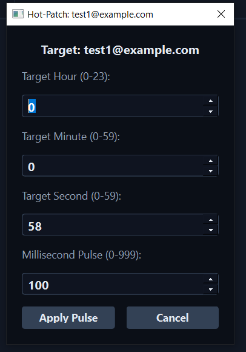

1 - **button   `view` `terminate` `delete`  have  wired inner text that use cant understand what is it** ..   i told you but inside the there button should contain text `view` `terminate` `delete` 
2-when i click view i should see wither instant is running or not 
3- bit shouldn't terminate instant from itself 
4- there an issue **bot open many instant all of them is jusst empty window of chrome just execute code in `browser/chrome.py` inside one instant**** that not  waht i want 
 i want code inside  `browser/chrome.py` executed inside all window at same time ..
 
5-user sould be able to copy paste code from isnide the dashboard .. 
6- comment document code inside `gui` to know each component 
make code mre redable easy to understand more human