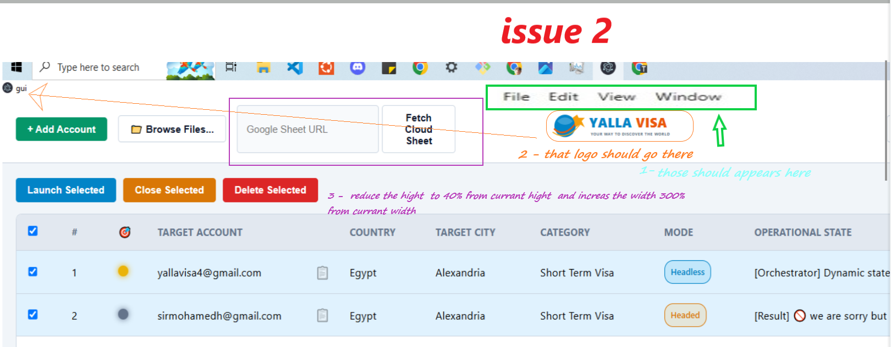

now every thing is working ...
i want

1-  user be able to add default values from main window ..  

    country:
    city: 
    appointmentCategory: 
    subCategory: "

when user press ` defaultBatchConfig`
menu like hot patch  appers allow  user to  change defaults 
this menu will be as same as setting by default until user change it 
-
2- bot  should be able  know if there are appointment available throw any alert element appers 
but i dont want bot to look for alert by unstable selectors like class or id ...
it should look for any div with role = alert  read its content tray to look for words that mean if there are appointment or not 
```html
<div role="alert" class="alert border-0 rounded-0"> We are sorry but no appointment slots are currently available. New slots open at regular intervals, please try again later </div>
```
if there appointment found  or there are not ,, it  should appers on main window 
after each account instant number 
body

```html

<body><noscript><iframe src="https://www.googletagmanager.com/ns.html?id=GTM-KCT7T5SV"height="0"width="0"class="dis-none-vis-hidden"></iframe></noscript><div id="loader" class="loader-box" style="display: none;"></div><app-root class="d-flex flex-column min-vh-100" ng-version="19.2.25"><div style="zoom: 1;"><header class="header-main bg-white sticky-top logged-in"><div class="navbar"><div class="container navbar-expand-sm"><!----><a tabindex="0" class="navbar-brand cursor-pointer"></a><!----><span class="ms-auto"></span><!----><button type="button" data-bs-toggle="collapse" data-bs-target="#navbarToggle" aria-controls="navbarToggle" aria-expanded="false" aria-label="Toggle navigation" class="navbar-toggler"></button><!----><div id="navbarToggle" class="collapse navbar-collapse justify-content-end"><!----><ul class="navbar-nav align-items-sm-center"><li class="nav-item dropdown"><a href="#" id="navbarDropdown" role="button" data-bs-toggle="dropdown" aria-haspopup="true" aria-expanded="false" class="nav-link dropdown-toggle c-brand-orange"> My Account </a><div aria-labelledby="navbarDropdown" class="dropdown-menu dropdown-menu-right mb-15 cursor-pointer"><a tabindex="0" class="dropdown-item">Dashboard</a><div class="dropdown-divider"></div><a tabindex="0" class="dropdown-item bg-brand-orange text-white cursor-pointer c-inherit"> Logout </a></div><!----></li></ul></div><!----><!----></div></div><!----><div class="mb-1"></div><!----><app-notification><!----></app-notification><div id="stepper"><nav class="navbar navbar-expand-lg flex-nowrap"><div class="container"><ul class="steps-nav navbar-nav navbar-expand-lg me-auto mb-2 mb-lg-0"><li class="nav-item active cursor-pointer"><a class="nav-link" aria-current="step"><span class="sr-num">1</span><span class="check-mark">✓</span><span class="name text-wrap">Appointment Details</span></a></li><li class="nav-item"><a class="nav-link"><span class="sr-num">2</span><span class="check-mark">✓</span><span class="name text-wrap">Your Details</span></a></li><li class="nav-item"><a class="nav-link"><span class="sr-num">3</span><span class="check-mark">✓</span><span class="name text-wrap">Book Appointment</span></a></li><li class="nav-item"><a class="nav-link"><span class="sr-num">4</span><span class="check-mark">✓</span><span class="name text-wrap">Services</span></a></li><li class="nav-item"><a class="nav-link"><span class="sr-num">5</span><span class="check-mark">✓</span><span class="name text-wrap">Review</span></a></li><!----></ul><!----></div></nav></div><!----><!----></header><main><div appkeydown="" class="clearfix main-container"><!----><router-outlet></router-outlet><app-eligibility-criteria><section class="container py-15 py-md-30"><form novalidate="" class="ng-untouched ng-pristine ng-valid"><mat-card class="mat-mdc-card mdc-card form-card"><p class="grey-color mb-5">All fields are mandatory</p><h1 class="fs-24 fs-sm-46 mb-25">Appointment Details</h1><p class="c-brand-grey-para mb-15">Please provide information about the type of visa you wish to apply for. Be aware that the appointment category Applicant 1 chooses will be applied to each of the applicants added to your appointment booking.</p><!----><form novalidate="" class="ng-touched ng-dirty ng-valid"><!----><!----><div class="form-group"><div class="mt-15"><label for="mat-select-0" id="mat-select-value-1" class="align-label"><div> Choose your Application Centre<span class="c-brand-error">*</span><!----></div><p class="d-inline float-end text-end"> 2 Centre(s) </p><!----></label></div><!----><mat-form-field aria-describedby="errorMsg" appearance="outline" class="mat-mdc-form-field mat-form-field-outline-brand mat-mdc-form-field-type-mat-select mat-form-field-appearance-outline mat-primary mat-form-field-animations-enabled ng-touched ng-dirty ng-valid"><!----><div class="mat-mdc-text-field-wrapper mdc-text-field mdc-text-field--outlined mdc-text-field--no-label"><!----><div class="mat-mdc-form-field-flex"><div matformfieldnotchedoutline="" class="mdc-notched-outline mdc-notched-outline--no-label"><div class="mat-mdc-notch-piece mdc-notched-outline__leading"></div><div class="mat-mdc-notch-piece mdc-notched-outline__notch"><!----><!----><!----></div><div class="mat-mdc-notch-piece mdc-notched-outline__trailing"></div></div><!----><!----><!----><div class="mat-mdc-form-field-infix"><!----><mat-select role="combobox" aria-haspopup="listbox" formcontrolname="centerCode" appdefaultselect="" class="mat-mdc-select mat-mdc-select-required ng-touched ng-dirty ng-valid" aria-labelledby="mat-select-value-0" id="mat-select-0" tabindex="0" aria-expanded="false" aria-required="true" aria-disabled="false" aria-invalid="false" aria-activedescendant="AEX"><div cdk-overlay-origin="" class="mat-mdc-select-trigger"><div class="mat-mdc-select-value" id="mat-select-value-0"><!----><span class="mat-mdc-select-value-text"><!----><span class="mat-mdc-select-min-line">Portugal Visa Application Center-Alexandria</span><!----></span><!----></div><div class="mat-mdc-select-arrow-wrapper"><div class="mat-mdc-select-arrow"><svg viewBox="0 0 24 24" width="24px" height="24px" focusable="false" aria-hidden="true"><path d="M7 10l5 5 5-5z"></path></svg></div></div></div><!----></mat-select></div><!----><!----></div><!----></div><div class="mat-mdc-form-field-subscript-wrapper mat-mdc-form-field-bottom-align"><div aria-atomic="true" aria-live="polite" class="mat-mdc-form-field-hint-wrapper"><!----><!----><div class="mat-mdc-form-field-hint-spacer"></div><!----></div></div></mat-form-field></div><hr role="presentation"><!----><!----><div class="form-group"><label for="mat-select-4" id="mat-select-value-5"> Choose your appointment category<span class="c-brand-error">*</span><!----></label><!----><mat-form-field aria-describedby="errorMsg" appearance="outline" class="mat-mdc-form-field mat-form-field-outline-brand mat-mdc-form-field-type-mat-select mat-form-field-appearance-outline mat-primary mat-form-field-animations-enabled ng-touched ng-dirty ng-valid"><!----><div class="mat-mdc-text-field-wrapper mdc-text-field mdc-text-field--outlined mdc-text-field--no-label"><!----><div class="mat-mdc-form-field-flex"><div matformfieldnotchedoutline="" class="mdc-notched-outline mdc-notched-outline--no-label"><div class="mat-mdc-notch-piece mdc-notched-outline__leading"></div><div class="mat-mdc-notch-piece mdc-notched-outline__notch"><!----><!----><!----></div><div class="mat-mdc-notch-piece mdc-notched-outline__trailing"></div></div><!----><!----><!----><div class="mat-mdc-form-field-infix"><!----><mat-select role="combobox" aria-haspopup="listbox" formcontrolname="selectedSubvisaCategory" appdefaultselect="" class="mat-mdc-select mat-mdc-select-required ng-touched ng-dirty ng-valid" aria-labelledby="mat-select-value-2" id="mat-select-2" tabindex="0" aria-expanded="false" aria-required="true" aria-disabled="false" aria-invalid="false" aria-activedescendant="1"><div cdk-overlay-origin="" class="mat-mdc-select-trigger"><div class="mat-mdc-select-value" id="mat-select-value-2"><!----><span class="mat-mdc-select-value-text"><!----><span class="mat-mdc-select-min-line">Short Term Visa</span><!----></span><!----></div><div class="mat-mdc-select-arrow-wrapper"><div class="mat-mdc-select-arrow"><svg viewBox="0 0 24 24" width="24px" height="24px" focusable="false" aria-hidden="true"><path d="M7 10l5 5 5-5z"></path></svg></div></div></div><!----></mat-select></div><!----><!----></div><!----></div><div class="mat-mdc-form-field-subscript-wrapper mat-mdc-form-field-bottom-align"><div aria-atomic="true" aria-live="polite" class="mat-mdc-form-field-hint-wrapper"><!----><!----><div class="mat-mdc-form-field-hint-spacer"></div><!----></div></div></mat-form-field></div><!----><hr role="presentation"><!----><!----><!----><div class="form-group"><label for="mat-select-2" id="mat-select-value-3"> Choose your sub-category<span class="c-brand-error">*</span><!----><!----></label><!----><mat-form-field aria-describedby="errorMsg" appearance="outline" class="mat-mdc-form-field mat-form-field-outline-brand mat-mdc-form-field-type-mat-select mat-form-field-appearance-outline mat-primary mat-form-field-animations-enabled ng-touched ng-dirty ng-valid"><!----><div class="mat-mdc-text-field-wrapper mdc-text-field mdc-text-field--outlined mdc-text-field--no-label"><!----><div class="mat-mdc-form-field-flex"><div matformfieldnotchedoutline="" class="mdc-notched-outline mdc-notched-outline--no-label"><div class="mat-mdc-notch-piece mdc-notched-outline__leading"></div><div class="mat-mdc-notch-piece mdc-notched-outline__notch"><!----><!----><!----></div><div class="mat-mdc-notch-piece mdc-notched-outline__trailing"></div></div><!----><!----><!----><div class="mat-mdc-form-field-infix"><!----><mat-select role="combobox" aria-haspopup="listbox" formcontrolname="visaCategoryCode" appdefaultselect="" mattooltipposition="above" mattooltipclass="mat-tooltip-full" class="mat-mdc-select mat-mdc-tooltip-trigger mat-mdc-select-required ng-touched ng-dirty ng-valid" aria-labelledby="mat-select-value-1" id="mat-select-1" tabindex="0" aria-expanded="false" aria-required="true" aria-disabled="false" aria-invalid="false"><div cdk-overlay-origin="" class="mat-mdc-select-trigger"><div class="mat-mdc-select-value" id="mat-select-value-1"><!----><span class="mat-mdc-select-value-text"><!----><span class="mat-mdc-select-min-line">Tourism</span><!----></span><!----></div><div class="mat-mdc-select-arrow-wrapper"><div class="mat-mdc-select-arrow"><svg viewBox="0 0 24 24" width="24px" height="24px" focusable="false" aria-hidden="true"><path d="M7 10l5 5 5-5z"></path></svg></div></div></div><!----></mat-select><!----></div><!----><!----></div><!----></div><div class="mat-mdc-form-field-subscript-wrapper mat-mdc-form-field-bottom-align"><div aria-atomic="true" aria-live="polite" class="mat-mdc-form-field-hint-wrapper"><!----><!----><div class="mat-mdc-form-field-hint-spacer"></div><!----></div></div></mat-form-field></div><hr role="presentation"><!----><!----><!----><!----><!----><!----><!----><!----><!----><!----><!----><!----><!----><div class="mb-0 Information"><div role="alert" class="alert border-0 rounded-0"> We are sorry but no appointment slots are currently available. New slots open at regular intervals, please try again later </div></div><!----><!----><!----></form></mat-card><!----><!----><mat-card class="mat-mdc-card mdc-card form-card p-0 border-0 mt-20 shadow-none"><button type="button" mat-raised-button="" class="btn mat-btn-lg btn-block btn-brand-orange mdc-button mdc-button--raised mat-mdc-raised-button mat-mdc-button-disabled mat-unthemed mat-mdc-button-base" mat-ripple-loader-uninitialized="" mat-ripple-loader-class-name="mat-mdc-button-ripple" mat-ripple-loader-disabled="" disabled="true"><span class="mat-mdc-button-persistent-ripple mdc-button__ripple"></span><span class="mdc-button__label"> Continue </span><span class="mat-focus-indicator"></span><span class="mat-mdc-button-touch-target"></span></button><!----><!----></mat-card></form></section></app-eligibility-criteria><!----></div></main><footer class="footer-bottom mt-auto"><div class="container c-brand-grey-para py-15"> AR-8.0.31 © 2026 VFS Global Group. All Rights Reserved. ISO 23026 compliant information. Our websites are created for viewing on modern browsers; Internet Explorer users please upgrade. <br><a target="_blank" class="pr-10" href="https://visa.vfsglobal.com/egy/en/prt/contact-us"><span class="c-brand-orange fs-sm-18 text-decoration-underline cursor-pointer">Contact Us</span></a><a target="_blank" href="https://visa.vfsglobal.com/egy/en/prt/accessibility" hidden=""><span class="c-brand-orange fs-sm-18 text-decoration-underline cursor-pointer">About VFS Global</span></a><!----></div></footer><!----><!----><ngx-ui-loader _nghost-ng-c2643326188=""><!----><div class="sr-only" role="status">Loading</div><div _ngcontent-ng-c2643326188="" class="ngx-overlay" style="background-color: rgba(40, 40, 40, 0.8); border-radius: 0px;"><!----><div _ngcontent-ng-c2643326188="" class="ngx-foreground-spinner center-center" style="color: rgba(12, 11, 11, 0.95); width: 40px; height: 40px; top: 50%;"><div _ngcontent-ng-c2643326188="" class="sk-ball-spin-clockwise"><div _ngcontent-ng-c2643326188=""></div><div _ngcontent-ng-c2643326188=""></div><div _ngcontent-ng-c2643326188=""></div><div _ngcontent-ng-c2643326188=""></div><div _ngcontent-ng-c2643326188=""></div><div _ngcontent-ng-c2643326188=""></div><div _ngcontent-ng-c2643326188=""></div><div _ngcontent-ng-c2643326188=""></div><!----></div><!----><!----></div><div _ngcontent-ng-c2643326188="" class="ngx-loading-text center-center" style="top: 50%; color: rgb(255, 255, 255);"><span _ngcontent-ng-c2643326188=""></span></div></div><div _ngcontent-ng-c2643326188="" class="ngx-background-spinner bottom-right" style="width: 60px; height: 60px; color: rgb(64, 84, 59); opacity: 0.5;"><div _ngcontent-ng-c2643326188="" class="sk-ball-spin-clockwise"><div _ngcontent-ng-c2643326188=""></div><div _ngcontent-ng-c2643326188=""></div><div _ngcontent-ng-c2643326188=""></div><div _ngcontent-ng-c2643326188=""></div><div _ngcontent-ng-c2643326188=""></div><div _ngcontent-ng-c2643326188=""></div><div _ngcontent-ng-c2643326188=""></div><div _ngcontent-ng-c2643326188=""></div><!----></div><!----><!----></div></ngx-ui-loader></div></app-root><noscript>This website requires JavaScript</noscript><script nonce="bdcddd3d-2299-4b83-b70b-ab8d738e1b95" src="https://liftassets.vfsglobal.com/_angular/runtime.7ba78eebffb4fac1.js?v=8.0.31" type="module" crossorigin="anonymous"></script><script nonce="bdcddd3d-2299-4b83-b70b-ab8d738e1b95" src="https://liftassets.vfsglobal.com/_angular/polyfills.feaa51907cc8c146.js?v=8.0.31" type="module" crossorigin="anonymous"></script><script nonce="bdcddd3d-2299-4b83-b70b-ab8d738e1b95" src="https://liftassets.vfsglobal.com/_angular/scripts.c1193da060556f64.js?v=8.0.31" defer="" crossorigin="anonymous" type="text/javascript"></script><script nonce="bdcddd3d-2299-4b83-b70b-ab8d738e1b95" src="https://liftassets.vfsglobal.com/_angular/vendor.d6d9162767bc1d98.js?v=8.0.31" type="module" crossorigin="anonymous"></script><script nonce="bdcddd3d-2299-4b83-b70b-ab8d738e1b95" src="https://liftassets.vfsglobal.com/_angular/main.dd510853c7fb6735.js?v=8.0.31" type="module" crossorigin="anonymous"></script><script type="module" src="https://static.cloudflareinsights.com/beacon.min.js/v31edd6df95cf4e85bb4c19e7a9bdbcba1788362987495" integrity="sha512-iIg7k2xntmwu6/uSb5tpc/hySgZc4eoL31yB29W6tJFo2akwjPWcEqnCEdJvGexCL0KEQwVYv5BlowfhVz26hg==" nonce="bdcddd3d-2299-4b83-b70b-ab8d738e1b95" data-cf-beacon="{&quot;version&quot;:&quot;2024.11.0&quot;,&quot;token&quot;:&quot;56589b51a3284db98432e08280dc099f&quot;,&quot;spa&quot;:2}" crossorigin="anonymous"></script>
<script nonce="bdcddd3d-2299-4b83-b70b-ab8d738e1b95">window.__CF$cv$params={r:'a3aaf6973edae22c',t:'MTc4OTM0MjQ3Mg==',u:'01a09d1f5b107093b460257a2ee4422f',ut:'GlctMwkeDD4uUCycwWc2vr0EgXcJAEw45DGh77chk4U-1789342472-1.2.1.1-qifrGqR81i.Wo1ds.mf2vC7nn9z5ncnB46FjMdSmI.dWrjgjxw7wuvAEP3nj92PNlOV1HelD3.Yf57kSYMGI4eshkR6mEazVZ9ZiHwdLVv8',i:60};(function(){if(!document.body)return;var s=document.createElement('script');s.nonce='bdcddd3d-2299-4b83-b70b-ab8d738e1b95';s.src='/cdn-cgi/challenge-platform/scripts/precursor/main.js';document.head.appendChild(s);})();</script>
<script type="text/javascript" id="" charset="">!function(b,e,f,g,a,c,d){b.fbq||(a=b.fbq=function(){a.callMethod?a.callMethod.apply(a,arguments):a.queue.push(arguments)},b._fbq||(b._fbq=a),a.push=a,a.loaded=!0,a.version="2.0",a.queue=[],c=e.createElement(f),c.async=!0,c.src=g,d=e.getElementsByTagName(f)[0],d.parentNode.insertBefore(c,d))}(window,document,"script","https://connect.facebook.net/en_US/fbevents.js");fbq("init","1005204308813543");fbq("track","PageView");</script>
<noscript></noscript>
<script type="text/javascript" id="" charset="">(function(){var b=["https://chat.vfsai.com"],d=function(a){if(b.includes(a.origin))try{var c=JSON.parse(a.data);window.dataLayer.push(c)}catch(e){}};window.addEventListener("message",d)})();</script><div id="onetrust-consent-sdk" data-nosnippet="true"><div class="onetrust-pc-dark-filter ot-fade-in" style="display: none;z-index:2147483645;visibility: hidden;
                    opacity: 0;transition: visibility 0s 400ms, opacity 400ms linear;"></div><div id="onetrust-banner-sdk" class="otFloatingRounded ot-bottom-left ot-wo-title vertical-align-content ot-fade-in" tabindex="0" role="region" aria-label="Cookie banner" style="display: none;
                    transition: visibility 0s 400ms, opacity 400ms linear;
                    opacity: 0;visibility: hidden;"><div class="ot-sdk-container" role="dialog" aria-modal="true" aria-label="Privacy"><div class="ot-sdk-row"><div id="onetrust-group-container" class="ot-sdk-twelve ot-sdk-columns"><div class="banner_logo"></div><div id="onetrust-policy"><div id="onetrust-policy-text">By clicking “Accept All Cookies”, you agree to the storing of cookies on your device to enhance site navigation, analyze site usage, and assist in our marketing efforts. <a class="ot-cookie-policy-link" href="https://www.vfsglobal.com/en/general/cookie-policy.html?from_section=0" aria-label="More information about your privacy, opens in a new tab" rel="noopener" target="_blank">Cookie Notice</a></div></div></div><div id="onetrust-button-group-parent" class="ot-sdk-twelve ot-sdk-columns has-reject-all-button"><div id="onetrust-button-group"><button id="onetrust-pc-btn-handler" aria-label="Cookies Settings, Opens the preference center dialog">Cookies Settings</button><div class="onetrust-banner-options"><button id="onetrust-reject-all-handler">Accept Only Necessary</button> <button id="onetrust-accept-btn-handler">Accept All Cookies</button></div></div></div><!-- Close Button --><div id="onetrust-close-btn-container"></div><!-- Close Button END--></div></div></div><div id="onetrust-pc-sdk" class="otPcTab ot-hide ot-fade-in" lang="en" aria-label="Preference center" role="region" style="display: none;
                    transition: visibility 0s 400ms, opacity 400ms linear;
                    opacity: 0;visibility: hidden;"><div role="dialog" aria-modal="true" style="height: 100%;" aria-label="Privacy Preference Center"><!-- pc header --><div class="ot-pc-header" role="presentation"><!-- Header logo --><div class="ot-pc-logo" role="img" aria-label="Company Logo"></div><div class="ot-title-cntr"><h2 id="ot-pc-title" aria-hidden="false">Privacy Preference Center</h2><div class="ot-close-cntr"><button id="close-pc-btn-handler" class="ot-close-icon" aria-label="Close preference center" style="background-image: url(&quot;https://cdn.cookielaw.org/logos/static/ot_close.svg&quot;);"></button></div></div></div><!-- content --><!-- Groups / Sub groups with cookies --><div id="ot-pc-content" class="ot-pc-scrollbar ot-sdk-row"><div class="ot-optout-signal ot-hide"><div class="ot-optout-icon"><svg xmlns="http://www.w3.org/2000/svg" aria-hidden="true"><path class="ot-floating-button__svg-fill" d="M14.588 0l.445.328c1.807 1.303 3.961 2.533 6.461 3.688 2.015.93 4.576 1.746 7.682 2.446 0 14.178-4.73 24.133-14.19 29.864l-.398.236C4.863 30.87 0 20.837 0 6.462c3.107-.7 5.668-1.516 7.682-2.446 2.709-1.251 5.01-2.59 6.906-4.016zm5.87 13.88a.75.75 0 00-.974.159l-5.475 6.625-3.005-2.997-.077-.067a.75.75 0 00-.983 1.13l4.172 4.16 6.525-7.895.06-.083a.75.75 0 00-.16-.973z" fill="#FFF" fill-rule="evenodd"></path></svg></div><span></span></div><div class="ot-sdk-container ot-grps-cntr ot-sdk-column"><div class="ot-sdk-four ot-sdk-columns ot-tab-list" aria-label="Cookie Categories"><h2 id="ot-pc-title-mobile" aria-hidden="true">Privacy Preference Center</h2><ul class="ot-cat-grp" role="tablist" aria-orientation="vertical"><li class="ot-abt-tab" role="presentation"><!-- About Privacy container --><div class="ot-active-menu category-menu-switch-handler" role="tab" tabindex="0" aria-selected="true" aria-controls="ot-tab-desc"><h3 id="ot-pvcy-txt">Your Privacy</h3></div></li><li class="ot-cat-item ot-always-active-group ot-vs-config" role="presentation" data-optanongroupid="C0001"><div class="category-menu-switch-handler" role="tab" tabindex="-1" aria-selected="false" aria-controls="ot-desc-id-C0001"><h3 id="ot-header-id-C0001">Strictly Necessary Cookies</h3></div></li><li class="ot-cat-item ot-vs-config" role="presentation" data-optanongroupid="C0003"><div class="category-menu-switch-handler" role="tab" tabindex="-1" aria-selected="false" aria-controls="ot-desc-id-C0003"><h3 id="ot-header-id-C0003">Functional Cookies</h3></div></li><li class="ot-cat-item ot-vs-config" role="presentation" data-optanongroupid="C0002"><div class="category-menu-switch-handler" role="tab" tabindex="-1" aria-selected="false" aria-controls="ot-desc-id-C0002"><h3 id="ot-header-id-C0002">Performance Cookies</h3></div></li><li class="ot-cat-item ot-vs-config" role="presentation" data-optanongroupid="C0004"><div class="category-menu-switch-handler" role="tab" tabindex="-1" aria-selected="false" aria-controls="ot-desc-id-C0004"><h3 id="ot-header-id-C0004">Targeting Cookies</h3></div></li></ul></div><div class="ot-tab-desc ot-sdk-eight ot-sdk-columns"><div class="ot-desc-cntr" id="ot-tab-desc" tabindex="0" role="tabpanel" aria-labelledby="ot-pvcy-hdr"><h4 id="ot-pvcy-hdr">Your Privacy</h4><p id="ot-pc-desc" class="ot-grp-desc">When you visit any website, it may store or retrieve information on your browser, mostly in the form of cookies. This information might be about you, your preferences or your device and is mostly used to make the site work as you expect it to. The information does not usually directly identify you, but it can give you a more personalized web experience. Because we respect your right to privacy, you can choose not to allow some types of cookies. Click on the different category headings to find out more and change our default settings. However, blocking some types of cookies may impact your experience of the site and the services we are able to offer.
            <br><a href="https://cookiepedia.co.uk/giving-consent-to-cookies" class="privacy-notice-link" rel="noopener" target="_blank" aria-label="More information about your privacy, opens in a new tab">More information</a><div class="ot-userid-title"><span>User ID: </span> 65ec2e37-b221-4239-9acf-a1ab4c42b0fd</div><div class="ot-userid-timestamp">Timestamp: 2026-09-13 23:34:39</div></p></div><div class="ot-desc-cntr ot-hide ot-always-active-group" role="tabpanel" tabindex="0" id="ot-desc-id-C0001"><div class="ot-grp-hdr1"><h4 class="ot-cat-header">Strictly Necessary Cookies</h4><div class="ot-tgl-cntr"><div class="ot-always-active">Always Active</div></div></div><p class="ot-grp-desc ot-category-desc">These cookies may be set through our site by our advertising partners. They may be used by those companies to build a profile of your interests and show you relevant adverts on other sites. They do not store directly personal information but are based on uniquely identifying your browser and internet device. If you do not allow these cookies, you will experience less targeted advertising. </p><div class="ot-hlst-cntr"><button class="ot-link-btn category-host-list-handler" aria-label="Strictly Necessary Cookies - Cookie Details button opens Cookie List menu" data-parent-id="C0001">Cookies Details‎</button></div></div><div class="ot-desc-cntr ot-hide" role="tabpanel" tabindex="0" id="ot-desc-id-C0003"><div class="ot-grp-hdr1"><h4 class="ot-cat-header">Functional Cookies</h4><div class="ot-tgl"><input type="checkbox" name="ot-group-id-C0003" id="ot-group-id-C0003" role="switch" class="category-switch-handler" data-optanongroupid="C0003" aria-labelledby="ot-header-id-C0003"> <label class="ot-switch" for="ot-group-id-C0003"><span class="ot-switch-nob"></span> <span class="ot-label-txt">Functional Cookies</span></label> </div><div class="ot-tgl-cntr"></div></div><p class="ot-grp-desc ot-category-desc">These cookies enable the website to provide enhanced functionality and personalisation. If you do not allow these cookies then some or all these services may not function properly.</p><div class="ot-hlst-cntr"><button class="ot-link-btn category-host-list-handler" aria-label="Functional Cookies - Cookie Details button opens Cookie List menu" data-parent-id="C0003">Cookies Details‎</button></div></div><div class="ot-desc-cntr ot-hide" role="tabpanel" tabindex="0" id="ot-desc-id-C0002"><div class="ot-grp-hdr1"><h4 class="ot-cat-header">Performance Cookies</h4><div class="ot-tgl"><input type="checkbox" name="ot-group-id-C0002" id="ot-group-id-C0002" role="switch" class="category-switch-handler" data-optanongroupid="C0002" aria-labelledby="ot-header-id-C0002"> <label class="ot-switch" for="ot-group-id-C0002"><span class="ot-switch-nob"></span> <span class="ot-label-txt">Performance Cookies</span></label> </div><div class="ot-tgl-cntr"></div></div><p class="ot-grp-desc ot-category-desc">These cookies allow us to count visits and traffic sources so we can measure and improve the performance of our site. They help us to know which pages are the most and least popular and see how visitors move around the site.    All the information these cookies collect is aggregated and therefore anonymous. If you do not allow these cookies we will not know when you have visited our site and will not be able to monitor its performance.</p><div class="ot-hlst-cntr"><button class="ot-link-btn category-host-list-handler" aria-label="Performance Cookies - Cookie Details button opens Cookie List menu" data-parent-id="C0002">Cookies Details‎</button></div></div><div class="ot-desc-cntr ot-hide" role="tabpanel" tabindex="0" id="ot-desc-id-C0004"><div class="ot-grp-hdr1"><h4 class="ot-cat-header">Targeting Cookies</h4><div class="ot-tgl"><input type="checkbox" name="ot-group-id-C0004" id="ot-group-id-C0004" role="switch" class="category-switch-handler" data-optanongroupid="C0004" aria-labelledby="ot-header-id-C0004"> <label class="ot-switch" for="ot-group-id-C0004"><span class="ot-switch-nob"></span> <span class="ot-label-txt">Targeting Cookies</span></label> </div><div class="ot-tgl-cntr"></div></div><p class="ot-grp-desc ot-category-desc">These cookies may be set through our site by our advertising partners. They may be used by those companies to build a profile of your interests and show you relevant adverts on other sites. They do not store directly personal information but are based on uniquely identifying your browser and internet device. If you do not allow these cookies, you will experience less targeted advertising. </p><div class="ot-hlst-cntr"><button class="ot-link-btn category-host-list-handler" aria-label="Targeting Cookies - Cookie Details button opens Cookie List menu" data-parent-id="C0004">Cookies Details‎</button></div></div></div></div></div><!-- Vendors / Hosts --><section id="ot-pc-lst" class="ot-hide ot-pc-scrollbar ot-enbl-chr"><div class="ot-lst-cntr ot-pc-scrollbar"><div id="ot-pc-hdr"><div id="ot-lst-title"><button class="ot-link-btn back-btn-handler" aria-label="Back"><svg id="ot-back-arw" xmlns="http://www.w3.org/2000/svg" xmlns:xlink="http://www.w3.org/1999/xlink" x="0px" y="0px" viewBox="0 0 444.531 444.531" xml:space="preserve"><title>Back Button</title><g><path fill="#656565" d="M213.13,222.409L351.88,83.653c7.05-7.043,10.567-15.657,10.567-25.841c0-10.183-3.518-18.793-10.567-25.835
                  l-21.409-21.416C323.432,3.521,314.817,0,304.637,0s-18.791,3.521-25.841,10.561L92.649,196.425
                  c-7.044,7.043-10.566,15.656-10.566,25.841s3.521,18.791,10.566,25.837l186.146,185.864c7.05,7.043,15.66,10.564,25.841,10.564
                  s18.795-3.521,25.834-10.564l21.409-21.412c7.05-7.039,10.567-15.604,10.567-25.697c0-10.085-3.518-18.746-10.567-25.978
                  L213.13,222.409z"></path></g></svg></button><h3>Cookie List</h3></div><div class="ot-lst-subhdr"><div id="ot-search-cntr"><p role="status" class="ot-scrn-rdr"></p><input id="vendor-search-handler" type="text" name="vendor-search-handler" placeholder="Search…" aria-label="Cookie list search"> <svg xmlns="http://www.w3.org/2000/svg" xmlns:xlink="http://www.w3.org/1999/xlink" x="0px" y="0px" viewBox="0 -30 110 110" aria-hidden="true"><path fill="#2e3644" d="M55.146,51.887L41.588,37.786c3.486-4.144,5.396-9.358,5.396-14.786c0-12.682-10.318-23-23-23s-23,10.318-23,23
              s10.318,23,23,23c4.761,0,9.298-1.436,13.177-4.162l13.661,14.208c0.571,0.593,1.339,0.92,2.162,0.92
              c0.779,0,1.518-0.297,2.079-0.837C56.255,54.982,56.293,53.08,55.146,51.887z M23.984,6c9.374,0,17,7.626,17,17s-7.626,17-17,17
              s-17-7.626-17-17S14.61,6,23.984,6z"></path></svg></div><div id="ot-fltr-cntr"><button id="filter-btn-handler" aria-label="Filter Cookie List" aria-haspopup="true"><svg role="presentation" aria-hidden="true" xmlns="http://www.w3.org/2000/svg" xmlns:xlink="http://www.w3.org/1999/xlink" x="0px" y="0px" viewBox="0 0 402.577 402.577" xml:space="preserve"><title>Filter Button</title><g><path fill="#2c3643" d="M400.858,11.427c-3.241-7.421-8.85-11.132-16.854-11.136H18.564c-7.993,0-13.61,3.715-16.846,11.136
                            c-3.234,7.801-1.903,14.467,3.999,19.985l140.757,140.753v138.755c0,4.955,1.809,9.232,5.424,12.854l73.085,73.083
                            c3.429,3.614,7.71,5.428,12.851,5.428c2.282,0,4.66-0.479,7.135-1.43c7.426-3.238,11.14-8.851,11.14-16.845V172.166L396.861,31.413
                            C402.765,25.895,404.093,19.231,400.858,11.427z"></path></g></svg></button></div></div></div><section id="ot-lst-cnt" class="ot-pc-scrollbar"><div class="ot-sdk-row"><div class="ot-sdk-column"><div id="ot-sel-blk"><div class="ot-sel-all"><div class="ot-sel-all-hdr"><span class="ot-consent-hdr">Consent</span> <span class="ot-li-hdr">Leg.Interest</span></div><div class="ot-sel-all-chkbox"><div class="ot-chkbox" id="ot-selall-hostcntr"><input id="select-all-hosts-groups-handler" type="checkbox"> <label for="select-all-hosts-groups-handler"><span class="ot-label-txt">checkbox label</span></label> <span class="ot-label-status">label</span></div><div class="ot-chkbox" id="ot-selall-vencntr"><input id="select-all-vendor-groups-handler" type="checkbox"> <label for="select-all-vendor-groups-handler"><span class="ot-label-txt">checkbox label</span></label> <span class="ot-label-status">label</span></div><div class="ot-chkbox" id="ot-selall-licntr"><input id="select-all-vendor-leg-handler" type="checkbox"> <label for="select-all-vendor-leg-handler"><span class="ot-label-txt">checkbox label</span></label> <span class="ot-label-status">label</span></div></div></div></div><ul id="ot-host-lst"></ul></div></div></section></div><div id="ot-anchor"></div><section id="ot-fltr-modal"><div id="ot-fltr-cnt"><div id="ot-filter-list-header"></div><button id="clear-filters-handler">Clear</button><div class="ot-fltr-scrlcnt ot-pc-scrollbar"><ul class="ot-fltr-opts"><li class="ot-fltr-opt"><div class="ot-chkbox"><input id="chkbox-id" type="checkbox" class="category-filter-handler"> <label for="chkbox-id"><span class="ot-label-txt">checkbox label</span></label> <span class="ot-label-status">label</span></div></li></ul><div class="ot-fltr-btns"><button id="filter-apply-handler">Apply</button> <button id="filter-cancel-handler">Cancel</button></div></div></div></section></section><!-- Footer buttons and logo --><div class="ot-pc-footer ot-pc-scrollbar"><div class="ot-btn-container"><button class="save-preference-btn-handler onetrust-close-btn-handler" ot-button-order="0">Confirm My Choices</button><div class="ot-btn-subcntr"> <button id="accept-recommended-btn-handler" ot-button-order="2">Allow All</button></div></div><div class="ot-pc-footer-logo"><a href="https://www.onetrust.com/products/cookie-consent/" target="_blank" rel="noopener noreferrer" aria-label="Powered by OneTrust Opens in a new Tab"></a></div></div><!-- Cookie subgroup container --><!-- Vendor list link --><!-- Cookie lost link --><!-- Toggle HTML element --><!-- Checkbox HTML --><!-- Arrow SVG element --><!-- Accordion basic element --><span class="ot-scrn-rdr" aria-atomic="true" aria-live="polite">Your Privacy [`dialog closed`]</span><!-- Vendor Service container and item template --></div><iframe class="ot-text-resize" sandbox="allow-same-origin" title="onetrust-text-resize" style="position: absolute; top: -50000px; width: 100em;" aria-hidden="true"></iframe></div></div><script nonce="bdcddd3d-2299-4b83-b70b-ab8d738e1b95" id="volt-recaptcha" src="https://challenges.cloudflare.com/turnstile/v0/api.js" async="" defer=""></script><div class="cdk-live-announcer-element cdk-visually-hidden" aria-atomic="true" aria-live="polite" id="cdk-live-announcer-0"></div><div class="cdk-overlay-container"></div></body>0
```



How would you like to handle accounts that already exist?

